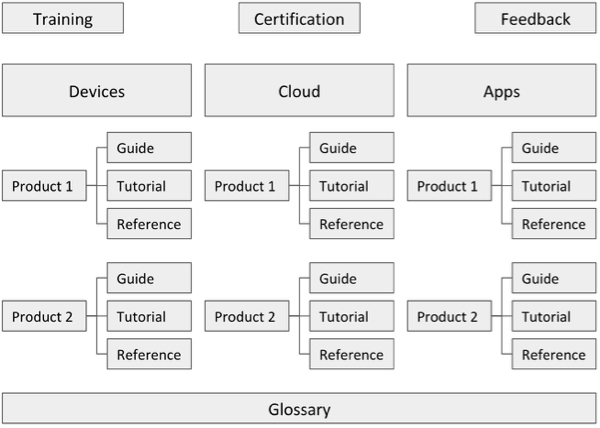

# Ayla Core Content

This repository contains source files for the [Ayla Core Content](https://hagenhaus.com/) website where Ayla Networks publishes essential guides, tutorials, references, and terminology, as well as information about training and certification. The site is currently hosted at a temporary location, and password protected. Email matt@aylanetworks.com for access. It will move to a permanent url soon. Click [ACC Jira project](https://aylanetworks.atlassian.net/browse/ACC) to see the associated Jira project.

Not just a website, Ayla Core Content (ACC) revolutionizes how Ayla creates, publishes, and manages technical documentation. It changes perceptions, attitudes, processes, job descriptions, and company organization. It removes bottlenecks, and enables the flow of information from subject matter experts to information consumers. 

## Features

### Authorship

The ACC build process uses [Metalsmith](http://www.metalsmith.io/) to transform Github-flavored markdown files, html templates, css, js, and image files into a static website. See this diagram:

The ability to source markdown files presents a big opportunity. Technical documentation writers, for example, provide a simple markdown style guide that helps engineers and others write markdown that transforms into decent html. Writers work with engineers to understand the details and importance of the style guide. Writes do more editing and organizing of text, and less original content production. Engineers write instructions, descriptions, and definitions (in markdown). Writers edit and enhance these drafts. The Metalsmith build process produces the final, versioned product. 

### Website Organization

The Ayla Core Content site is designed to be a one-stop shop for Ayla essential technical information consumers. See this diagram:

The content is divided into Devices, Cloud, and Apps. It is further divided into products (e.g. Ayla Wi-Fi Production Agent). The site provides a Guide, Tutorial, and Reference for each product. All pages can refer to the Ayla Glossary. Consumers who want help learning this content may sign up for various forms of training. Consumers who want to be able to verify their competence can pursue certification which is based on ACC content. The prominent Feedback form channels comments, suggestions, corrections, etc., to the Jira project which facilitates agile improvements. The breadcrumb bar makes for easy navigation.

### Other

Other features include the following:

* Versioning
* Search
* Usage statistics
* Multi-language
* Feedback

## Processes

### Website build process

### Authoring process

### Editing process

### Publishing process

### Versioning process
