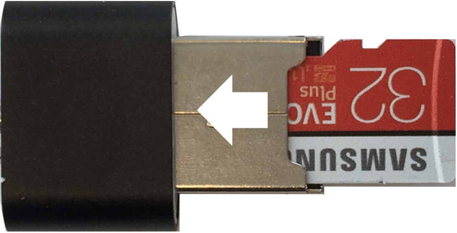

By Matt Hagen on April 2, 2019

This article shows you how to set up a [Raspberry Pi 3 Model B+](https://www.canakit.com/raspberry-pi-3-model-b-plus-ultimate-kit.html) for use with the Ayla Linux Agent or Ayla Dynamic Gateway Agent. Instructions encompass the following:

|Topic|Options|
|-|-|
|OS|Raspbian Full or Lite|
|Connectivity|Ethernet or Wi-Fi|
|Access|Serial cable, ssh, and/or vnc|

Follow these steps:

<ol>

<li>Download one of the flavors of [Raspbian Stretch](https://www.raspberrypi.org/downloads/raspbian/) to your computer. Do not unzip.</li>

<li>Download [Etcher](https://www.balena.io/etcher/) to your computer, and install it.</li>

<li>Insert the MicroSD card into a USB MicroSD card reader, and insert the reader into a USB port on your computer:

</li>

<li>Run Etcher, click the gear, uncheck <code>Auto-unmount</code>, and click Back.</li>

<li>Flash the new Raspian image to the MicroSD card.</li>

<li>In a terminal on your computer, access the MicroSD card <code>boot</code> directory with <code>cd /Volumes/boot</code>.</li>

<li>Enable serial communication by appending <code>enable_uart=1</code> to config.txt.</li>

<li>Enable Secure Shell by creating an empty ssh text file with <code>touch ssh</code>.</li>

<li>Enable Wi-Fi: Create a wpa_supplicant.conf file with <code>touch wpa_supplicant.conf</code>, add the following, customize, and save.
<pre>
ctrl_interface=DIR=/var/run/wpa_supplicant GROUP=netdev
update_config=1
country=US
network={
  ssid="your-network-name"
  psk="your-security-key"
  key_mgmt=WPA-PSK
}
</pre>

At boot time, Raspian copies this file to <code>/etc/wpa_supplicant/wpa_supplicant.conf</code>.
</li>
<li>Unmount the MicroSD card, remove it from the reader, insert it into the RPi (upside down), and power on.</li>

<li>Access the RPi in one of the following ways:
<ol>
<li>[Use a Serial/Console Cable](https://learn.adafruit.com/adafruits-raspberry-pi-lesson-5-using-a-console-cable/enabling-serial-console).</li>
<li>Secure Shell (ssh)
<ol>
<li>Discover the RPi IP address. (Browse to the router manager page, or run <code>arp -a</code> in a shell.)</li>
<li>Run <code>ssh pi&#64;192.168.1.20</code>.
Normally, you will see a message similar to the following:
<pre>
The authenticity of host '192.168.1.9 (192.168.1.9)' can't be established.
ECDSA key fingerprint is SHA256:CcQtTqvRl5SLlAbCdEfG/UsK0/NN018UKnSRw.
Are you sure you want to continue connecting (yes/no)?
</pre>
Sometimes, however, you will see this message:
<pre>
@@@@@@@@@@@@@@@@@@@@@@@@@@@@@@@@@@@@@@@@@@@@@@@@@@@@@@@@@@@
@    WARNING: REMOTE HOST IDENTIFICATION HAS CHANGED!     @
@@@@@@@@@@@@@@@@@@@@@@@@@@@@@@@@@@@@@@@@@@@@@@@@@@@@@@@@@@@
IT IS POSSIBLE THAT SOMEONE IS DOING SOMETHING NASTY!
Someone could be eavesdropping on you right now (man-in-the-middle attack)!
It is also possible that a host key has just been changed.
The fingerprint for the ECDSA key sent by the remote host is
SHA256:r4Y+vxKp5N6tEsMJtc6za1v/Rujms4wfjMY51jH8wsw.
Please contact your system administrator.
Add correct host key in /Users/matt/.ssh/known_hosts to get rid of this message.
Offending ECDSA key in /Users/matt/.ssh/known_hosts:5
ECDSA host key for 192.168.1.8 has changed and you have requested strict checking.
Host key verification failed.
</pre>
To solve this, open <code>&#126;/.ssh/known_hosts</code> on your computer, and delete the row representing the previous (IP Address, ECDSA Key) association, save, and run ssh again.
</li>
<li>Type <code>yes</code>, and enter <code>raspberry</code> for password. (Your username is <code>pi</code>).</li>
</ol>
</li>
</ol>
</li>
<li>If you are using Raspbian Stretch Lite, install <code>git</code>:
<pre>
$ sudo apt-get update
$ sudo apt-get install git -y
</pre>
</li>
</ol>

## Additional Links

* [raspberrypi.org/documentation/remote-access/ssh](https://www.raspberrypi.org/documentation/remote-access/ssh/)
* [Installing NOOBS for first time without screen or keyboard](https://www.raspberrypi.org/forums/viewtopic.php?t=172862)
* [NOOBS (New Out of Box Software)](https://github.com/raspberrypi/noobs/blob/master/README.md)
* [Setting up a Raspberry Pi headless](https://www.raspberrypi.org/documentation/configuration/wireless/headless.md)
* [Raspbian](https://www.raspberrypi.org/downloads/raspbian/)
* [pi zero w wpa_supplicant](https://www.raspberrypi.org/forums/viewtopic.php?t=203716)
* [Setting WiFi up via the command line](https://www.raspberrypi.org/documentation/configuration/wireless/wireless-cli.md)
* [SSH (Secure Shell)](https://www.raspberrypi.org/documentation/remote-access/ssh/)
* [Setting up your own Raspberry Pi 3 git server with Go Git Service (Gogs) and Raspbian Stretch Lite](https://www.techcoil.com/blog/setting-up-your-own-raspberry-pi-3-git-server-with-go-git-service-gogs-and-raspbian-stretch-lite/)
* [Setting Wi-Fi up via the command line](https://www.raspberrypi.org/documentation/configuration/wireless/wireless-cli.md)
* [User management in Raspbian](https://www.raspberrypi.org/documentation/linux/usage/users.md)
* [Change Raspberry Pi’s hostname](https://geek-university.com/raspberry-pi/change-raspberry-pis-hostname/)
* [Automatically connect a Raspberry Pi to a Wifi network](https://weworkweplay.com/play/automatically-connect-a-raspberry-pi-to-a-wifi-network/)
* [Automatically connect to open WiFi network](https://www.raspberrypi.org/forums/viewtopic.php?t=107852)
* [Adafruit's Raspberry Pi Lesson 5. Using a Console Cable](https://learn.adafruit.com/adafruits-raspberry-pi-lesson-5-using-a-console-cable/enabling-serial-console)
* [Read and Write From Serial Port With Raspberry Pi](https://www.instructables.com/id/Read-and-write-from-serial-port-with-Raspberry-Pi/)
* [The Raspberry Pi UARTs](https://www.raspberrypi.org/documentation/configuration/uart.md)
* [Node-RED Running on Raspberry Pi](https://nodered.org/docs/hardware/raspberrypi)
* [Raspberry Pi Serial (UART) Tutorial](https://www.teachmemicro.com/raspberry-pi-serial-uart-tutorial/)
* [VNC (Virtual Network Computing)](https://www.raspberrypi.org/documentation/remote-access/vnc/)
* [Control Arduino using Raspberry Pi | Arduino Raspberry Pi Serial Communication](https://electronicshobbyists.com/control-arduino-using-raspberry-pi-arduino-and-raspberry-pi-serial-communication/)