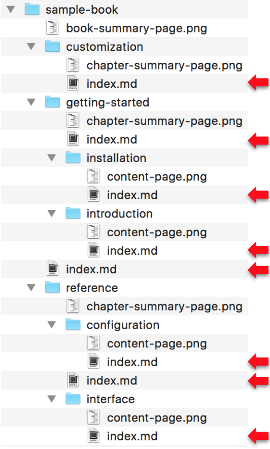
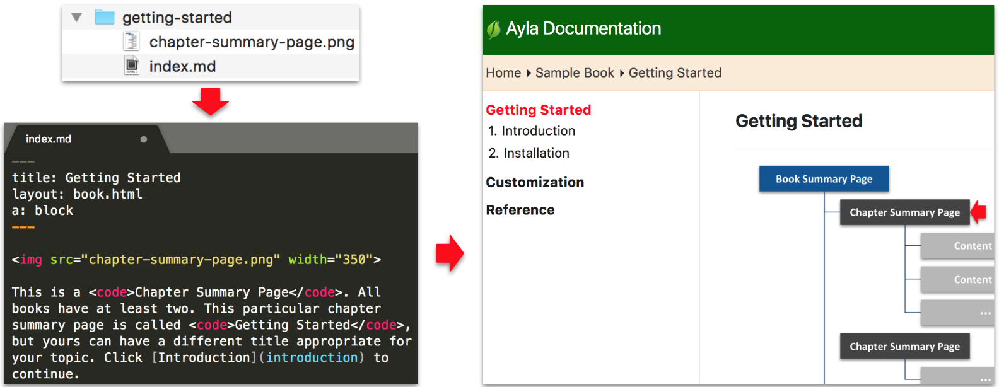

Site content is organized into <code>Books</code>. See the [Sample Book](/sample-book) and the corresponding [source files on Github](https://github.com/AylaNetworks/ayla-documentation/tree/master/src/sample-book).

All markdown files are named <code>index.md</code>.

Image files (almost always) reside in the same directory as the index.md file on which they appear. See the Images page for the exception.

