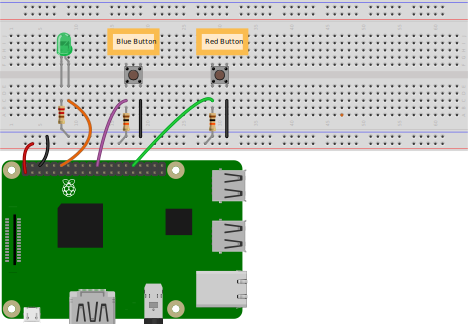

You can add ordered and unordered lists to a page using markdown or HTML. 

## Ordered lists

Here is an ordered list:

1. Shutdown your Raspberry Pi.
1. Wire the GPIO pins on your RPi as seen in the diagram below.
1. Restart your Raspberry Pi.

Here is the markdown source:

<pre>
1. Shutdown your Raspberry Pi.
1. Wire the GPIO pins on your RPi as seen in the diagram below.
1. Restart your Raspberry Pi.
</pre>

### Ordered list with image

Here is an ordered list with an image:

1. Shutdown your Raspberry Pi.
1. Wire the GPIO pins on your RPi as seen in the diagram below.

1. Restart your Raspberry Pi.

Here is the markdown source:

<pre>
1. Shutdown your Raspberry Pi.
1. Wire the GPIO pins on your RPi as seen in the diagram below.
&lt;img src="pinout.svg" width="500"&gt;
1. Restart your Raspberry Pi.
</pre>

### Ordered list with code snippet

Here is an ordered list with code snippets:

1. Open <code>&#126;/device_linux_public/app/appd/appd.c</code> for editing.
1. Add the following variable:
<pre>
   static u8 red_button;
</pre>
1. Scroll to <code>appd_prop_table</code>, and add the following prop struct after the Blue_button entry:
<pre>
   {
     .name = "Red_button",
     .type = PROP_BOOLEAN,
     .send = prop_arg_send,
     .arg = &red_button,
     .len = sizeof(red_button),
     .ads_failure_cb = appd_prop_ads_failure_cb,
   },
</pre>
1. Add the following function:
<pre>
   void red_button_isr(void) {
     if(digitalRead(RED_BUTTON) == LOW) {
       red_button = 1;
     } else {
       red_button = 0;
     }
     prop_send_by_name("Red_button");
   }
</pre>
1. Save the file.

Here is the markdown source:

<pre>
1. Open &lt;code&gt;&#126;/device_linux_public/app/appd/appd.c&lt;/code&gt; for editing.
1. Add the following variable:
&lt;pre&gt;
   static u8 red_button;
&lt;/pre&gt;
1. Scroll to &lt;code&gt;appd_prop_table&lt;/code&gt;, and add the following prop struct after the Blue_button entry:
&lt;pre&gt;
   {
     .name = "Red_button",
     .type = PROP_BOOLEAN,
     .send = prop_arg_send,
     .arg = &red_button,
     .len = sizeof(red_button),
     .ads_failure_cb = appd_prop_ads_failure_cb,
   },
&lt;/pre&gt;
1. Add the following function:
&lt;pre&gt;
   void red_button_isr(void) {
     if(digitalRead(RED_BUTTON) == LOW) {
       red_button = 1;
     } else {
       red_button = 0;
     }
     prop_send_by_name("Red_button");
   }
&lt;/pre&gt;
1. Save the file.
</pre>

### Ordered list with table

Here is an ordered list with tables:

1. Create a template with the following attributes.
<table>
<tr><th>Field</th><th>Value</th></tr>
<tr><td>Visibility</td><td>oem</td></tr>
<tr><td>Name</td><td>BT GW Generic</td></tr>
<tr><td>Description</td><td>Generic</td></tr>
<tr><td>Registration Type</td><td>None</td></tr>
<tr><td>Model</td><td>linuxevb</td></tr>
<tr><td>Template Key</td><td>generic</td></tr>
<tr><td>Version</td><td>\*</td></tr>
<tr><td>Type</td><td>Node</td></tr>
</table>
1. Add the following properties to the template.
<table>
<tr><th>Name</th><th>Display Name</th><th>Type</th><th>Direction</th><th>Scope</th></tr>
<tr><td>Name</td><td>Name</td><td>String</td><td>From Device</td><td>user</td></tr>
<tr><td>Icon</td><td>Icon</td><td>String</td><td>From Device</td><td>user</td></tr>
<tr><td>Class</td><td>Class</td><td>Integer</td><td>From Device</td><td>user</td></tr>
<tr><td>Appearance</td><td>Appearance</td><td>Integer</td><td>From Device</td><td>user</td></tr>
<tr><td>Alias</td><td>Alias</td><td>String</td><td>To Device</td><td>user</td></tr>
</table>

You must build your tables with HTML to intersperse them in a list:

<pre>
1. Create a template with the following attributes.
&lt;table&gt;
&lt;tr&gt;&lt;th&gt;Field&lt;/th&gt;&lt;th&gt;Value&lt;/th&gt;&lt;/tr&gt;
&lt;tr&gt;&lt;td&gt;Visibility&lt;/td&gt;&lt;td&gt;oem&lt;/td&gt;&lt;/tr&gt;
&lt;tr&gt;&lt;td&gt;Name&lt;/td&gt;&lt;td&gt;BT GW Generic&lt;/td&gt;&lt;/tr&gt;
&lt;tr&gt;&lt;td&gt;Description&lt;/td&gt;&lt;td&gt;Generic&lt;/td&gt;&lt;/tr&gt;
&lt;tr&gt;&lt;td&gt;Registration Type&lt;/td&gt;&lt;td&gt;None&lt;/td&gt;&lt;/tr&gt;
&lt;tr&gt;&lt;td&gt;Model&lt;/td&gt;&lt;td&gt;linuxevb&lt;/td&gt;&lt;/tr&gt;
&lt;tr&gt;&lt;td&gt;Template Key&lt;/td&gt;&lt;td&gt;generic&lt;/td&gt;&lt;/tr&gt;
&lt;tr&gt;&lt;td&gt;Version&lt;/td&gt;&lt;td&gt;\*&lt;/td&gt;&lt;/tr&gt;
&lt;tr&gt;&lt;td&gt;Type&lt;/td&gt;&lt;td&gt;Node&lt;/td&gt;&lt;/tr&gt;
&lt;/table&gt;
1. Add the following properties to the template.
&lt;table&gt;
&lt;tr&gt;&lt;th&gt;Name&lt;/th&gt;&lt;th&gt;Display Name&lt;/th&gt;&lt;th&gt;Type&lt;/th&gt;&lt;th&gt;Direction&lt;/th&gt;&lt;th&gt;Scope&lt;/th&gt;&lt;/tr&gt;
&lt;tr&gt;&lt;td&gt;Name&lt;/td&gt;&lt;td&gt;Name&lt;/td&gt;&lt;td&gt;String&lt;/td&gt;&lt;td&gt;From Device&lt;/td&gt;&lt;td&gt;user&lt;/td&gt;&lt;/tr&gt;
&lt;tr&gt;&lt;td&gt;Icon&lt;/td&gt;&lt;td&gt;Icon&lt;/td&gt;&lt;td&gt;String&lt;/td&gt;&lt;td&gt;From Device&lt;/td&gt;&lt;td&gt;user&lt;/td&gt;&lt;/tr&gt;
&lt;tr&gt;&lt;td&gt;Class&lt;/td&gt;&lt;td&gt;Class&lt;/td&gt;&lt;td&gt;Integer&lt;/td&gt;&lt;td&gt;From Device&lt;/td&gt;&lt;td&gt;user&lt;/td&gt;&lt;/tr&gt;
&lt;tr&gt;&lt;td&gt;Appearance&lt;/td&gt;&lt;td&gt;Appearance&lt;/td&gt;&lt;td&gt;Integer&lt;/td&gt;&lt;td&gt;From Device&lt;/td&gt;&lt;td&gt;user&lt;/td&gt;&lt;/tr&gt;
&lt;tr&gt;&lt;td&gt;Alias&lt;/td&gt;&lt;td&gt;Alias&lt;/td&gt;&lt;td&gt;String&lt;/td&gt;&lt;td&gt;To Device&lt;/td&gt;&lt;td&gt;user&lt;/td&gt;&lt;/tr&gt;
&lt;/table&gt;
</pre>

