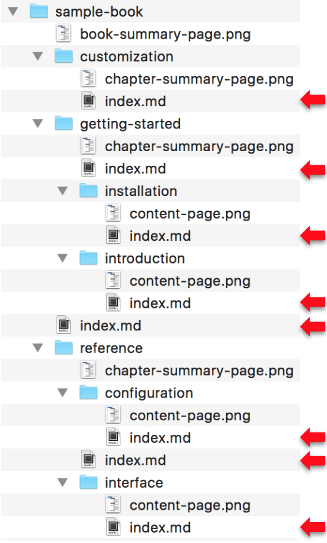
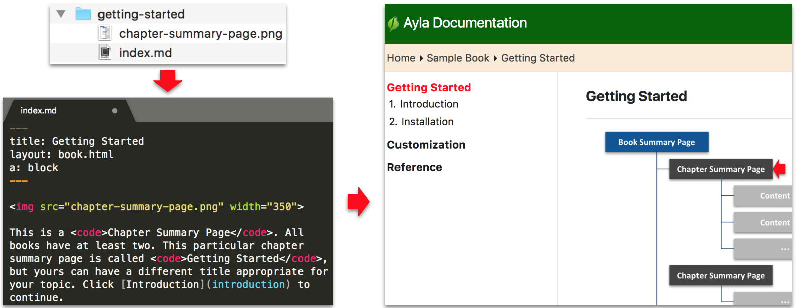

Content on this site is organized into <code>Books</code>. A book has two views as demonstrated by our Sample Book:

1. The [Published view](/sample-book) is what customers, partners, and colleagues see.
1. The [Repository view](https://github.com/AylaNetworks/ayla-documentation/tree/master/src/sample-book) is where your source files live. Note the following:
  1. All markdown files are named <code>index.md</code>.
  
  1. Image files and the index.md file on which they appear almost always reside in the same directory.
  
