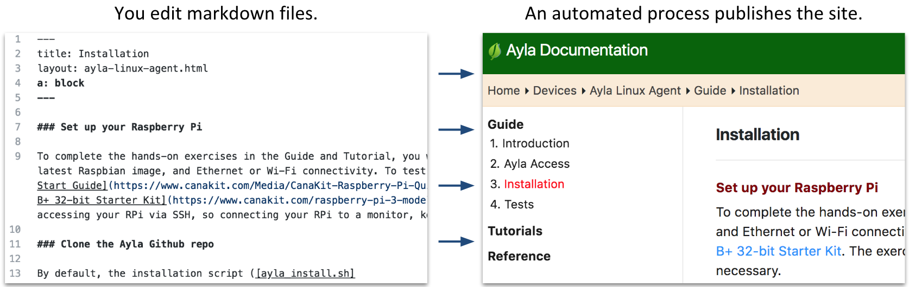

Authoring pages for the Ayla Documentation website is easy, crucial to Ayla's success, and an optimal way to record <code>How To's</code> for your own use, for the use of customers, partners, and colleagues.

The process is straightforward: (A) You edit [Github](https://github.com/AylaNetworks/ayla-documentation) markdown files, and (B) we use an automated process to publish the site.

We also provide iterative help with organization, diagrams, editing, etc.

To get started, click [Overview](overview).