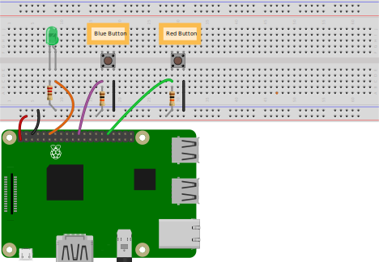

Use an HTML <code>&lt;img&gt;</code> tag (without linefeeds) to interject an image into a list:

<pre>
1. Shutdown your Raspberry Pi.
1. Wire the GPIO pins on your RPi as seen in the diagram below.
&lt;img src="pinout.svg" width="500"&gt;
1. Restart your Raspberry Pi.  
</pre>

Here is the rendered list:

1. Shutdown your Raspberry Pi.
1. Wire the GPIO pins on your RPi as seen in the diagram below.

1. Restart your Raspberry Pi.