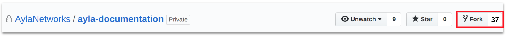
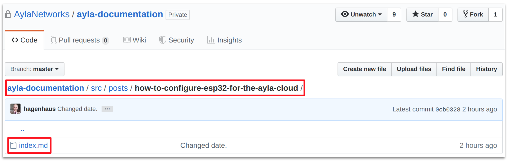
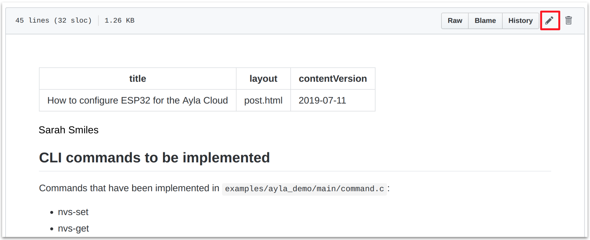
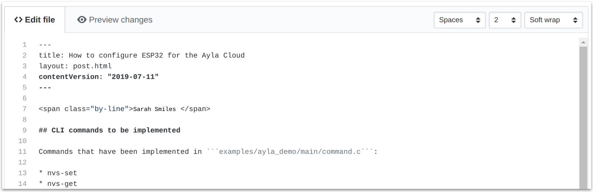
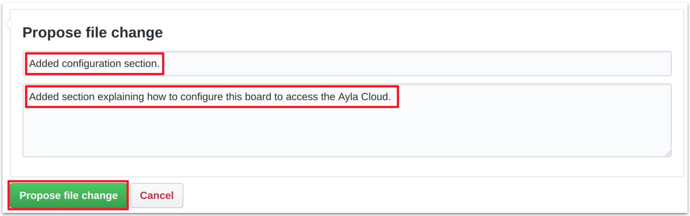
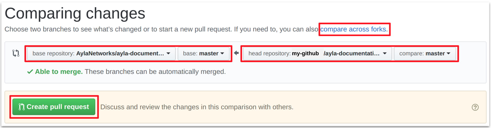
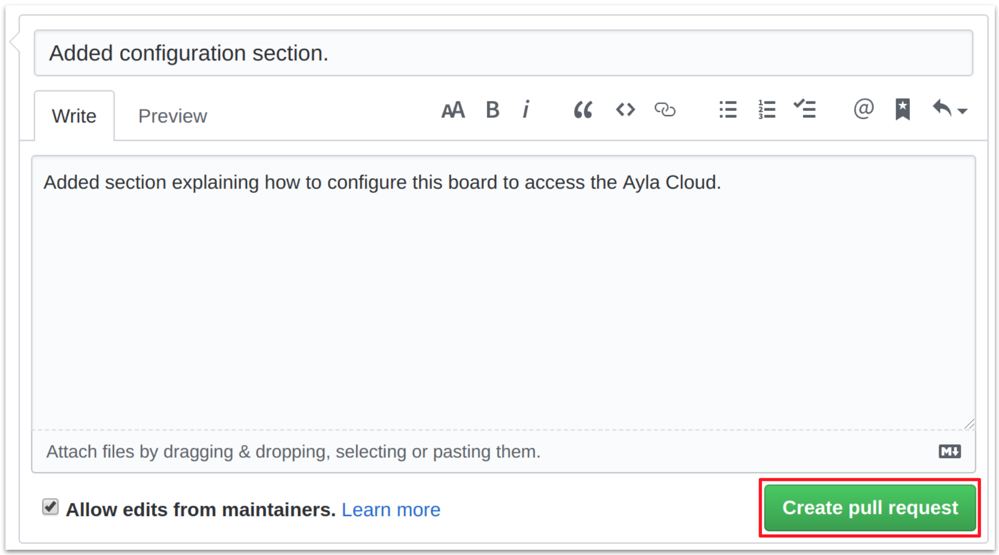

<span class="by-line">Matt Hagen</span>

This post explains how to contribute a post or other content to the [Ayla Docs](https://docs.aylanetworks.com) website.

1. If you don't yet have access to [github.com/AylaNetworks/ayla-documentation](https://github.com/AylaNetworks/ayla-documentation), request access via the [Contact](https://docs.aylanetworks.com/contact/) form.
1. Fork [github.com/AylaNetworks/ayla-documentation](https://github.com/AylaNetworks/ayla-documentation) to create a copy of the repo in your own Github account:

1. In either the original or forked repository, navigate to, and click, the ```index.md``` file you want to edit:

The contents of the file will resemble the following. Note the Pencil icon.

1. Click the Pencil icon to enable the editing view:

1. Modify the file using [Github Markdown](https://guides.github.com/features/mastering-markdown/).
1. Scroll to the bottom of the page, and propose a file change:

1. Click ```Create pull request``` after verifying that the head repository is yours:

1. Click ```Create pull request``` again:

1. Exit this particular Github page without clicking any other buttons. The Ayla Docs admin will evaluate the pull request, and then merge/publish the new content, or contact you for further discussion.
