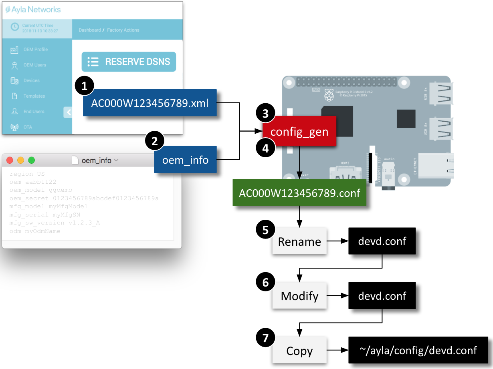

Matt Hagen

This page shows you how to create an Ayla Linux Agent configuration file (devd.conf) that permits the agent to access your company's OEM account in the Ayla Cloud. The diagram below illustrates the steps:

### 1. Create a dsn.xml file

1. Browse to the [Ayla Dashboard Portal](/content/ayla-dashboard-portal/), and log in.
1. Click Factory Actions in the sidebar.
1. Click the Reserve DSNs button.
1. For Model, select <code>AY001MRT1-Linux Software Agent</code>.
1. In the textbox on the right, select 1.
1. Click Submit. Ayla reserves for you a unique Device Serial Number (DSN) (e.g. AC000W123456789).
1. Download the archive file to your computer.
1. Unzip the archive file to extract the XML file.
1. Secure Copy the XML file from your computer to <code>/home/pi</code> on your RPi:
<pre>
$ scp AC000W123456789.xml pi&#64;192.168.1.9:
</pre>

### 2. Create on oem_info file

1. On your computer, create a text file called <code>oem_info</code>.
1. Copy and paste the content below. Each line is a space-delimited, key:value pair with no quotes.
<pre>
region myRegion
oem myOemId
oem_model myOemModel
oem_secret myOemSecret
mfg_model myMfgModel
mfg_serial myMfgSN
mfg_sw_version v1.2.3_A
odm myOdmName
</pre>
1. Replace <code>myRegion</code> with US, EU, or CN.
1. Replace <code>myOemId</code> with your oemId (see Ayla Dashboard Portal &gt; OEM Profile &gt; OEM ID).
1. Replace <code>myOemModel</code> with the <code>linuxevb</code>.
1. Replace <code>myOemSecret</code> with your oemSecret (see Ayla Dashboard Portal &gt; OEM Profile &gt; OEM Secret)
1. Leave the other values alone, and save. 
1. Secure Copy the file to <code>/home/pi</code> on your RPi:
<pre>
$ scp oem_info pi&#64;192.168.1.9:
</pre>

### 3. Make the config_gen utility

1. On your RPi, change directory to your Ayla source directory:
<pre>
$ cd &#126;/device_linux_public
</pre>
1. Build config_gen. 
<pre>
$ sudo make host_utils
</pre>
The newly built utility is in <code>&#126;/device_linux_public/build/native/utils</code>.

### 4. Run config_gen to generate devd.conf

1. From <code>/home/pi</code>, run <code>config_gen</code> to view command-line options.
1. Run config_gen to generate a <code>.conf</code> file:
<pre>
$ ./device_linux_public/build/native/utils/config_gen -n -d ./AC000W123456789.xml -i ./oem_info
</pre>

### 5. Rename to devd.conf

Rename the resulting <code>AC000W123456789.conf</code> file to <code>devd.conf</code> (overwriting any existing one), and leave it in <code>/home/pi</code>.

<pre>
$ mv AC000W123456789.conf devd.conf
</pre>

### 6. Modify devd.conf

<ol>
<li>Open <code>devd.conf</code>.</li>
<li>Add <code>,"server": {"default": 1}</code> to the <code>client</code> section as indicated in yellow below, and save. Don't forget the initial comma. This addition is important for initial prototyping, but must be removed when the device is deployed on your production platform.
<pre>
{
  "config": {
    "sys": {
      "factory": 1
    },
    "id": {
      "dsn": "AC000W123456789",
      "rsa_pub_key": "-----BEGIN RSA PUBLIC KEY-----\nMIIB...
    },
    "client": {
      "region": "US",
      "server": {
          "default": 1
      }
    },
    "oem": {
      "oem": "0aaa111e",
      "model": "linuxevb",
      "key": "UT9...
    }
  }
}
</pre>
This addition is important for initial prototyping, but must be removed when the device is deployed on your production platform.
</li>
</ol>

### 7. Copy devd.conf

Copy <code>devd.conf</code> from <code>&#126;/</code> to <code>&#126;/ayla/config</code>:
<pre>
$ sudo cp devd.conf ~/ayla/config/devd.conf
</pre>
