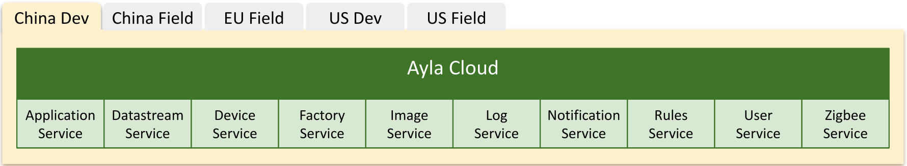

The Ayla Cloud provides a REST Application Programming Interface (API) for the following services across five regions:



See the following:

<ul>
<li><a href="https://developer.aylanetworks.com/apibrowser">Ayla API Browser</a></li>
<li><a href="/data-management/ayla-datastream-service/#api">Ayla Datastream Service</a></li>
<li><a href="/archive/ayla-factory-service-api-specification">Ayla Factory Service API Specification</a></li>
<li><a href="/archive/ayla-rbac-api-specification">Ayla RBAC API Specification</a></li>
<li><a href="/archive/ayla-rules-api-specification">Ayla Rules API Specification</a></li>
<li><a href="/archive/ayla-service-api-specification">Ayla Service API Specification</a></li>
</ul>

<!--
Topics to include on this page:

* Explanation of the API organization, schema, filters, pagination, throttling.
* Authentication
* Available client libraries that wrap the API.
* Link to the new [API Browser](api-browser).
* Link to the [Change Log](change-log).
* Explanation of API-related terminology.
  * Resource is ```/users``` or ```/users/{userId}```.
  * Method is ```GET```, ```POST```, etc.
  * Operation is ```GET /users/{userId}```.
  * API is all operations. 
* API Terms of Service
* [CommonMark](https://commonmark.org/help/)
-->
