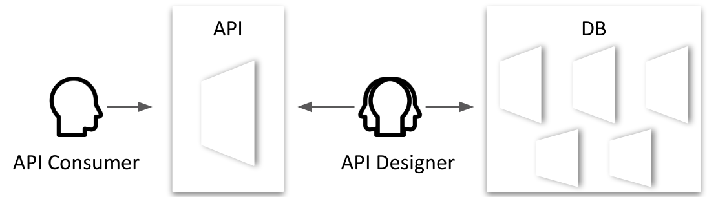

## Perspectives

The best data perspective for API consumers may not align with the perspective offered by internal data models, so API designers must map between the two: 



See also [Your data model is not an API](https://tyk.io/your-data-model-is-not-an-api).

## Resources

REST APIs should be organized into resources. A resource is a collective noun (e.g. car). An item is an instance of a resource. Depending on your needs, an item might denote a kind of thing:

```
{
  "id":111
  "year":"2018",
  "make":"Honda",
  "model":"Civic",
  "trim":"LX",
}
```

Or, it might denote a particular thing:

```
{
  "id":222
  "vin":"1HGBH41JXMN109186"
  "year":"2018",
  "make":"Honda",
  "model":"Civic",
  "trim":"LX",
}
```

A collection is a set of items. 

```
[
  {
    "id":222
    "vin":"1HGBH41JXMN109186"
    "year":"2018",
    "make":"Honda",
    "model":"Civic",
    "trim":"LX",
  },
  {
    "id":333
    "vin":"1HGBH41JXMN101234"
    "year":"2018",
    "make":"Honda",
    "model":"Civic",
    "trim":"LX",
  }
]
```

The following table provides resource examples from the IoT domain:

|Item|Collection|
|-|-|
|device|devices|
|file|files|
|filter|filters|
|group|groups|
|image|images|
|job|jobs|
|property|properties|
|schedule|schedules|
|subscription|subscriptions|
|trigger|triggers|
|role|roles|
|rule|rules|
|user|users|

## Services

## Operations

## Identification

## Url Format

## Data Format

## Pagination

## References

* [API Design Guide - Postman](https://documenter.getpostman.com/view/1372588/S1LsZqc9?version=latest)
* [API Design Guide - Google](https://cloud.google.com/apis/design)
* [API Design Guidelines - PayPal](https://github.com/paypal/api-standards/blob/master/api-style-guide.md)
* [Web API design - Microsoft](https://docs.microsoft.com/en-us/azure/architecture/best-practices/api-design)
* [Your data model is not an API](https://tyk.io/your-data-model-is-not-an-api/)

https://www.vinaysahni.com/best-practices-for-a-pragmatic-restful-api
https://stackoverflow.blog/2020/03/02/best-practices-for-rest-api-design/
https://docs.microsoft.com/en-us/azure/architecture/best-practices/api-design
https://www.moesif.com/blog/api-guide/api-design-guidelines/
https://florimond.dev/blog/articles/2018/08/restful-api-design-13-best-practices-to-make-your-users-happy/
https://www.merixstudio.com/blog/best-practices-rest-api-development/
https://medium.com/hashmapinc/rest-good-practices-for-api-design-881439796dc9
https://restfulapi.net/resource-naming/
https://swagger.io/blog/api-design/api-design-best-practices/
https://hackernoon.com/restful-api-designing-guidelines-the-best-practices-60e1d954e7c9
