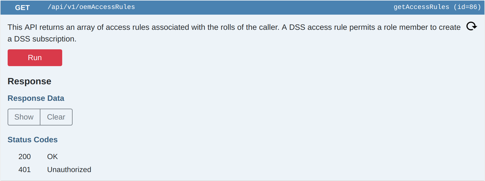
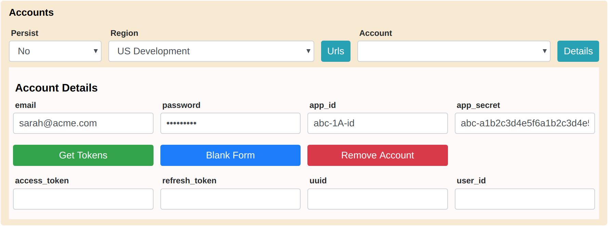
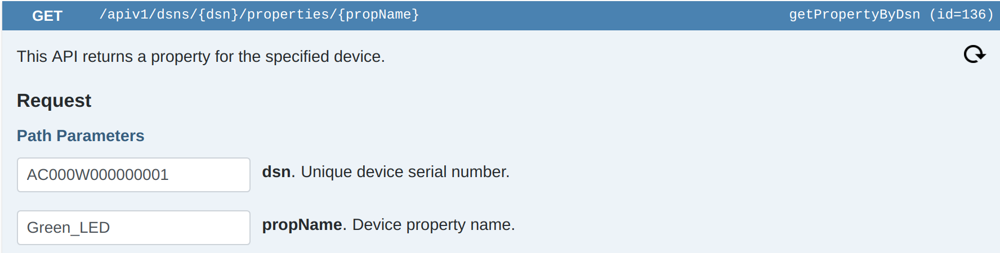

<aside id="pagebar" class="d-xl-block collapse">
  <ul>
    <li><a href="#core-title">API Guide</a>
      <ul>
        <li><a href="#overview">Overview</a></li>
        <li><a href="#panels">Panels</a></li>
        <li><a href="#tutorials">Tutorials</a></li>
      </ul>
    </li>
    <li><a href="#datastream-service">Datastream Service</a>
      <ul>
        <li><a href="#dss-overview">DSS Overview</a></li>
        <li><a href="#dss-tutorial">DSS Tutorial</a></li>
      </ul>
    </li>
    <li><a href="#device-service">Device Service</a>
      <ul>
        <li><a href="#ads-overview">ADS Overview</a></li>
        <li><a href="#notifications-and-triggers">Notifications & Triggers</a></li>
      </ul>
    </li>
    <li><a href="#iot-command-center">IoT Command Center</a>
      <ul>
        <li><a href="#icc-overview">ICC Overview</a></li>
        <li><a href="#set-property-tutorial">Set Property Tutorial</a></li>
      </ul>
    </li>
  </ul>
</aside>

This guide shows you how to use the [API Browser](../api-browser). In preparation, please watch the video on the [Cloud Services](../) page, and open the API Browser in another tab. For instructions about managing account credentials, see the Accounts Panel section under [Panels](#panels).

## Overview

The API Browser is organized into Panel Buttons and Service Buttons:

Panel buttons, like the Accounts Button, open and close panels:

Service buttons, like the Datastream Service button, open and close lists of API buttons:

API buttons, like the getAccessRules button, open and close API cards which enable you to run APIs and show results:

Each API card contains only the sections required by the API. For example, createDatapointByDevId requires path parameters and a request data object, but no query parameters:

And, getDevices accepts several optional query parameters, but no path parameters or request data object:


## Panels

The API Browser includes five panels: Accounts, Devices, Streams, Events, and Filter.

### Accounts Panel

The Accounts panel enables you to obtain an access token for each of your Ayla user accounts. Ayla API requests require an Authorization header specifying an Ayla-provided access token. Here is an example:

```
"Authorization": "auth_token 1234567890abcdef1234567890abcdef"
```

The API Browser automatically adds this header, including an access token, to each API call once you obtain a valid access token. Here's how to obtain one:

1. Click API Browser > Accounts to open the Accounts panel. Then, choose a region.

1. Click Details, enter your email and password, and, if you are targeting an Ayla Company Account, enter an app_id and app_secret obtained from the [Ayla Dashboard Portal](/system-administration/ayla-dashboard-portal/):

1. Click Get Tokens to display your account name, access_token, refresh_token, uuid, and userId.

<div style="color:red;">The API Browser does not yet use refresh tokens to automatically refresh access tokens. So, you may need to click Return Tokens and then Get Tokens to refresh an access token for a particular account.</div>
1. Click Blank Form, and repeat these steps to access another account.

By default, the API Browser stores your credentials and tokens in cache memory only which helps to ensure that your information remains safe. Remember to clear browser cache when you finish using a public computer. If you are using your own computer, persisting account credentials to browser local storage is convenient because it eliminates the need to re-enter your credentials every time you access the API Browser. To do so, set Persist to Yes on the Accounts panel. Setting Persist to Yes causes the API Browser to save current and future account information to local storage. Setting it to No causes the API Browser to delete the information from local storage, and stops the API Browser from saving the information to local storage in the future.

### Devices Panel

The Devices panel, which abstracts a handful of Device Service APIs, is a convenient (though non-essential) feature of the API Browser. Follow these steps to explore the Devices panel:

1. Click API Browser > Devices to open the Devices panel.

<div>The Accounts panel and the Devices panel work together. When, in the Accounts panel, you select a particular region and account, the Devices panel loads, from that account, the first 50 of your devices ordered by product_name.</div>
1. Select various devices and properties.
1. Click the Details buttons to see device and property details.
1. Change the property value of any "To Device" property.
1. Go to API Browser > Device Service > getPropertyByDsn:

<div>Note that the dsn and propName path parameters are already populated with values from the currently selected device and property in the Devices panel. Both the Accounts panel and the Devices panel dynamically populate various API fields, all of which can be overwritten as needed.</div>

### Streams Panel

Use the Streams panel to establish a WebSocket connection between the Ayla Datastream Service and your browser. See [Datastream Service](#datastream-service) below for an example.

### Events Panel

Use the Events panel to display DSS events received from the Ayla Datastream Service via a stream. See [Datastream Service](#datastream-service) below for an example.

### Filter Panel

Use the Filter panel to show/hide sets of related APIs.


## Tutorials

The turorials on this page refer to the following devices:

|product_name|dsn|model|oem_model|
|-|-|-|
|Device 1|AC000W000000001|AY008ESP1|ledevb|
|Device 2|AC000W000000002|AY008ESP1|ledevb|

Each of these devices includes the properties in the table below. Regarding the ```direction``` column, ```output``` means data flows from the device to the cloud, and ```input``` means data flows from the cloud to the device.

|name|base_type|direction|notes|
|-|-|-|-|-|
|Blue_button|boolean|output||
|Blue_LED|boolean|input||
|Green_LED|boolean|input||
|cmd|string|input|Sets log = cmd.|
|log|string|output||
|input|integer|input|Sets output = input.|
|output|integer|output||
|decimal_in|decimal|input|Sets decimal_out = decimal_in.|
|decimal_out|decimal|output||
|upload_file|file|input|Upload file to this property|
|download_file|file|output|Download file from this property|

You can benefit from the tutorials in several ways including the following:

**Option 1**: Obtain two ESP32 boards, connect them to the Ayla Cloud following the steps in [Ayla ESP32 Solution](/edge-solutions/ayla-esp32-solution), name them accordingly, and follow the steps in the tutorials exactly.

**Option 2**: Use any two devices, connect them to the Ayla Cloud following the appropriate [Edge Solutions](/edge-solutions) guides, and adjust the tutorials to fit your devices.

**Option 3**: Read the tutorials, and apply the essential concepts to your existing devices.

# Datastream Service

This section shows you how to use Datastream Service APIs in conjunction with a WebSocket to (1) create OEM Access Rules, (2) create DSS subscriptions based on the rules, (3) create DSS event streams based on the subscription keys, and (4) receive events from the Ayla Cloud. 

## DSS Overview

The Ayla Datastream Service (DSS) is a WebSocket server capable of sustained, bidirectional communication over HTTP. It sends device-related event notifications (in near real-time) and heartbeats from the Ayla Cloud to subscribing WebSocket clients which receive the events and acknowledge the heartbeats. See the diagram:


The diagram shows the following:

1. An example device with a green LED, red LED, and black button.
1. A digital twin in the Ayla Cloud representing the device.
1. A browser-based WebSocket client receiving/displaying events and sending acknowledgements. 
1. A server WebSocket client (e.g. Node.js) receiving/persisting events and sending acks.

The DSS WebSocket server sends notifications of the following events to subscribed clients:

|Event|Description|
|-|-|
|connectivity|The Ayla Cloud is able/not able to interact with a registered device.|
|datapoint|A digital twin property value changed.|
|datapointack|A device-based Ayla Agent confirmed to the Ayla Cloud that a device property value changed.|
|location|A digital twin latitute/longitude value changed.|
|registration|The Ayla Cloud registered/unregistered a device.|

Below are the event formats:

### Connectivity Event

<pre>
{
  "seq": "1",
  "metadata": {
    "oem_id": "1234abcd",
    "oem_model": "ledevb",
    "dsn": "AC000W123456789",
    "resource_tags": [],
    "event_type": "connectivity"
  },
  "connection": {
    "event_time": "2018-09-24T10:26:37Z",
    "user_uuid": "b1234567-1234-1234-1234-a1234567890a",
    "status": "Online"
  }
} 
</pre>

### Datapoint Event

<pre>
{
  "seq": "13",
  "metadata": {
    "oem_id": "1234abcd",
    "oem_model": "linuxevb",
    "dsn": "AC000W123456789",
    "property_name": "Blue_LED",
    "display_name": "Blue_LED",
    "base_type": "boolean",
    "resource_tags": [],
    "event_type": "datapoint"
  },
  "datapoint": {
    "id": "f123f123-2abc-12ab-a1b2-1234567abcde",
    "created_at_from_device": null,
    "updated_at": "2018-09-24T10:25:14Z",
    "created_at": "2018-09-24T10:25:14Z",
    "user_uuid": "b1234567-1234-1234-1234-a1234567890a",
    "echo": true,
    "closed": false,
    "value": 0,
    "metadata": {}
  }
}
</pre>

### Datapointack Event

<pre>
{
  "seq": "2",
  "metadata": {
    "oem_id": "1234abcd",
    "oem_model": "linuxevb",
    "dsn": "AC000W123456789",
    "property_name": "Blue_LED",
    "display_name": "Blue_LED",
    "base_type": "boolean",
    "resource_tags": [],
    "event_type": "datapointack"
  },
  "datapoint": {
    "id": "f123f123-2abc-12ab-a1b2-1234567abcde",
    "created_at_from_device": null,
    "updated_at": "2018-09-24T10:24:57Z",
    "created_at": "2018-09-24T10:24:57Z",
    "user_uuid": "b1234567-1234-1234-1234-a1234567890a",
    "echo": false,
    "closed": false,
    "value": 1,
    "ack_message": 0,
    "ack_status": 200,
    "ack_id": "f123f123-2abc-12ab-a1b2-1234567abcdf",
    "acked_at": "2018-09-24T10:24:57Z",
    "metadata": {}
  }
}
</pre>

### Location Event

<pre>
{
  "seq": "1",
  "metadata": {
    "oem_id": "1234abcd",
    "oem_model": "ledevb",
    "dsn": "AC000W123456789",
    "resource_tags": [],
    "event_type": "location"
  },
  "location_event": {
    "dsn": "AC000W123456789",
    "ip": "67.255.234.73",
    "lat": " 44.769500",
    "long": "-69.428300",
    "provider": "ip-based",
    "user_uuid": "b1234567-1234-1234-1234-a1234567890a",
    "created_at": "2018-09-24T11:04:07Z"
  }
}
</pre>

### Registration Event

<pre>
{
  "seq": "1",
  "metadata": {
    "oem_id": "1234abcd",
    "oem_model": "ledevb",
    "dsn": "AC000W123456789",
    "resource_tags": [],
    "event_type": "registration"
  },
  "registration_event": {
    "dsn": "AC000W123456789",
    "user_uuid": null,
    "registered": false,
    "registration_type": "AP-Mode",
    "unregistered_at": "2018-09-24T10:29:50Z"
  }
}
</pre>

### WebSocket Implementation

A Javascript client might instantiate a WebSocket in this manner: 

<pre>
let socket = new WebSocket(url + '?stream_key=' + key)
</pre>

The <code>url</code> parameter is region-specific. See API Browser > Accounts. Select a region, and click the URLs button. The <code>key</code> parameter specifies the subscription key. See the [DSS Tutorial](#dss-tutorial) below. Once constructed, a WebSocket client listens for events with a set of callback functions similar to the following:

<pre>
socket.onopen = function(msg){}
socket.onerror = function(msg){}
socket.onmessage = function(msg){}
socket.onclose = function(msg){}
</pre>

A WebSocket onmessage function receives MessageEvent objects that encapsulate DSS events or heartbeats. A MessageEvent object might include key/value pairs similar to the following: 

<pre>
bubbles: false
cancelBubble: false
cancelable: false
composed: false
currentTarget: WebSocket {}
data: "1|Z"
defaultPrevented: false
eventPhase: 0
isTrusted: true
lastEventId: ""
origin: "wss://stream.aylanetworks.com"
path: []
ports: []
returnValue: true
source: null
srcElement: WebSocket {}
target: WebSocket {}
timeStamp: 192795.29999988154
type: "message"
</pre>

The key/value pair of interest is <code>data:"1&#124;Z"</code>. The key is <code>data</code>. The value, <code>"1&#124;Z"</code>, indicates that this MessageEvent is a DSS heartbeat. If the MessageEvent had been an actual event (connectivity, datapoint, etc.), the value would have been similar to <code>data:"481&#124;{}"</code>. The number <code>481</code> represents the length of the JSON event string within the curly braces. The "&#124;" is useful for splitting the string into length and event. And, the curly braces, <code>{}</code>, encapsulate the actual JSON event string which might look like this:

<pre>{
  "seq": "13",
  "metadata": {
    "oem_id": "1234abcd",
    "oem_model": "linuxevb",
    "dsn": "AC000W123456789",
    "property_name": "Blue_LED",
    "display_name": "Blue_LED",
    "base_type": "boolean",
    "resource_tags": [],
    "event_type": "datapoint"
  },
  "datapoint": {
    "id": "f123f123-2abc-12ab-a1b2-1234567abcde",
    "created_at_from_device": null,
    "updated_at": "2018-09-24T10:25:14Z",
    "created_at": "2018-09-24T10:25:14Z",
    "user_uuid": "b1234567-1234-1234-1234-a1234567890a",
    "echo": true,
    "closed": false,
    "value": 0,
    "metadata": {}
  }
}</pre>

A DSS client onmessage function must (1) determine if a MessageEvent is a heartbeat or a DSS event, (2) respond if it's a heartbeat, and (3) process if it's a DSS event: 

<pre>socket.onmessage = function(msg) {
  if(msg.data.includes('|Z')) {
    stream.socket.send('Z')
  }
  else {
    var arr = msg.data.split('|')
    let event = JSON.parse(arr[1])
    process(event)
  }
}</pre>

## DSS Tutorial

The following DSS tutorial shows you how to listen for datapoint and location events.

### Create access rules

1. Go to API Browser > Datastream Service > createAccessRule.

1. Copy the following object into the Request Data box:
<pre>{
     "role": "OEM::Admin",
     "oem_model": "&#42;",
     "property_name": "&#42;",
     "client_type": "cloud",
     "subscription_type": "datapoint"
}</pre>
1. Click Run, and then click Show. The response data provides the new access rule id:
<pre>
{
     "OemAccessRule": {
     &nbsp;&nbsp;"id": 123,
     &nbsp;&nbsp;"role": "OEM::Admin",
     &nbsp;&nbsp;"oem": "1234abcd",
     &nbsp;&nbsp;"property_name": "&#42;",
     &nbsp;&nbsp;"oem_model": "&#42;",
     &nbsp;&nbsp;"client_type": "cloud",
     &nbsp;&nbsp;"subscription_type": "datapoint",
     &nbsp;&nbsp;"access_grant": true,
     &nbsp;&nbsp;"created_at": "2020-01-01T17:09:13Z",
     &nbsp;&nbsp;"updated_at": "2020-01-01T17:09:13Z"
     }
}
</pre>
<div>This access rule allows OEM admins to subscribe to datapoint events.</div>
1. Create another rule allowing OEM admins to subscribe to location events.

### Create subscriptions

1. Go to API Browser > Datastream Service > createSubscription.

1. Copy the following object into the Request Data box:
<pre>{
     "name": "Datapoint Subscription",
     "description": "This subscription allows reception of datapoint events.",
     "dsn": "&#42;",
     "oem_model": "ledevb",
     "property_name": "&#42;",
     "client_type": "cloud",
     "subscription_type": "datapoint"
}</pre>
1. Click Run, and then click Show. The response data provides the new subscription key:
<pre>{
     "subscription": {
     &nbsp;&nbsp;"id": 12345,
     &nbsp;&nbsp;"oem": "1234abcd",
     &nbsp;&nbsp;"dsn": "&#42;",
     &nbsp;&nbsp;"name": "Datapoint Subscription",
     &nbsp;&nbsp;"description": "This subscription allows reception of datapoint events.",
     &nbsp;&nbsp;"property_name": "&#42;",
     &nbsp;&nbsp;"connection_status": "Offline",
     &nbsp;&nbsp;"batch_size": 1,
     &nbsp;&nbsp;"is_suspended": false,
     &nbsp;&nbsp;"created_at": "2020-01-01T17:50:55Z",
     &nbsp;&nbsp;"updated_at": "2020-01-01T17:50:55Z",
     &nbsp;&nbsp;"date_suspended": null,
     &nbsp;&nbsp;"user_uuid": "b1234567-1234-1234-1234-a1234567890a",
     &nbsp;&nbsp;"oem_model": "ledevb",
     &nbsp;&nbsp;"stream_key": "ab12cd34ef56ab12cd34ef56ab12cd01",
     &nbsp;&nbsp;"client_type": "cloud",
     &nbsp;&nbsp;"subscription_type": "datapoint"
     }
}</pre>
<div>This subscription allows the reception of datapoint events.</div>
1. Create another subscription allowing the reception of location events. Be sure to modify the name, description, and subscription_type of the request data.

### Create events streams

1. Click API Browser > Streams to open the Streams panel.

1. Enter a stream name and a stream key (from the appropriate subscription). Leave start and end blank:

1. Click Create:

<div>ES stands for Event Stream. The API Browser automatically numbers event streams. The Events column represents the number of events received by the stream. HBs stands for heartbeats. The Ayla Datastream Service sends heartbeats to listening WebSockets every 30 seconds. The HBs column represents the number of heartbeats received.</div>
1. Create a Location Stream:

1. Close the Streams panel.

### Monitor datapoint events

1. Open the Devices and Events panels, and select Device 1 and Green_LED:

1. Toggle the Green_LED property value several times to generate and receive several datapoint events:

1. Click a datapoint row to see details:

1. Change the values of other properties, and receive additional datapoint events.

### Monitor location events

1. Go to API Browser > Device Service > updateDeviceLocation.

1. Enter an appropriate devId path parameter.
1. Copy coordinates (e.g. Paris, France) into the Request Data box:
<pre>{
     "location": {
     &nbsp;&nbsp;"lat": "48.864716",
     &nbsp;&nbsp;"long": "2.349014"
     }
}</pre>
1. Click Run.
1. Check the Events panel:


### Delete event streams

1. Open the Streams panel, and select both streams:

1. Click Delete.

# Device Service

## ADS Overview

Ayla Device Service (ADS) APIs enable client applications to interact with cloud-based digital twins (or models) that represent real-world devices:

In the diagram, the yellow box on the left represents a real-world device with a handful of properties, and the pink box on the right represents the corresponding cloud-based digital twin. Client applications typically interact via ADS with the digital twin, and the Ayla Cloud manages communication between the digital twin and the real-world device.

## Notifications and Triggers

<iframe 
  width="560" 
  height="315" 
  src="https://www.youtube.com/embed/xokI8XTon_k" 
  frameborder="0" 
  allow="accelerometer; autoplay; encrypted-media; gyroscope; picture-in-picture" 
  allowfullscreen>
</iframe>

# IoT Command Center

## ICC Overview

This section shows you how to use IoT Command Center APIs to perform the actions in the table below:

|ID|Name|Description|
|-|-|-|
|1|SET_PROPERTY|Update one or more property values for a set of devices.|
|4|OTA|Update host application firmware for a set of devices.|
|5|FILE_TRANSFER|Transfer files to/from file properties for a set of devices.|

In general, client applications use the following pattern to interact with ICC:

1. Create a filter that specifies target devices. Filters use device property values, device attributes, device serial numbers, and other criteria, often in combination.
1. Create a job that specifies the action, filter, execution method (one-time or continuous), delivery option (system-push or user-consent), and schedule option (immediate or scheduled).
1. Configure the job according to the action. If setting properties, specify the properties to set and the values to use. If updating firmware, specify the new firmware version, etc. If transferring files, specify the file name, etc.
1. Add a schedule if needed.
1. Start the job.

## Set Property Tutorial

The set_property action enables you create a job that sets one or more property values for a set of filtered devices.

### Initialize devices

1. Go to API Browser > Devices.
1. Select Device = Device 1, Property = Green_LED, and set to "on" (i.e. 1).

1. Select Device = Device 2, Property = Green_LED, and set to "on" (i.e. 1).

### Create a filter

1. Go to API Browser > IoT Command Center > previewFilter.

1. Copy the following filter request object into the Request Data box:
<pre>{
     "name": "AY008ESP1 devices where Green_LED = 1",
     "description": "This filter uses an attribute array and a property array.",
     "attributes": [
       {
         "key": "model",
         "value": "AY008ESP1",
         "op": "="
       }
     ],
     "properties":[
       {
         "key": "Green_LED",
         "op": "=", 
         "value":"1"
       }
     ],
     "oem_model": "ledevb"
}</pre>
1. Click Run, and then click Show. The response data is an array of filtered devices:
<pre>{
     "total": 2,
     "oem_model": "ledevb",
     "devices": [
       {
         "lifecycle": "registered",
         "connection_status": "Online",
         "connected_at": "2019-12-23 00:00:00",
         "dsn": "AC000W000000001"
       },
       {
         "lifecycle": "registered",
         "connection_status": "Online",
         "connected_at": "2019-12-23 00:00:00",
         "dsn": "AC000W000000002"
       }
     ]
}</pre>
1. Go to API Browser > IoT Command Center > createFilter.

1. Copy the same filter request object into the Request Data box:
1. Click Run, and then click Show. The response data is a Filter Object. It should resemble the following:
<pre>{
     "id": 2250,
     "name": "AY008ESP1 devices where Green_LED = 1",
     "description": "This filter uses an attribute array and a property array.",
     "attributes": [
       {
         "key": "model",
         "value": "AY008ESP1",
         "op": "="
       }
     ],
     "dsns": null,
     "properties": [
       {
         "key": "Green_LED",
         "value": "1",
         "metadata": null,
         "op": "="
       }
     ],
     "status": null,
     "oem_model": "ledevb",
     "device_metadata": null,
     "created_at": "2019-12-24T10:03:28+0000",
     "updated_at": "2019-12-24T10:03:28+0000",
     "filter_metadata": [],
     "oem_version": null,
     "match_oem_version": true
}</pre>

### Create a job

1. Go to API Browser > IoT Command Center > createJob.

1. Copy the following object into the Request Data box:
<pre>{
     "name": "Set cmd and input",
     "description": "Set cmd and input for AY008ESP1 devices if Green_LED = 1",
     "type_id": "SET_PROPERTY",
     "filter_id": 2250,
     "exec_method": "ONE_TIME",
     "delivery_option": "SYSTEM_PUSH",
     "retries": 0
}</pre>
1. Click Run, and then click Show. The response data is a Job Object. It should resemble the following:
<pre>{
     "id": 2444,
     "name": "Set cmd and input",
     "description": "Set cmd and input for AY008ESP1 devices if Green_LED = 1",
     "status": "CREATED",
     "payload": null,
     "type_id": 1,
     "filter": {
       "id": 2250,
       "name": "AY008ESP1 devices where Green_LED = 1",
       "description": "This filter uses an attribute array and a property array.",
       "attributes": [
         {
           "key": "model",
           "value": "AY008ESP1",
           "op": "="
         }
       ],
       "dsns": null,
       "properties": [
         {
           "key": "Green_LED",
           "value": "1",
           "metadata": null,
           "op": "="
         }
       ],
       "status": null,
       "oem_model": "ledevb",
       "device_metadata": null,
       "created_at": "2019-12-24T10:03:28+0000",
       "updated_at": "2019-12-24T10:03:28+0000",
       "filter_metadata": [],
       "oem_version": null,
       "match_oem_version": true
     },
     "filter_name": "AY008ESP1 devices where Green_LED = 1",
     "schedule_type": "IMMEDIATE",
     "started_at": null,
     "stopped_at": null,
     "created_at": "2019-12-24T10:16:12+0000",
     "updated_at": "2019-12-24T10:16:12+0000",
     "device_total": 0,
     "devices_processing": 0,
     "devices_succeed": 0,
     "devices_failed": 0,
     "job_metadata": [],
     "exec_method": "ONE_TIME",
     "delivery_option": "SYSTEM_PUSH",
     "job_type": "Set property"
}</pre>

### Configure the job

1. Go to API Browser > IoT Command Center > setPropertiesForJob.

1. For Path Parameters > jobId, enter your jobId.
1. Copy the following object into the Request Data box:
<pre>{
     "properties": [
       {
         "key": "cmd",
         "value": "CMD_1"
       },
       {
         "key": "input",
         "value": "1"
       }
     ]
}</pre>
1. Click Run, and then click Show. The response data should be the same as the request data.

### Run the job

1. Go to API Browser > IoT Command Center > startJob.

1. For Path Parameters > jobId, enter your jobId.
1. Click Run, and verify that the returned status code = 200.
1. Go to API Browser > Devices.
1. Select Device = Device 1, Property = cmd, and verify that value = ```CMD_1```.

1. Select Device = Device 1, Property = input, and verify that value = ```1```.
1. Select Device = Device 2, and repeat for both properties.
1. The ```log``` and ```output``` properties for both devices should be ```CMD_1``` and ```1```, respectively, too.

### Test the filter

1. Go to API Browser > Devices.
1. Select Device = Device 2, Property = Green_LED, and set to "off" (i.e. 0).

1. Go to API Browser > IoT Command Center > setPropertiesForJob.
1. Configure the job to set cmd = CMD_2 and input = 2.
1. Go to API Browser > IoT Command Center > startJob, and run the job.
1. Verify that the job targeted Device 1, but not Device 2.
1. Reset Green_LED = 1 for Device 2.

### Inspect job devices

1. Go to API Browser > IoT Command Center > getDevicesSnapshot.

1. For Path Parameters > jobId, enter your jobId.
1. Click Run, and then click Show. The response data is an array of devices affected by the most recent job execution:
<pre>{
     "total": 1,
     "oem_model": "ledevb",
     "devices": [
       {
         "lifecycle": "registered",
         "connection_status": "Online",
         "connected_at": "2019-12-23 00:00:00",
         "dsn": "AC000W000000001"
       }
     ],
     "previous_page": null,
     "next_page": null,
     "current_page_number": 1,
     "start_count_on_page": 1,
     "end_count_on_page": 1
}</pre>
1. Go to API Browser > IoT Command Center > setPropertiesForJob.
1. Configure the job to set cmd = CMD_3 and input = 3.
1. Go to API Browser > IoT Command Center > startJob, and run the job.
1. Run getDevicesSnapshot again. The response data should resemble the following:
<pre>{
     "total": 2,
     "oem_model": "ledevb",
     "devices": [
       {
         "lifecycle": "registered",
         "connection_status": "Online",
         "connected_at": "2019-12-23 00:00:00",
         "dsn": "AC000W000000001"
       },
       {
         "lifecycle": "registered",
         "connection_status": "Online",
         "connected_at": "2019-12-23 00:00:00",
         "dsn": "AC000W000000002"
       }
     ],
     "previous_page": null,
     "next_page": null,
     "current_page_number": 1,
     "start_count_on_page": 1,
     "end_count_on_page": 2
}</pre>
