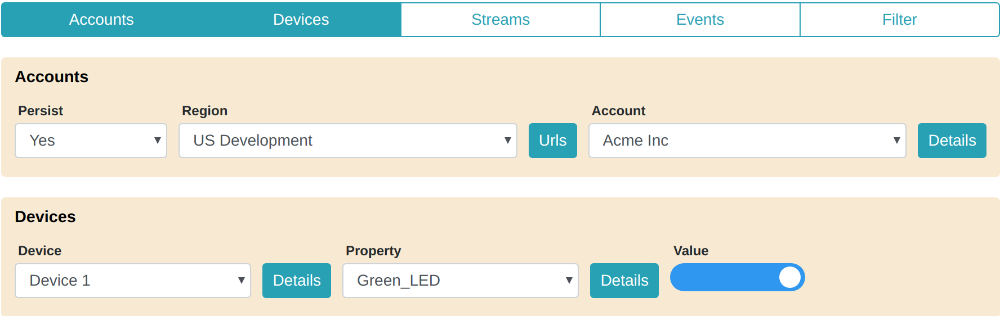

<aside id="pagebar" class="d-xl-block collapse">
  <ul>
    <li><a href="#core-title">API Guide</a>
      <ul>
        <li><a href="#accounts-panel">Accounts Panel</a></li>
        <li><a href="#devices-panel">Devices Panel</a></li>
        <li><a href="#example-devices">Example Devices</a></li>
      </ul>
    </li>
    <li><a href="#devices">Device Service</a></li>
    <li><a href="#properties">Datastream Service</a></li>
    <li><a href="#events">IoT Command Center</a></li>
  </ul>
</aside>

This page shows you how to use the [API Browser](../api-browser) to explore Ayla APIs. In preparation, please watch the video on the [Cloud Services](../) page, and open the API Browser in another tab. 

## Accounts Panel

Ayla API requests require an Authorization header specifying an Ayla-provided access token. Here is an example:

```
"Authorization": "auth_token 1234567890abcdef1234567890abcdef"
```

The API Browser automatically adds this header, including an access token, to each API call once you obtain a valid access token. Here's how to obtain one:

1. Click Accounts to open the Accounts panel, and choose a region.

1. Click Details, enter your email and password, and, if you are targeting an Ayla Company Account, enter an app_id and app_secret obtained from the [Ayla Dashboard Portal](/system-administration/ayla-dashboard-portal/):

1. Click Get Tokens to display your account name, access_token, refresh_token, uuid, and userId.

1. Click Blank Form, and repeat these steps to access another account.

By default, the API Browser stores your credentials and tokens in cache memory only, and deletes the information from cache memory when you exit the API Browser page. The data structure looks like this:

<pre>{
  "cndev": [],
  "cnfield": [],
  "eufield": [],
  "usdev": [
    {
      "email": "sarah@acme.com",
      "password": "MyPassword",
      "app_id": "abc-1A-id",
      "app_secret": "abc-a1b2c3d4e5f6a1b2c3d4e5f6XYZ",
      "access_token": "1234567890abcdef1234567890abcdef",
      "refresh_token": "1234512345abcabc1234512345abcabc",
      "uuid": "b1234567-1234-1234-1234-a1234567890a",
      "user_id": 1234567,
      "account_name": "Acme Inc"
    }
  ],
  "usfield": []
}</pre>

Although not recommended, if you use the API Browser on a public computer, this default behavior helps to ensure that your information remains safe. For additional security, clear cache when you are finished using a public computer. However, if you are using your own computer, persisting account credentials to browser local storage is convenient because it eliminates the need to re-enter your credentials every time you access the API Browser. To do so, set Persist to Yes on the Accounts panel. Setting Persist to Yes causes the API Browser to save current and future account information to local storage. Setting it to No causes the API Browser to delete the information from local storage, and stops the API Browser from saving the information to local storage in the future.

## Devices Panel

The Devices panel, which abstracts a handful of Device Service APIs, is a convenient (though non-essential) feature of the API Browser. Follow these steps to explore the Devices panel:

1. Click Devices to open the Devices panel.

<div>The Accounts panel and the Devices panel work together. When, in the Accounts panel, you select a particular region and account, the Devices panel loads, from that account, the first 50 of your devices.</div>
1. Select various devices and properties.
1. Click the Details buttons to see device and property details.
1. Change the property value of any "To Device" property.
1. Expand Device Service, and then expand getPropertyByDsn:

<div>Note that the dsn and propName path parameters are already populated with values from the currently selected device and property in the Devices panel. Both the Accounts panel and the Devices panel dynamically populate various API fields, all of which can be overwritten as needed.</div>

## Example Devices

The examples on this page refer to the following fictional devices:

|product_name|dsn|model|oem_model|
|-|-|-|
|Device A|AC000W000000001|AY008ESP1|ledevb|
|Device B|AC000W000000002|AY008ESP1|ledevb|

Each of these devices includes the properties in the table below. Regarding the ```direction``` column, ```output``` means data flows from the device to the cloud, and ```input``` means data flows from the cloud to the device.

|name|base_type|direction|notes|
|-|-|-|-|-|
|Blue_button|boolean|output||
|Blue_LED|boolean|input||
|Green_LED|boolean|input||
|cmd|string|input|Sets log = cmd.|
|log|string|output||
|input|integer|input|Sets output = input.|
|output|integer|output||
|decimal_in|decimal|input|Sets decimal_out = decimal_in.|
|decimal_out|decimal|output||
|upload_file|file|input|Upload file to this property|
|download_file|file|output|Download file from this property|

# Device Service

# Datastream Service

# IoT Command Center
