<aside id="pagebar" class="d-xl-block collapse">
  <ul>
    <li><a href="#core-title">API Users Guide</a></li>
    <li><a href="#receive-dss-v1-events">Receive DSS v1 events</a></li>
    <li><a href="#perform-ota-update">Perform OTA update</a></li>
    <li><a href="#update-property-values">Update property values</a></li>
  </ul>
</aside>

This guide provides examples of how to combine Ayla APIs to complete tasks. Many of the examples refer to the devices in the table below, but the examples are generally applicable to many different types of devices:

|product_name|dsn|model|oem_model|
|-|-|-|
|Device 1|AC000W000000001|AY008ESP1|ledevb|
|Device 2|AC000W000000002|AY008ESP1|ledevb|

See [Ayla ESP32 Solution](/edge-solutions/ayla-esp32-solution) to set up an ESP32 development environment, build an application consisting of an Ayla agent and an example host application, flash it to your devices, configure the devices, and connect them to the Ayla Cloud.

# Receive DSS v1 events

The following steps shows you how to listen for datapoint and location events using DSS v1.

### Get started

1. Open the [API Browser](/cloud-services/api-browser) in a dedicated browser tab. Click the Accounts tab. Select a region. Input your email, password, app_id, app_secret. Click Get Tokens. Click the Accounts tab again to close it.
1. Open the [Ayla ESP32 Solution](/edge-solutions/ayla-esp32-solution) page in another dedicated tab, and follow the instructions on the page to establish an ESP32 development environment, and to connect one or more devices to the Ayla Cloud.

### Create access rules

1. Go to API Browser > Datastream Service > createAccessRule.
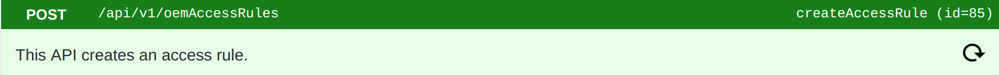
1. Copy the following object into the Request Data box:
<pre>{
     "role": "OEM::Admin",
     "oem_model": "&#42;",
     "property_name": "&#42;",
     "client_type": "cloud",
     "subscription_type": "datapoint"
}</pre>
1. Click Run, and then click Show. The response data provides the new access rule id:
<pre>
{
     "OemAccessRule": {
     &nbsp;&nbsp;"id": 123,
     &nbsp;&nbsp;"role": "OEM::Admin",
     &nbsp;&nbsp;"oem": "1234abcd",
     &nbsp;&nbsp;"property_name": "&#42;",
     &nbsp;&nbsp;"oem_model": "&#42;",
     &nbsp;&nbsp;"client_type": "cloud",
     &nbsp;&nbsp;"subscription_type": "datapoint",
     &nbsp;&nbsp;"access_grant": true,
     &nbsp;&nbsp;"created_at": "2020-01-01T17:09:13Z",
     &nbsp;&nbsp;"updated_at": "2020-01-01T17:09:13Z"
     }
}
</pre>
<div>This access rule allows OEM admins to subscribe to datapoint events.</div>
1. Create another rule allowing OEM admins to subscribe to location events.

### Create subscriptions

1. Go to API Browser > Datastream Service > createSubscription.
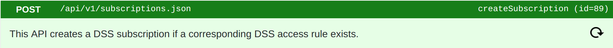
1. Copy the following object into the Request Data box:
<pre>{
     "name": "Datapoint Subscription",
     "description": "This subscription allows reception of datapoint events.",
     "dsn": "&#42;",
     "oem_model": "ledevb",
     "property_name": "&#42;",
     "client_type": "cloud",
     "subscription_type": "datapoint"
}</pre>
1. Click Run, and then click Show. The response data provides the new subscription key:
<pre>{
     "subscription": {
     &nbsp;&nbsp;"id": 12345,
     &nbsp;&nbsp;"oem": "1234abcd",
     &nbsp;&nbsp;"dsn": "&#42;",
     &nbsp;&nbsp;"name": "Datapoint Subscription",
     &nbsp;&nbsp;"description": "This subscription allows reception of datapoint events.",
     &nbsp;&nbsp;"property_name": "&#42;",
     &nbsp;&nbsp;"connection_status": "Offline",
     &nbsp;&nbsp;"batch_size": 1,
     &nbsp;&nbsp;"is_suspended": false,
     &nbsp;&nbsp;"created_at": "2020-01-01T17:50:55Z",
     &nbsp;&nbsp;"updated_at": "2020-01-01T17:50:55Z",
     &nbsp;&nbsp;"date_suspended": null,
     &nbsp;&nbsp;"user_uuid": "b1234567-1234-1234-1234-a1234567890a",
     &nbsp;&nbsp;"oem_model": "ledevb",
     &nbsp;&nbsp;"stream_key": "ab12cd34ef56ab12cd34ef56ab12cd01",
     &nbsp;&nbsp;"client_type": "cloud",
     &nbsp;&nbsp;"subscription_type": "datapoint"
     }
}</pre>
<div>This subscription allows the reception of datapoint events.</div>
1. Create another subscription allowing the reception of location events. Be sure to modify the name, description, and subscription_type of the request data.

### Create events streams

1. Click API Browser > Streams to open the Streams panel.
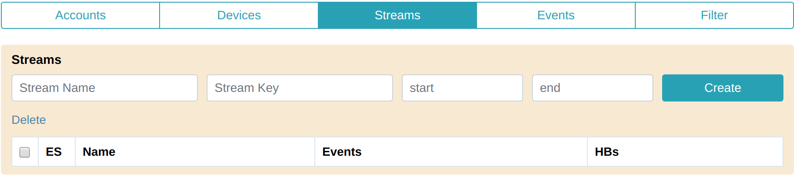
1. Enter a stream name and a stream key (from the appropriate subscription). Leave start and end blank:
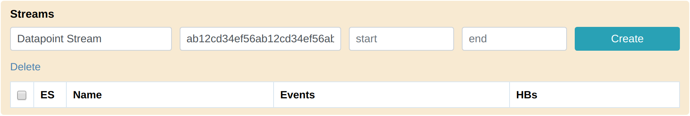
1. Click Create:

<div>ES stands for Event Stream. The API Browser automatically numbers event streams. The Events column represents the number of events received by the stream. HBs stands for heartbeats. The Ayla Datastream Service sends heartbeats to listening WebSockets every 30 seconds. The HBs column represents the number of heartbeats received.</div>
1. Create a Location Stream:
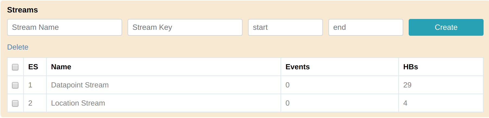
1. Close the Streams panel.

### Monitor datapoint events

1. Open the Devices and Events panels, and select Device 1 and Green_LED:
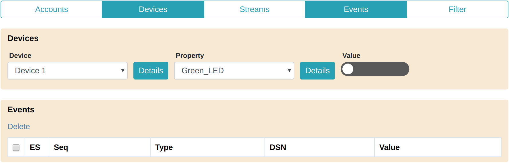
1. Toggle the Green_LED property value several times to generate and receive several datapoint events:
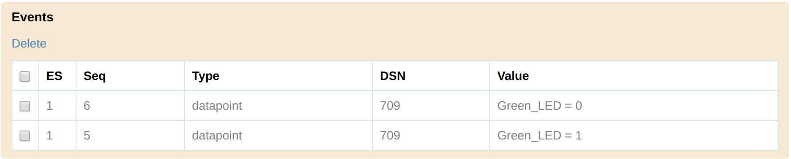
1. Click a datapoint row to see details:
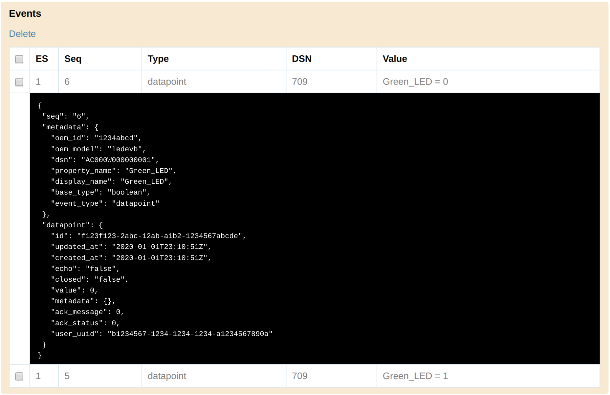
1. Change the values of other properties, and receive additional datapoint events.

### Monitor location events

1. Go to API Browser > Device Service > updateDeviceLocation.
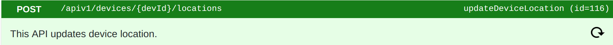
1. Enter an appropriate devId path parameter.
1. Copy coordinates (e.g. Paris, France) into the Request Data box:
<pre>{
     "location": {
     &nbsp;&nbsp;"lat": "48.864716",
     &nbsp;&nbsp;"long": "2.349014"
     }
}</pre>
1. Click Run.
1. Check the Events panel:


### Delete event streams

1. Open the Streams panel, and select both streams:
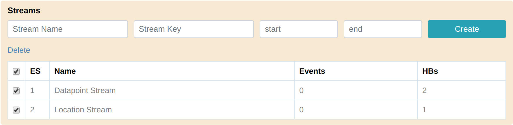
1. Click Delete.

# Perform OTA update

The following steps show you how (over-the-air) to upgrade the Ayla agent and/or host app running on your devices.

1. Open the [API Browser](/cloud-services/api-browser) in a dedicated browser tab. Click the Accounts tab. Select a region. Input your email, password, app_id, app_secret. Click Get Tokens. Click the Accounts tab again to close it.
1. Open the [Ayla ESP32 Solution](/edge-solutions/ayla-esp32-solution) page in another dedicated tab, and follow the instructions on the page to establish an ESP32 development environment, and connect one or more devices to the Ayla Cloud.
1. In your Docker shell, `cd /root/esp/esp-idf-v3.2/examples/ayla_demo`.
1. Open `main/demo_ledevb.c`, and set the following constants to values of your choice like this:
    ```
    #define BUILD_PROGNAME "esp32"
    #define BUILD_VERSION "1.00"
    ```
1. Run `make` and `make flash` to update the firmware on your device.
1. Use the API Browser's Device Tab to verify your device's `version` property value in the cloud. Example:
    ```
    esp32 1.00 Mar 26 2020 16:38:39
    ```
1. Increment `BUILD_VERSION` in `demo_ledevb.c`. Example:
    ```
    #define BUILD_VERSION "1.01"
    ```
1. Run `make`, but do not flash the image to the device. Here is the location of the new image file:
    ```
    /root/esp/esp-idf-v3.2/examples/ayla_demo/build/ayla_demo.bin
    ```
1. **In a host terminal**, copy the image file from the docker container to your host computer:
    ```
    $ docker cp esp:/root/esp/esp-idf-v3.2/examples/ayla_demo/build/ayla_demo.bin .
    ```
1. Rename the image file to indicate the version:
    ```
    $ mv ayla_demo.bin esp32_101.bin
    ```
1. In the API Browser, click the IoT Command Center tile to reveal the IoT APIs.
1. Run `createImageRecord` to create an image record using a request data object similar to the following:
    ```
    {
      "description": "esp32_101",
      "model": "ledevb",
      "version": "esp32_101"
    }
    ```
1. Run `uploadImage` to upload your image file, and associate it with the image record.
1. Run `getImageRecord` to verify your work. The response data object should resemble the one below. Check the `file_size` property. It reflects the size of the uploaded file (e.g. 1004064).
    ```
    {
      "oem": "1234abcd",
      "checksum": "1edacac70f418aac404d3e026165ed1e",
      "created_at": "2020/04/13 16:21:29",
      "description": "esp32_101",
      "file_location": "/0bbb112e/host/ledevb/ce0e1c025228c274c8851470cef4ea45",
      "file_size": 1004064,
      "in_use": true,
      "model": "ledevb",
      "updated_at": "2020/04/13 16:35:00",
      "uploaded_at": "2020/04/13 16:34:49",
      "user_id": "b1234567-1234-1234-1234-a1234567890a",
      "version": "esp32_101",
      "base_mod_img_model": null,
      "base_mod_img_version": null,
      "property_name": null
    }
    ```
1. Run `createFilter` to target the ESP32 device(s) you want to upgrade. ICC filters provide various ways of selecting device sets. The following request data object is one example:
    ```
    {
      "name": "My ESP32 Devices",
      "dsns": {
        "match": [
          "AC000W000000001",
          "AC000W000000002"
        ]
      },
      "oem_model": "ledevb"
    }
    ```
    Note the value of the `id` field (e.g. 6028) in the response data object.
1. Run `getFilter` to verify that the filter was created. The response data object should resemble the following:
    ```
    {
      "id": 6028,
      "name": "My ESP32 Devices",
      "description": null,
      "attributes": null,
      "dsns": {
        "match": [
          "AC000W000000001",
          "AC000W000000002"
        ],
        "include": null,
        "exclude": null
      },
      "properties": null,
      "status": null,
      "oem_model": "ledevb",
      "device_metadata": null,
      "created_at": "2020-04-13T17:13:59+0000",
      "updated_at": "2020-04-13T17:13:59+0000",
      "filter_metadata": [],
      "oem_version": null,
      "match_oem_version": true
    }
    ```
1. Run `createJob` with a request data object similar to the following:
    ```
    {
      "name": "Upgrade ESP32 devices to esp32_101",
      "type_id": "OTA",
      "filter_id": 6028,
      "delivery_option": "SYSTEM_PUSH",
      "exec_method": "ONE_TIME",
      "retries": 0,
      "action_payload": {
        "type":"host",
        "version":"esp32_101"
      }
    }
    ```
    Note the value of the `id` field (e.g. 4944) in the response data object.
1. Run `getJob` to verify job information. Note that `status = CREATED`.
1. Run `startJob`.

# Update property values

The following steps show you how to set property values for groups of devices.

### Get started

1. Open the [API Browser](/cloud-services/api-browser) in a dedicated browser tab. Click the Accounts tab. Select a region. Input your email, password, app_id, app_secret. Click Get Tokens. Click the Accounts tab again to close it.
1. Open the [Ayla ESP32 Solution](/edge-solutions/ayla-esp32-solution) page in another dedicated tab, and follow the instructions on the page to establish an ESP32 development environment, and to connect one or more devices to the Ayla Cloud.

### Initialize devices

1. Go to API Browser > Devices.
1. Select Device = Device 1, Property = Green_LED, and set to "on" (i.e. 1).
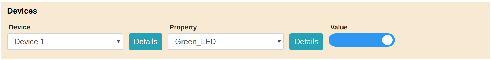
1. Select Device = Device 2, Property = Green_LED, and set to "on" (i.e. 1).

### Create a filter

1. Go to API Browser > IoT Command Center > previewFilter.

1. Copy the following filter request object into the Request Data box:
<pre>{
     "name": "AY008ESP1 devices where Green_LED = 1",
     "description": "This filter uses an attribute array and a property array.",
     "attributes": [
       {
         "key": "model",
         "value": "AY008ESP1",
         "op": "="
       }
     ],
     "properties":[
       {
         "key": "Green_LED",
         "op": "=", 
         "value":"1"
       }
     ],
     "oem_model": "ledevb"
}</pre>
1. Click Run, and then click Show. The response data is an array of filtered devices:
<pre>{
     "total": 2,
     "oem_model": "ledevb",
     "devices": [
       {
         "lifecycle": "registered",
         "connection_status": "Online",
         "connected_at": "2019-12-23 00:00:00",
         "dsn": "AC000W000000001"
       },
       {
         "lifecycle": "registered",
         "connection_status": "Online",
         "connected_at": "2019-12-23 00:00:00",
         "dsn": "AC000W000000002"
       }
     ]
}</pre>
1. Go to API Browser > IoT Command Center > createFilter.
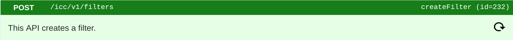
1. Copy the same filter request object into the Request Data box:
1. Click Run, and then click Show. The response data is a Filter Object. It should resemble the following:
<pre>{
     "id": 2250,
     "name": "AY008ESP1 devices where Green_LED = 1",
     "description": "This filter uses an attribute array and a property array.",
     "attributes": [
       {
         "key": "model",
         "value": "AY008ESP1",
         "op": "="
       }
     ],
     "dsns": null,
     "properties": [
       {
         "key": "Green_LED",
         "value": "1",
         "metadata": null,
         "op": "="
       }
     ],
     "status": null,
     "oem_model": "ledevb",
     "device_metadata": null,
     "created_at": "2019-12-24T10:03:28+0000",
     "updated_at": "2019-12-24T10:03:28+0000",
     "filter_metadata": [],
     "oem_version": null,
     "match_oem_version": true
}</pre>

### Create a job

1. Go to API Browser > IoT Command Center > createJob.
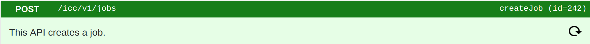
1. Copy the following object into the Request Data box:
<pre>{
     "name": "Set cmd and input",
     "description": "Set cmd and input for AY008ESP1 devices if Green_LED = 1",
     "type_id": "SET_PROPERTY",
     "filter_id": 2250,
     "exec_method": "ONE_TIME",
     "delivery_option": "SYSTEM_PUSH",
     "retries": 0
}</pre>
1. Click Run, and then click Show. The response data is a Job Object. It should resemble the following:
<pre>{
     "id": 2444,
     "name": "Set cmd and input",
     "description": "Set cmd and input for AY008ESP1 devices if Green_LED = 1",
     "status": "CREATED",
     "payload": null,
     "type_id": 1,
     "filter": {
       "id": 2250,
       "name": "AY008ESP1 devices where Green_LED = 1",
       "description": "This filter uses an attribute array and a property array.",
       "attributes": [
         {
           "key": "model",
           "value": "AY008ESP1",
           "op": "="
         }
       ],
       "dsns": null,
       "properties": [
         {
           "key": "Green_LED",
           "value": "1",
           "metadata": null,
           "op": "="
         }
       ],
       "status": null,
       "oem_model": "ledevb",
       "device_metadata": null,
       "created_at": "2019-12-24T10:03:28+0000",
       "updated_at": "2019-12-24T10:03:28+0000",
       "filter_metadata": [],
       "oem_version": null,
       "match_oem_version": true
     },
     "filter_name": "AY008ESP1 devices where Green_LED = 1",
     "schedule_type": "IMMEDIATE",
     "started_at": null,
     "stopped_at": null,
     "created_at": "2019-12-24T10:16:12+0000",
     "updated_at": "2019-12-24T10:16:12+0000",
     "device_total": 0,
     "devices_processing": 0,
     "devices_succeed": 0,
     "devices_failed": 0,
     "job_metadata": [],
     "exec_method": "ONE_TIME",
     "delivery_option": "SYSTEM_PUSH",
     "job_type": "Set property"
}</pre>

### Configure the job

1. Go to API Browser > IoT Command Center > setPropertiesForJob.
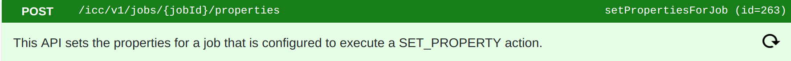
1. For Path Parameters > jobId, enter your jobId.
1. Copy the following object into the Request Data box:
<pre>{
     "properties": [
       {
         "key": "cmd",
         "value": "CMD_1"
       },
       {
         "key": "input",
         "value": "1"
       }
     ]
}</pre>
1. Click Run, and then click Show. The response data should be the same as the request data.

### Run the job

1. Go to API Browser > IoT Command Center > startJob.
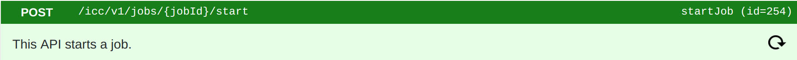
1. For Path Parameters > jobId, enter your jobId.
1. Click Run, and verify that the returned status code = 200.
1. Go to API Browser > Devices.
1. Select Device = Device 1, Property = cmd, and verify that value = ```CMD_1```.
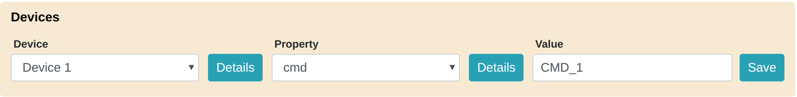
1. Select Device = Device 1, Property = input, and verify that value = ```1```.
1. Select Device = Device 2, and repeat for both properties.
1. The ```log``` and ```output``` properties for both devices should be ```CMD_1``` and ```1```, respectively, too.

### Test the filter

1. Go to API Browser > Devices.
1. Select Device = Device 2, Property = Green_LED, and set to "off" (i.e. 0).
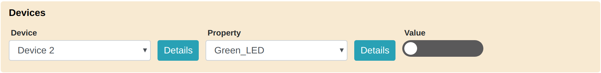
1. Go to API Browser > IoT Command Center > setPropertiesForJob.
1. Configure the job to set cmd = CMD_2 and input = 2.
1. Go to API Browser > IoT Command Center > startJob, and run the job.
1. Verify that the job targeted Device 1, but not Device 2.
1. Reset Green_LED = 1 for Device 2.

### Inspect job devices

1. Go to API Browser > IoT Command Center > getDevicesSnapshot.
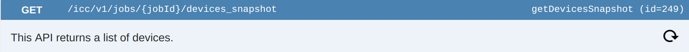
1. For Path Parameters > jobId, enter your jobId.
1. Click Run, and then click Show. The response data is an array of devices affected by the most recent job execution:
<pre>{
     "total": 1,
     "oem_model": "ledevb",
     "devices": [
       {
         "lifecycle": "registered",
         "connection_status": "Online",
         "connected_at": "2019-12-23 00:00:00",
         "dsn": "AC000W000000001"
       }
     ],
     "previous_page": null,
     "next_page": null,
     "current_page_number": 1,
     "start_count_on_page": 1,
     "end_count_on_page": 1
}</pre>
1. Go to API Browser > IoT Command Center > setPropertiesForJob.
1. Configure the job to set cmd = CMD_3 and input = 3.
1. Go to API Browser > IoT Command Center > startJob, and run the job.
1. Run getDevicesSnapshot again. The response data should resemble the following:
<pre>{
     "total": 2,
     "oem_model": "ledevb",
     "devices": [
       {
         "lifecycle": "registered",
         "connection_status": "Online",
         "connected_at": "2019-12-23 00:00:00",
         "dsn": "AC000W000000001"
       },
       {
         "lifecycle": "registered",
         "connection_status": "Online",
         "connected_at": "2019-12-23 00:00:00",
         "dsn": "AC000W000000002"
       }
     ],
     "previous_page": null,
     "next_page": null,
     "current_page_number": 1,
     "start_count_on_page": 1,
     "end_count_on_page": 2
}</pre>
