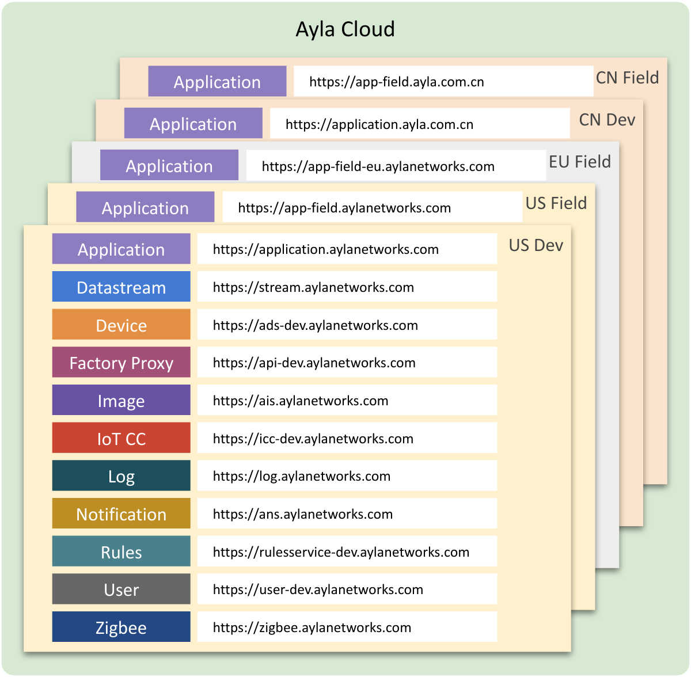

<aside id="pagebar" class="d-xl-block collapse">
  <ul>
    <li><a href="#core-title">Cloud Services</a></li>
  </ul>
</aside>

The Ayla Cloud offers the following services to client applications:

<ol style="margin-bottom:0;">
<li style="margin-top:0;">Application Service</li>
<li>Datastream Service</li>
<li>Device Service</li>
<li>Factory Proxy Service</li>
<li>Image Service</li>
<li>IoT Command Center</li>
</ol>

<ol style="margin-bottom:0;" start="7">
<li style="margin-top:0;">Log Service</li>
<li>Notification Service</li>
<li>Rules Service</li>
<li>User Service</li>
<li>Zigbee Service</li>
</ol>

Each service includes a set of public REST APIs. The [API Browser](api-browser) enables you to experiment with these APIs. See the sidebar for details about a particular service. Note that each service has a unique URL for each Ayla region as illustrated in the diagram below. To see the URL for a particular service/region, go to API Browser > Accounts > Urls.

