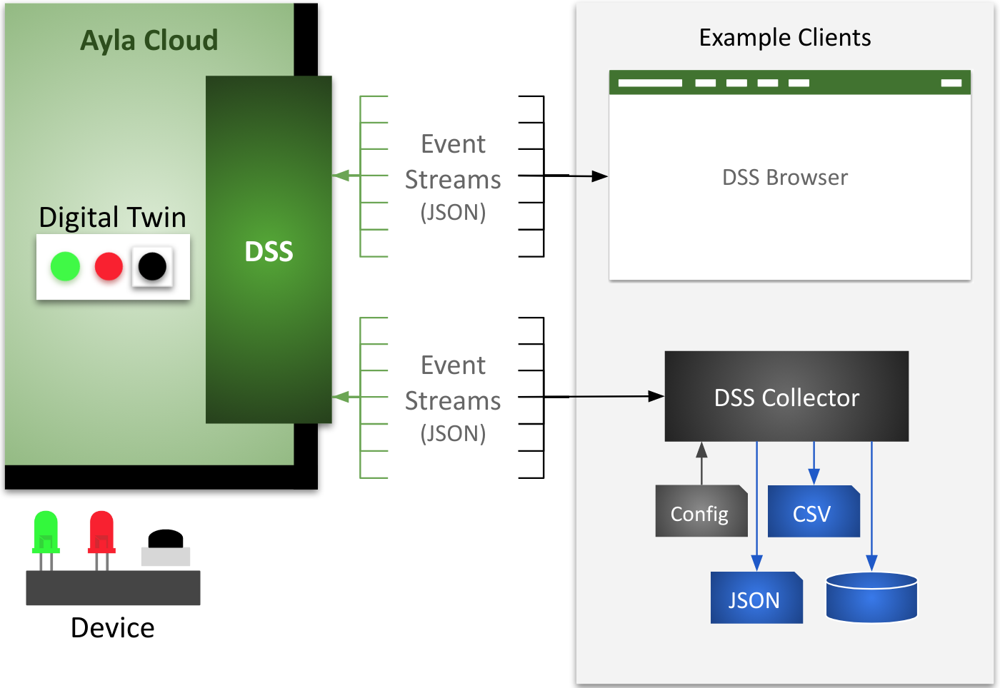

<aside id="pagebar" class="d-xl-block collapse">
  <ul>
    <li><a href="#core-title">Cloud Services</a></li>
    <li><a href="#datastream-service">Datastream Service</a>
      <ul>
        <li><a href="#dss-events">DSS Events</a></li>
        <li><a href="#dss-technology">DSS Technology</a></li>
      </ul>
    </li>
    <li><a href="#device-service">Device Service</a></li>
    <li><a href="#factory-proxy-service">Factory Proxy Service</a></li>
    <li><a href="#iot-command-center">IoT Command Center</a></li>
    <li><a href="#message-service">Message Service</a></li>
    <li><a href="#rules-service">Rules Service</a></li>
    <li><a href="#user-service">User Service</a></li>
  </ul>
</aside>

Welcome, developers and integrators! This video introduces you to Ayla Cloud Services and APIs:

<iframe 
  width="560" 
  height="315" 
  src="https://www.youtube.com/embed/3V5X-NXsIL0" 
  frameborder="0" 
  allow="accelerometer; autoplay; encrypted-media; gyroscope; picture-in-picture" 
  allowfullscreen>
</iframe>

Each Ayla Cloud service is summarized below. You can use the [API Browser](api-browser) to experiment with APIs, and the [API Users Guide](api-users-guide) to learn how to accomplish tasks with sets of APIs.

# Datastream Service

The Ayla Datastream Service (DSS) is a WebSocket server that pushes device-related event notifications (in near real-time) from the Ayla Cloud to subscribing WebSocket clients. See the diagram:



The diagram shows the following:

1. An example device with a green LED, red LED, and black button.
1. A digital twin in the Ayla Cloud representing the device.
1. A browser-based client receiving/displaying events and sending acknowledgements. 
1. A Node.js DSS client receiving/persisting events and sending acks.

## DSS Events

The DSS WebSocket server sends notifications of the following events to subscribed clients:

|Event|Description|
|-|-|
|connectivity|The Ayla Cloud is able/not able to interact with a registered device.|
|datapoint|A digital twin property value changed.|
|datapointack|A device-based Ayla Agent confirmed to the Ayla Cloud that a device property value changed.|
|location|A digital twin latitute/longitude value changed.|
|registration|The Ayla Cloud registered/unregistered a device.|

The JSON formats of the notifications are seen below:

### Connectivity

```
{
  "seq": "1",
  "metadata": {
    "oem_id": "0dfc7900",
    "oem_model": "ledevb",
    "dsn": "AC000W000340649",
    "resource_tags": [],
    "event_type": "connectivity"
  },
  "connection": {
    "event_time": "2018-09-24T10:26:37Z",
    "user_uuid": "00000000-0000-0000-0000-000000000000",
    "status": "Online"
  }
} 
```

### Datapoint

```
{
  "seq": "13",
  "metadata": {
    "oem_id": "0dfc7900",
    "oem_model": "linuxevb",
    "dsn": "AC000W005606115",
    "property_name": "Blue_LED",
    "display_name": "Blue_LED",
    "base_type": "boolean",
    "resource_tags": [],
    "event_type": "datapoint"
  },
  "datapoint": {
    "id": "1ff9b91c-bfe4-11e8-1261-67d251d3ec96",
    "created_at_from_device": null,
    "updated_at": "2018-09-24T10:25:14Z",
    "created_at": "2018-09-24T10:25:14Z",
    "user_uuid": "00000000-0000-0000-0000-000000000000",
    "echo": true,
    "closed": false,
    "value": 0,
    "metadata": {}
  }
}
```

### Datapointack

```
{
  "seq": "2",
  "metadata": {
    "oem_id": "0dfc7900",
    "oem_model": "linuxevb",
    "dsn": "AC000W005606115",
    "property_name": "Blue_LED",
    "display_name": "Blue_LED",
    "base_type": "boolean",
    "resource_tags": [],
    "event_type": "datapointack"
  },
  "datapoint": {
    "id": "15af3cfc-bfe4-11e8-f2f0-9aab1d61f636",
    "created_at_from_device": null,
    "updated_at": "2018-09-24T10:24:57Z",
    "created_at": "2018-09-24T10:24:57Z",
    "user_uuid": "00000000-0000-0000-0000-000000000000",
    "echo": false,
    "closed": false,
    "value": 1,
    "ack_message": 0,
    "ack_status": 200,
    "ack_id": "160c8c90-bfe4-11e8-87f4-8d732085e587",
    "acked_at": "2018-09-24T10:24:57Z",
    "metadata": {}
  }
}
```

### Location

```
{
  "seq": "1",
  "metadata": {
    "oem_id": "0dfc7900",
    "oem_model": "ledevb",
    "dsn": "AC000W000340779",
    "resource_tags": [],
    "event_type": "location"
  },
  "location_event": {
    "dsn": "AC000W000340779",
    "ip": "67.255.234.73",
    "lat": " 44.769500",
    "long": "-69.428300",
    "provider": "ip-based",
    "user_uuid": "00000000-0000-0000-0000-000000000000",
    "created_at": "2018-09-24T11:04:07Z"
  }
}
```

### Registration

```
{
  "seq": "1",
  "metadata": {
    "oem_id": "0dfc7900",
    "oem_model": "ledevb",
    "dsn": "AC000W000340649",
    "resource_tags": [],
    "event_type": "registration"
  },
  "registration_event": {
    "dsn": "AC000W000340649",
    "user_uuid": null,
    "registered": false,
    "registration_type": "AP-Mode",
    "unregistered_at": "2018-09-24T10:29:50Z"
  }
}
```

## DSS Technology

### WebSockets

A WebSocket enables sustained, bidirectional communication over HTTP. Ayla DSS is a WebSocket server that sends events and heartbeats to WebSocket clients that receive the events and acknowledge the heartbeats. A Javascript client might instantiate a WebSocket in this manner: 

```
let socket = new WebSocket(url + '?stream_key=' + key)
```

There are several instances of Ayla DSS throughout the world, and the <code>url</code> parameter indicates the appropriate instance for your region and deployment type (see [Regional Domains](#regional-domains)). The <code>key</code> parameter specifies the subscription key. Once constructed, a WebSocket client listens for events with a set of callback functions similar to the following:

```
socket.onopen = function(msg){}
socket.onerror = function(msg){}
socket.onmessage = function(msg){}
socket.onclose = function(msg){}
```

### Messages

A WebSocket onmessage function receives MessageEvent objects that encapsulate heartbeats or DSS events. A MessageEvent object might include key/value pairs similar to the following: 

```
bubbles: false
cancelBubble: false
cancelable: false
composed: false
currentTarget: WebSocket {}
data: "1|Z"
defaultPrevented: false
eventPhase: 0
isTrusted: true
lastEventId: ""
origin: "wss://stream.aylanetworks.com"
path: []
ports: []
returnValue: true
source: null
srcElement: WebSocket {}
target: WebSocket {}
timeStamp: 192795.29999988154
type: "message"
```

The key/value pair of interest is <code>data:"1&#124;Z"</code>. The key is <code>data</code>. The value, <code>"1&#124;Z"</code>, indicates that this MessageEvent is a DSS heartbeat. If the MessageEvent had been an actual event (connectivity, datapoint, etc.), the value would have been similar to <code>data:"481&#124;{}"</code>. The number <code>481</code> represents the length of the JSON event string within the curly braces. The "&#124;" is useful for splitting the string into length and event. And, the curly braces, <code>{}</code>, encapsulate the actual JSON event string which might look like this:

```
{
  "seq": "13",
  "metadata": {
    "oem_id": "0dfc7900",
    "oem_model": "linuxevb",
    "dsn": "AC000W005606115",
    "property_name": "Blue_LED",
    "display_name": "Blue_LED",
    "base_type": "boolean",
    "resource_tags": [],
    "event_type": "datapoint"
  },
  "datapoint": {
    "id": "1ff9b91c-bfe4-11e8-1261-67d251d3ec96",
    "created_at_from_device": null,
    "updated_at": "2018-09-24T10:25:14Z",
    "created_at": "2018-09-24T10:25:14Z",
    "user_uuid": "00000000-0000-0000-0000-000000000000",
    "echo": true,
    "closed": false,
    "value": 0,
    "metadata": {}
  }
}
```

### Heartbeats

A DSS client onmessage function must, therefore, (1) determine if a MessageEvent is a heartbeat or a DSS event, (2) respond if it's a heartbeat, and (3) process if it's a DSS event: 

```
socket.onmessage = function(msg) {
  if(msg.data.includes('|Z')) {
    stream.socket.send('Z')
  }
  else {
    var arr = msg.data.split('|')
    let event = JSON.parse(arr[1])
    process(event)
  }
}
```

# Device Service

# Factory Proxy Service

# IoT Command Center

# Message Service

# Rules Service

# User Service
