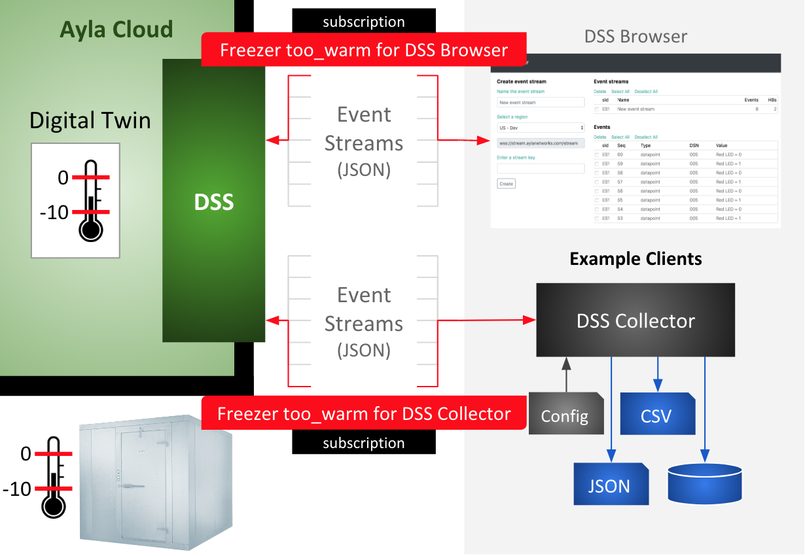

Instructions in the guide are based on the following scenario: 

Your company utilizes a walk-in freezer connected to the Ayla Cloud, and instrumented with two properties: The max_temp property (integer) specifies the maximum safe temperature for your freezer. The too_warm property (boolean) indicates whether the temperature inside the freezer is above (true) or below (false) max_temp. You record too_warm events in a database from which you determine (1) the number of too_warm "true" events per day, (2) the total too_warm minutes per day, and (3) the average too_warm minutes per day. You collect other information, too, outside the scope of this scenario, including the IDs of employees who open the freezer, time/date of deliveries that require repeated, prolonged access to the freezer, condensor maintenance, etc. Your business system aggregates and analyzes this information to help you improve business procedures and policies to ensure safe, quality freezer content. 

Instructions target OEM accounts (not default Ayla accounts).

Setting up this scenario is straight-forward. It includes creating a device template, a virtual device, an access rule, and two identical subscriptions depicted in the diagram below, one for DSS Browser and one for DSS Collector. 

