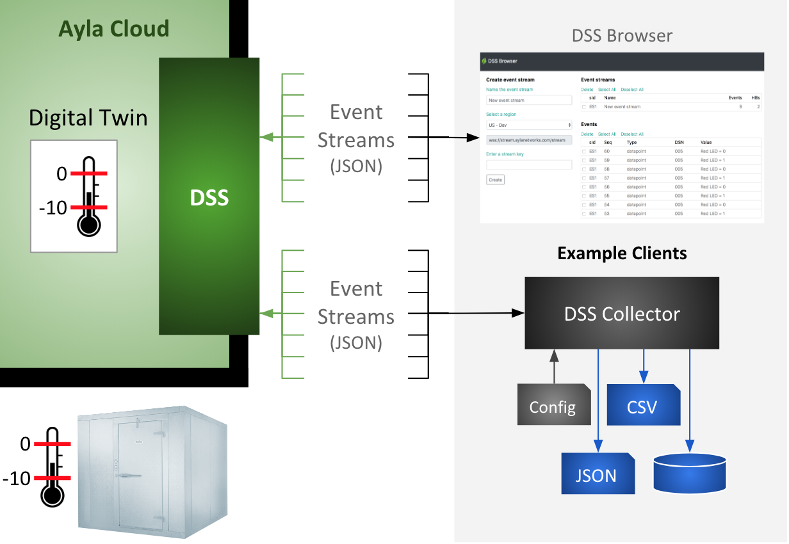

The Ayla Datastream Service (DSS) is a WebSocket server that pushes device-related events (in near real-time) from the Ayla Cloud to subscribing WebSocket clients associated (typically) with data analytics systems.

### Diagram Notes

<ol>
  <li>The diagram shows two example clients:
    <ol>
      <li><a href="https://docs.aylanetworks.com/cloud/ayla-datastream-service/dss-browser/source/client.html" target="_blank">DSS Browser</a> is a browser-based WebSocket client to facilitate experimentation and quick understanding.</li>
      <li>DSS Collector is a Node.JS WebSocket client that demonstrates persistence.</li>
    </ol>
  </li>
  <li>DSS sends the following types of events in JSON format to subscribing clients:
    <table class="key-value-table">
      <tr>
        <th>connectivity</th>
        <td>The Ayla Cloud started/stopped interacting with a registered device.</td>
      </tr>
      <tr>
        <th>datapoint</th>
        <td>A digital twin property value changed.</td>
      </tr>
      <tr>
        <th>datapointack</th>
        <td>An Ayla Agent confirmed to the Ayla Cloud that a device property value changed.</td>
      </tr>
      <tr>
        <th>location</th>
        <td>A digital twin latitute/longitude value changed.</td>
      </tr>
      <tr>
        <th>registration</th>
        <td>The Ayla Cloud registered/unregistered a device.</td>
      </tr>
    </table>
  </li>
  <li>A client can manage multiple event streams simultaneously. Each event stream must be associated with a dedicated subscription specifying an event type, and a device filter composed of device model IDs, device serial numbers, and/or device property names in various combinations. Event streams may not share the same subscription. However, subscriptions may be identical.</li>
  <li>Each client in the diagram is listening to several event streams, each associated with a dedicated subscription.</li>
  <li>Event information flows from left to right. However, DSS also sends a heartbeat message every 30 seconds on each event stream to which clients must respond, as indicated by the green arrows pointing left.</li>
</ol>