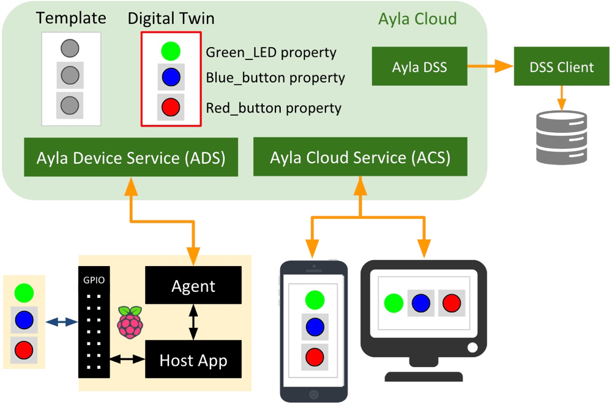

This guide demonstrates how client applications (like [DSS Client](http://localhost/cloud/ayla-datastream-service/client/)) receive device-related events from the Ayla Datastream Service (DSS).

<h1>Concepts</h1>

<h3>Ayla Platform</h3>

The Ayla Platform is a cloud-based service that enables applications to interact with a model of a device, controlling various aspects of the device, and responding to device activity. Consider, for example, a simple Linux-based device composed of a host application, green LED, blue button, and red button:

The central character in this diagram is the digital twin (red box) composed of properties representing various aspects of the device. The digital twin is how web and mobile apps see the device. These applications send commands to the device via "To Device" properties like the green LED. They remain aware of device state via "From Device" properties like the buttons. The Ayla software agent enables the device to connect to the Ayla Cloud.

<h3>Ayla Datastream Service (DSS)</h3>

The Ayla Datastream Service (DSS) is a [WebSocket](https://en.wikipedia.org/wiki/WebSocket) service that provides the following event notifications to subscribing client applications:

<table>
  <tr>
    <th>Event Type</th>
    <th>Meaning</th>
  </tr>
  <tr>
    <td>connectivity</td>
    <td>The Ayla Cloud started/stopped interacting with a registered device.</td>
  </tr>
  <tr>
    <td>datapoint</td>
    <td>A digital twin property value changed.</td>
  </tr>
  <tr>
    <td>datapointack</td>
    <td>An Ayla Agent confirmed to the Ayla Cloud that a device property value changed.</td>
  </tr>
  <tr>
    <td>location</td>
    <td>A digital twin latitute/longitude value(s) changed.</td>
  </tr>
  <tr>
    <td>registration</td>
    <td>The Ayla Cloud registered a (new) device.</td>
  </tr>
</table>

DSS is available to the following client profiles at the following urls:

<table>
  <tr>
    <th>Region</th>
    <th>Deployment Type</th>
    <th>Client Type</th>
    <th>URL</th>
  </tr>
  <tr>
    <td rowspan="4">China</td>
    <td rowspan="2">Development</td>
    <td>Cloud</td>
    <td>wss://stream.ayla.com.cn/stream/stream</td>
  </tr>
  <tr>
    <td>Mobile</td>
    <td>wss://mstream.ayla.com.cn/stream</td>
  </tr>
  <tr>
    <td rowspan="2">Field</td>
    <td>Cloud</td>
    <td>wss://stream-field.ayla.com.cn/stream</td>
  </tr>
  <tr>
    <td>Mobile</td>
    <td>wss://mstream-field.ayla.com.cn/stream</td>
  </tr>
  <tr>
    <td rowspan="2">Europe</td>
    <td rowspan="2">Field</td>
    <td>Cloud</td>
    <td>wss://stream-field-eu.aylanetworks.com/stream</td>
  </tr>
  <tr>
    <td>Mobile</td>
    <td>wss://mstream-field-eu.aylanetworks.com/stream</td>
  </tr>
  <tr>
    <td rowspan="6">United States</td>
    <td rowspan="2">Development</td>
    <td>Cloud</td>
    <td>wss://stream.aylanetworks.com/stream</td>
  </tr>
  <tr>
    <td>Mobile</td>
    <td>wss://mstream-dev.aylanetworks.com/stream</td>
  </tr>
  <tr>
    <td rowspan="2">Staging</td>
    <td>Cloud</td>
    <td>wss://staging-dss.ayladev.com/stream</td>
  </tr>
  <tr>
    <td>Mobile</td>
    <td>wss://staging-mstream.ayladev.com/stream</td>
  </tr>
  <tr>
    <td rowspan="2">Field</td>
    <td>Cloud</td>
    <td>wss://stream-field.aylanetworks.com/stream</td>
  </tr>
  <tr>
    <td>Mobile</td>
    <td>wss://mstream-field.aylanetworks.com/stream</td>
  </tr>
</table>

<h3>DSS Clients</h3>

DSS clients are WebSocket clients that receive event notifications from the Ayla Datastream Service.

Cross Origin Resource Sharing

Server-side Proxies

---

---

The DSS Client presented in this guide leverages common browser technologies and PHP for simple server proxies.

<h1>DSS Client Workflow</h1>

<h3>Server-side Proxies</h3>

The DSS client includes server-side proxies (small PHP files) to circumvent [Cross-Origin Resource Sharing (CORS)](https://en.wikipedia.org/wiki/Cross-origin_resource_sharing) which restricts browser-based client access to REST API endpoints (e.g. Ayla REST API endpoints). These proxies make REST API calls on behalf of a browser.

<h3>DSS Client Application Flow</h3>

These steps describe the general workflow of a DSS client:

<ol>
<li>Obtain an email address and a password from the user.</li>
<li>POST them to the Ayla REST API <code>/users/sign_in</code> endpoint, and obtain an access token.</li>
<li>POST the access token and an event type to the <code>/v1/subscriptions.json</code> endpoint, and obtain a stream key. </li>
<li>Instantiate a WebSocket using a service URL and the stream key:
<pre>
function start() {
  ...
  var webSocket = new WebSocket(url + '?stream_key=' + stream_key);
  run(webSockets); 
  ...
}
</pre>

One WebSocket takes one stream key and listens for one event type. DSS client listening for five event types needs five WebSockets.

</li>
<li>React to events:
<pre>
function run(webSocket) {
  webSocket.onopen = function(event) {...}

  webSocket.onerror = function(error) {...}

  webSocket.onmessage = function(event) {...}

  webSocket.onclose = function(event) {...}
}
</pre>
</li>
</ol>
