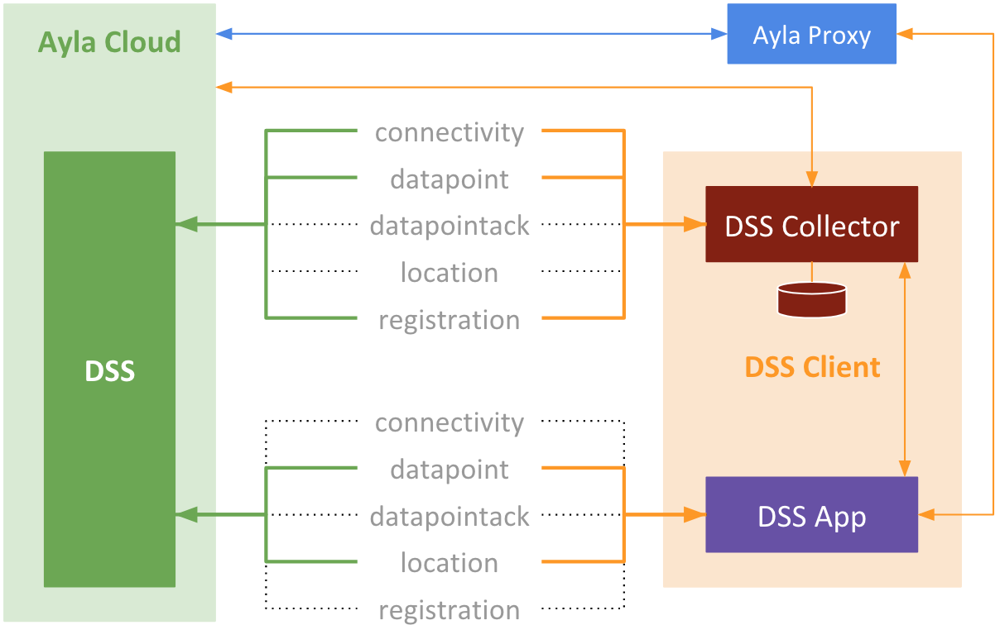

<a data-toggle="collapse" href="#toc-list">Table of Contents</a>

<ol>
<li><a href="#a-overview">Overview</a></li>
<li><a href="#a-dss-collector">DSS Collector</a></li>
<li><a href="#a-dss-app">DSS App</a></li>
<li><a href="#a-ayla-proxy">Ayla Proxy</a></li>
<li><a href="#a-dss-events">DSS Events</a></li>
</ol>

<h1 class="target">Overview</h1>

1. The green box is the Ayla Datastream Service (DSS), a WebSocket server that pushes device data to subscribers.
1. The maroon box is the DSS Collector, a Node JS subscriber that stores received data.
1. The purple box is the DSS App, a browser-based subscriber that displays received data.
1. DSS provides five types of device information, one per socket
1. In the diagram, the DSS Collector is subcribed to three types, and the DSS App to two.
1. The DSS Collector provides a small REST API allowing external apps to open/close sockets, and to access collected data.
1. The DSS App utilizes this REST API to control the DSS Collector, and to GET data.
1. The orange box is the DSS Client. It is an example. It includes the DSS Collector and the DSS App.
1. The blue box is the Ayla Proxy, a Node JS server that uses the [Ayla REST API](https://developer.aylanetworks.com/apibrowser), and offers its own REST API.
1. The DSS App communicates with the Ayla Cloud via the Ayla Proxy REST API because [CORS](https://en.wikipedia.org/wiki/Cross-origin_resource_sharing) prevents the DSS App from communicating directly with the Ayla REST API.
1. DSS sends a heartbeat event on every socket every 30 seconds. Subscribers must respond or DSS will close the socket.

<h1 class="target">DSS Collector</h1>

<h1 class="target">DSS App</h1>

<h1 class="target">Ayla Proxy</h1>

<pre>
$ mkdir ayla-proxy
$ cs ayla-proxy
$ npm init -y
$ npm install express
$ npm install axios
$ touch server.js
</pre>

<h1 class="target">DSS Events</h1>

### connectivity

<pre>
{
  "seq": "1",
  "metadata": {
    "oem_id": "0dfc7900",
    "oem_model": "ledevb",
    "dsn": "AC000W000340649",
    "resource_tags": [],
    "event_type": "connectivity"
  },
  "connection": {
    "event_time": "2018-09-24T10:26:37Z",
    "user_uuid": "40e45b84-690c-11e8-acf3-12f911dcfe40",
    "status": "Online"
  }
} 
</pre>

### datapoint

<pre>
{
  "seq": "13",
  "metadata": {
    "oem_id": "0dfc7900",
    "oem_model": "linuxevb",
    "dsn": "AC000W005606115",
    "property_name": "Blue_LED",
    "display_name": "Blue_LED",
    "base_type": "boolean",
    "resource_tags": [],
    "event_type": "datapoint"
  },
  "datapoint": {
    "id": "1ff9b91c-bfe4-11e8-1261-67d251d3ec96",
    "created_at_from_device": null,
    "updated_at": "2018-09-24T10:25:14Z",
    "created_at": "2018-09-24T10:25:14Z",
    "user_uuid": "40e45b84-690c-11e8-acf3-12f911dcfe40",
    "echo": true,
    "closed": false,
    "value": 0,
    "metadata": {}
  }
}
</pre>

### datapointack

<pre>
{
  "seq": "2",
  "metadata": {
    "oem_id": "0dfc7900",
    "oem_model": "linuxevb",
    "dsn": "AC000W005606115",
    "property_name": "Blue_LED",
    "display_name": "Blue_LED",
    "base_type": "boolean",
    "resource_tags": [],
    "event_type": "datapointack"
  },
  "datapoint": {
    "id": "15af3cfc-bfe4-11e8-f2f0-9aab1d61f636",
    "created_at_from_device": null,
    "updated_at": "2018-09-24T10:24:57Z",
    "created_at": "2018-09-24T10:24:57Z",
    "user_uuid": "40e45b84-690c-11e8-acf3-12f911dcfe40",
    "echo": false,
    "closed": false,
    "value": 1,
    "ack_message": 0,
    "ack_status": 200,
    "ack_id": "160c8c90-bfe4-11e8-87f4-8d732085e587",
    "acked_at": "2018-09-24T10:24:57Z",
    "metadata": {}
  }
}
</pre>

### location

<pre>
{
  "seq": "1",
  "metadata": {
    "oem_id": "0dfc7900",
    "oem_model": "ledevb",
    "dsn": "AC000W000340779",
    "resource_tags": [],
    "event_type": "location"
  },
  "location_event": {
    "dsn": "AC000W000340779",
    "ip": "67.255.234.73",
    "lat": " 44.769500",
    "long": "-69.428300",
    "provider": "ip-based",
    "user_uuid": "40e45b84-690c-11e8-acf3-12f911dcfe40",
    "created_at": "2018-09-24T11:04:07Z"
  }
}
</pre>

### registration

<pre>
{
  "seq": "1",
  "metadata": {
    "oem_id": "0dfc7900",
    "oem_model": "ledevb",
    "dsn": "AC000W000340649",
    "resource_tags": [],
    "event_type": "registration"
  },
  "registration_event": {
    "dsn": "AC000W000340649",
    "user_uuid": null,
    "registered": false,
    "registration_type": "AP-Mode",
    "unregistered_at": "2018-09-24T10:29:50Z"
  }
}
</pre>
