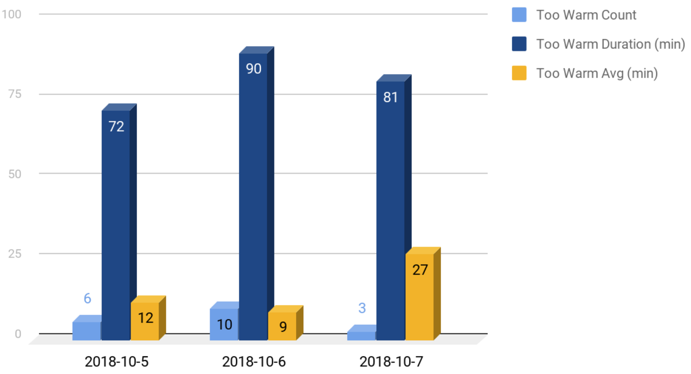

## Save to a JSON file

This section shows you how to save events to JSON files.

<ol>
<li>Open config.json, and change <code>false</code> to <code>true</code> for both <code>json</code> keys.
<pre>
"persistence": {
  "json": true,
  "relational": false
}
</pre>
</li>
<li>Run DSS Collector, and generate max_temp and too_warm events.</li>
<li>In a second terminal, change directory to <code>events</code>.
<pre>$ cd events/</pre>
</li>
<li>List the directory contents:
<pre>
$ ls -1
ES1-datapoint.json
ES2-datapoint.json
</pre>
</li>
<li><code>cat</code> or <code>tail</code> one of the files:
<pre>
$ tail ES1-datapoint.json 
{"seq":"86","metadata":{"oem_id":"0bbb112e","oem_model":"freezer-model","dsn":"VD0bbb112e0000011","property_name":"too_warm","display_name":"Too Warm","base_type":"boolean","event_type":"datapoint"},"datapoint":{"id":"497868f0-d5e8-11e8-0e75-3f195033d92c","created_at_from_device":null,"updated_at":"2018-10-22T10:50:27Z","created_at":"2018-10-22T10:50:27Z","user_uuid":"b95384c0-8165-11e8-929b-0a27c1b236f4","echo":false,"closed":false,"value":1,"metadata":{"key1":"","key2":""}}}
{"seq":"87","metadata":{"oem_id":"0bbb112e","oem_model":"freezer-model","dsn":"VD0bbb112e0000011","property_name":"too_warm","display_name":"Too Warm","base_type":"boolean","event_type":"datapoint"},"datapoint":{"id":"499b5a90-d5e8-11e8-6118-87a6f989b19f","created_at_from_device":null,"updated_at":"2018-10-22T10:50:27Z","created_at":"2018-10-22T10:50:27Z","user_uuid":"b95384c0-8165-11e8-929b-0a27c1b236f4","echo":false,"closed":false,"value":0,"metadata":{"key1":"","key2":""}}}
{"seq":"88","metadata":{"oem_id":"0bbb112e","oem_model":"freezer-model","dsn":"VD0bbb112e0000011","property_name":"too_warm","display_name":"Too Warm","base_type":"boolean","event_type":"datapoint"},"datapoint":{"id":"49cfb376-d5e8-11e8-5ffb-d412e49bfd18","created_at_from_device":null,"updated_at":"2018-10-22T10:50:28Z","created_at":"2018-10-22T10:50:28Z","user_uuid":"b95384c0-8165-11e8-929b-0a27c1b236f4","echo":false,"closed":false,"value":1,"metadata":{"key1":"","key2":""}}}
{"seq":"89","metadata":{"oem_id":"0bbb112e","oem_model":"freezer-model","dsn":"VD0bbb112e0000011","property_name":"too_warm","display_name":"Too Warm","base_type":"boolean","event_type":"datapoint"},"datapoint":{"id":"49f9dc8c-d5e8-11e8-64b2-2c35b108a89e","created_at_from_device":null,"updated_at":"2018-10-22T10:50:28Z","created_at":"2018-10-22T10:50:28Z","user_uuid":"b95384c0-8165-11e8-929b-0a27c1b236f4","echo":false,"closed":false,"value":0,"metadata":{"key1":"","key2":""}}}
</pre>
</li>
</ol>

## Save to a database table

This section shows you how to save events to a mysql table.

<ol>
<li>Create a database table:
<pre>
DROP TABLE IF EXISTS too_warm;
CREATE TABLE too_warm(
  id int NOT NULL AUTO_INCREMENT,
  sequence_id INT,
  creation_date VARCHAR(24),
  value BOOLEAN,
  PRIMARY KEY (id)
);
</pre>
</li>
<li>Test the table by adding a fake record:
<pre>
INSERT INTO too_warm (sequence_id, creation_date, value) VALUES ('0', '2018-10-21T21:46:22Z', '1');
</pre>
</li>
<li>Open collector.js, and modify <code>mysql.createPool</code> appropriately:
<pre>
const pool = mysql.createPool({
  connectionLimit : 10,
  host: 'localhost',
  user: 'root',
  password: 'abc123',
  database: 'dss'
})
</pre>
</li>
<li>Open config.json, and change <code>false</code> to <code>true</code> for the <code>relational</code> key of the <code>too_warm</code> entry.
<pre>
{
  "id" : "ES1",
  "name": "Freezer too_warm for DSS Collector",
  "url": "wss://stream.aylanetworks.com/stream",
  "key": "abcdef01234567890000000000000001",
  "persistence": {
    "json": true,
    "relational": true
  }
}
</pre>
</li>
<li>Run DSS Collector, and generate too_warm events.</li>
<li>Use phpMyAdmin (or similar) to check results:

</li>
</ol>

## Utilize the data

Each record in the database contains a sequence_id, creation_date, and value. These values yield (1) the number of too_warm "true" events per day, (2) the total too_warm minutes per day, and (3) the average too_warm minutes per day:

In conjunction with other statistics such as the IDs of employees who open the freezer, time/date of deliveries that require repeated, prolonged access to the freezer, and condensor maintenance, this information can help you improve business procedures and policies to ensure safe, quality freezer content.
