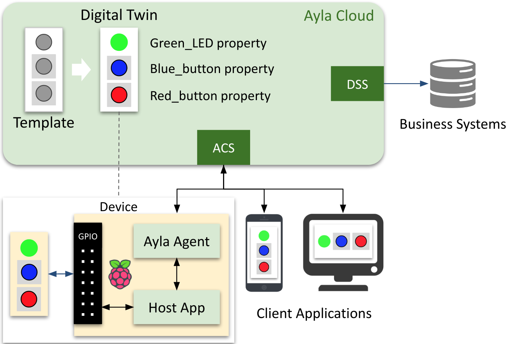

<aside id="pagebar" class="d-xl-block collapse">
  <ul>
    <li><a href="#core-title">Linux Device v1.7</a>
      <ul>
        <li><a href="#video-overview">Video overview</a>
      </ul>
    </li>
    <li><a href="#build-and-run">Build and Run</a>
      <ul>
        <li><a href="#gcc-ubuntu-docker">GCC/Ubuntu/Docker</a>
        <li><a href="#gcc-raspbian">GCC/Raspbian</a>
      </ul>
    </li>
  </ul>
</aside>

<div class="dropdown mb-3">
  <button class="btn btn-warning btn-sm dropdown-toggle" type="button" id="versions" data-toggle="dropdown" aria-haspopup="true" aria-expanded="false">Choose a version</button>
  <div class="dropdown-menu" aria-labelledby="versions">
    <a class="dropdown-item" href="../v1-7">v1.7</a>
    <a class="dropdown-item" href="../v1-6">v1.6</a>
    <a class="dropdown-item" href="../v1-5">v1.5</a>
  </div>
</div>

The Ayla Linux Device Solution, composed of an Ayla Agent and an example Linux-based host application, enables the Ayla Cloud to create and maintain a corresponding [digital twin](/glossary/digital-twin/) by which client applications and business systems can monitor & control device behavior, and gather & analyze data. Consider the diagram below:



The device in the diagram is composed of a Raspberry Pi wired to a breadboard hosting a green LED, a blue button, and a red button. The device also includes an Ayla Agent and an example Host Application implemented as daemons, running on Raspbian, and communicating via sockets. The names of the Ayla Agent and Host App executable files are ```devd``` for device daemon and  ```appd``` for application daemon. ```devd``` enables secure communication from the device to the Ayla Cloud, and ```appd``` communicates directly with peripherals. (ACS is Ayla Cloud Services, and DSS is [Ayla Datastream Service](../../../integrate-systems/ayla-datastream-service).)

## Video overview

<iframe 
  width="560" 
  height="315" 
  src="https://www.youtube.com/embed/aDdyFeo2A5E?rel=0&amp;showinfo=0" 
  frameborder="0" 
  allow="autoplay; 
  encrypted-media" 
  allowfullscreen>
</iframe>

### Transcript

A Host Application called appd (written in C) is running on the CPU of this Raspberry Pi 3, and it is controlling this green LED, this blue button, and this red button. Together, the Raspberry Pi, the host application, the LED, and the buttons form our Raspberry Pi Device.

An Ayla Linux Agent called devd (also written in C) is also running on this CPU.

Now, appd uses devd to talk to the Ayla Cloud which maintains a digital twin of our Raspberry Pi Device that includes a Green_LED property, a Blue_button property, and a Red-button property.

Mobile and web applications (like the Aura Mobile App shown here) send commands to, and receive events from, our Raspberry Pi Device by interacting with the digital twin in the cloud. So, for example, we can send a command, via the digital twin, to illumindate the LED, and we can receive press and release events from the blue and red buttons.

# Build and Run

## GCC/Ubuntu/Docker

## GCC/Raspian

<!--
```
adc-1.7: import from device_linux db95d01 
https://github.com/AylaNetworks/device_linux_public/commit/5a4c0760b379a4c3cbbc698252d24e2b1286b51b
$ git clone https://github.com/AylaNetworks/device_linux_public.git
$ git checkout 5a4c0760b379a4c3cbbc698252d24e2b1286b51b
```
-->
