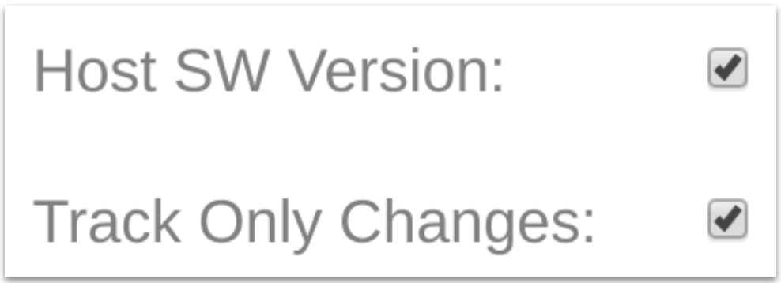

1. Create and save a ```properties.csv``` file to your local file system. Include a header row, and one row for each property you want to include in your template. The example below includes three properties (cmd, log, and version):

    ```
  base_type,direction,name,scope
  string,input,cmd,oem
  string,output,log,oem
  string,output,version,oem
    ```

1. Browse to the [Ayla Developer Portal](/content/ayla-developer-portal), and click Design a Device.

1. Click Add, fill out the form, and click OK.

    

1. Search for your new template on the list, click to open, and click Properties.

1. Click Import, choose your ```properties.csv```, and click Import:

    

1. Click the Version property, check Host SW Version, and click OK:

    