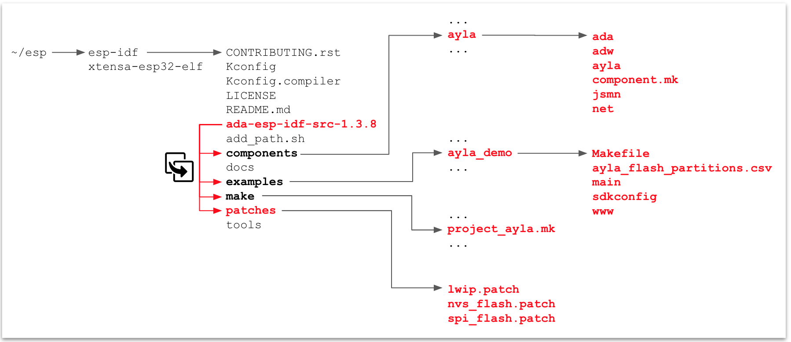

## Build, Configure, Run, Connect, Register

1. Obtain an Espressif [ESP32-DevKitC](https://www.espressif.com/en/products/hardware/esp32-devkitc/overview) board.

1. [Create an Ayla user account](../../common-tasks/create-a-user-account).

1. [Reserve a DSN](../../common-tasks/reserve-a-dsn).

1. [Create a template](../../common-tasks/create-a-template) with the following properties and details:

    1. Properties:

        ```
      base_type,direction,name,scope
      boolean,output,Blue_button,oem
      boolean,input,Blue_LED,oem
      string,input,cmd,oem
      decimal,input,decimal_in,oem
      decimal,output,decimal_out,oem
      boolean,input,Green_LED,oem
      integer,input,input,oem
      string,output,log,oem
      integer,output,output,oem
      string,output,version,oem
        ```

    1. Details:

        * Visibility: ```oem```
        * Name: ```ADA ESP v1.3.8```
        * Description: ```ADA ESP v1.3.8```
        * Registration: ```Dsn```
        * Model: ```ledevb```
        * Version: ```ada-esp-idf-src-1.3.8```

1. Download [Ayla source code](https://connection.aylanetworks.com/s/article/2648919) (ada-esp-idf-src-1.3.8.tgz).

1. Determine the computer-to-ESP32 serial port:

    1. List the serial ports on your computer (e.g. ```ls /dev/tty*```).

    1. Connect an ESP32 board to your computer using a serial cable.

    1. List the serial ports again. The new serial port on the list is the one to use (e.g. ```/dev/ttyUSB0```).

1. Install a [Docker Engine](https://docs.docker.com/get-started/) on your Windows, Mac, and/or Linux host OS.

1. Create a Docker [ubuntu](https://hub.docker.com/_/ubuntu) container:

    ```
  $ docker run --net=host --name=esp -w /root -it --device=/dev/ttyUSB0 ubuntu bash
    ```

    You are root, and the current working directory is ```/root```.

1. Prepare your development environment:

    1. Update package list:

        ```
      # apt update
        ```

    1.  Install miscellaneous packages:

        ```
      # apt install nano screen iputils-ping 
        ```

    1. Install prerequisites for [Espressif Standard Setup of Toolchain v3.2.2 for Linux](https://docs.espressif.com/projects/esp-idf/en/v3.2.2/get-started/linux-setup.html).

        ```
      # apt install gcc git wget make libncurses-dev flex bison gperf \
      python python-pip python-setuptools python-serial python-cryptography python-future
        ```

    1. Create an ```esp``` directory, and change directory:

        ```
      # mkdir esp
      # cd esp
        ```

    1. Download ESP32 toolchain for Linux:

        ```
      # wget https://dl.espressif.com/dl/xtensa-esp32-elf-linux64-1.22.0-80-g6c4433a-5.2.0.tar.gz
        ```

    1. Extract the archive file:

        ```
      # tar -xzf xtensa-esp32-elf-linux64-1.22.0-80-g6c4433a-5.2.0.tar.gz
        ```

    1. Add to the PATH environment variable:

        ```
      # export PATH=$HOME/esp/xtensa-esp32-elf/bin:$PATH
        ```

    1. Install [Espressif IoT Development Framework](https://github.com/espressif/esp-idf):

        ```
      # git clone https://github.com/espressif/esp-idf.git
      # cd esp-idf
      # git checkout v3.1-beta1
      # git submodule update --init --recursive
        ```

    1. Create the ```IDF_PATH``` environment variable:

        ```
      # export IDF_PATH=$HOME/esp/esp-idf
        ```

1. Test the development environment with the hello_world example:

    1. Change directory:
    
        ```
      # cd /root/esp/esp-idf/examples/get-started/hello_world
        ```

    1. Customize configuration. (Defaults should be fine.)
    
        ```
      # make menuconfig
        ```

    1. Build, flash, and monitor:

        ```
      # make
      # make flash
      # make monitor
        ```

        Output appears similar to this:

        ```
      Toolchain path: /root/esp/xtensa-esp32-elf/bin/xtensa-esp32-elf-gcc
      Toolchain version: esp32-2019r1
      Compiler version: 8.2.0
      ...
      ...
      Hello world!
      This is ESP32 chip with 2 CPU cores, WiFi/BT/BLE, silicon revision 1, 4MB external flash
      Restarting in 10 seconds...
      Restarting in 9 seconds...
      ...
      ...
        ```

        Press ```Ctl``` + ```]``` to exit the monitor.

1. Install Ayla source code:

    1. <span style="color:red;">In a host terminal</span>, copy ```ada-esp-idf-src-1.3.8.tgz``` to your Docker container:

        ```
      $ docker cp /home/matt/Downloads/ada-esp-idf-src-1.3.8.tgz esp:/root/esp
        ```

    1. In your Docker terminal, extract the archive file:

        ```
      # cd /root/esp
      # tar zxvf ada-esp-idf-src-1.3.8.tgz
        ```

    1. Copy the ```ada-esp-idf-src-1.3.8``` directory on top of the ```esp-idf``` directory:

        ```
      # cp -R ada-esp-idf-src-1.3.8/* ./esp-idf
        ```

        This diagram gives you an idea of where the Ayla files are copied:

        

1. Configure and build the Ayla agent and host application:

    1. Change directory:

        ```
      # cd esp-idf/examples/ayla_demo
        ```

    1. Edit ```./main/conf.h```. Set the following:

        ```
      #define DEMO_OEM_ID           "00000000" /* replace with your Ayla OEM ID */
      #define DEMO_TEMPLATE_VERSION "ada-esp-idf-src-1.3.8"
        ```

    1. Optionally, erase flash, OTA, and NVS on the ESP32 DevKit:

        ```
      # make erase_flash
        ```

    1. Build, flash, and monitor:

        ```
      # make
      # make flash
      # make monitor
        ```

    1. Configure networking and security (use ```log debug all``` for maximum visibility):

        ```
      # nvs-set ada.f.wifi/profile/0/ssid <ssid>
      # nvs-set ada.f.wifi/profile/0/security <security_type> # 0=none, 3=wpa, 4=wpa2
      # nvs-set ada.f.wifi/profile/0/key <passphrase>
      # nvs-set ada.f.wifi/profile/0/enable 1
      # nvs-set "ada.f.id/dev_id" AC000W000000001
      # nvs-set "ada.f.id/key" MIIB... (long number)
      # nvs-set ada.f.client/server/default 1
      # esp-reboot
        ```
        ```
      # oem key 0123456789abcdef0123456789abcdef ledevb
      # save
        ```

1. [Register your device](../../common-tasks/register-a-device).
