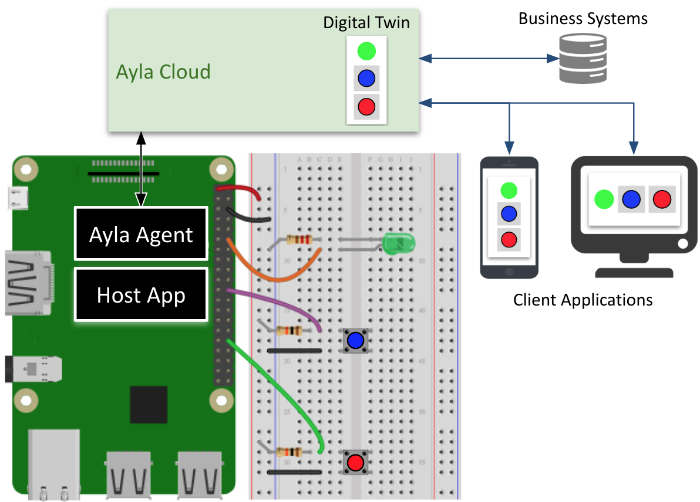

<aside id="pagebar" class="d-xl-block collapse">
  <ul>
    <li><a href="#core-title">Linux Device v1.7</a>
      <ul>
        <li><a href="#introduction">Introduction</a>
      </ul>
    </li>
    <li><a href="#install-build-run">Install, Build, Run</a>
      <ul>
        <li><a href="#ubuntu-docker">Ubuntu/Docker</a>
        <li><a href="#raspbian-rpi">Raspbian/RPi</a>
      </ul>
    </li>
  </ul>
</aside>

<div class="dropdown mb-3">
  <button class="btn btn-warning btn-sm dropdown-toggle" type="button" id="versions" data-toggle="dropdown" aria-haspopup="true" aria-expanded="false">Choose a version</button>
  <div class="dropdown-menu" aria-labelledby="versions">
    <a class="dropdown-item" href="../v1-7">v1.7</a>
    <a class="dropdown-item" href="../v1-6">v1.6</a>
    <a class="dropdown-item" href="../v1-5">v1.5</a>
  </div>
</div>

This page introduces the Ayla Linux Device Solution, and shows you how to build and run it.

## Introduction

The Ayla Linux Device Solution enables Linux-based devices to communicate securely with the Ayla Cloud. The solution is composed primarily of an Ayla Agent and an example Host App. Consider the following Raspbian-based example:

 

The example shows the Ayla Cloud, the Ayla Agent, and the Host App working together to ensure that the [digital twin](/glossary/digital-twin) and the device peripherals stay in sync so that client applications and business systems can monitor & control device behavior, and gather & analyze data. The following video further illustrates:

<iframe 
  width="560" 
  height="315" 
  src="https://www.youtube.com/embed/aDdyFeo2A5E?rel=0&amp;showinfo=0" 
  frameborder="0" 
  allow="autoplay; 
  encrypted-media" 
  allowfullscreen>
</iframe>

<p><a class="btn-link" data-toggle="collapse" href="#video-transcript" aria-expanded="false" aria-controls="video-transcript">Read the transcript</a>.</p>
<div class="collapse" id="video-transcript">
<div class="card card-body">
<p>A Host Application called appd (written in C) is running on the CPU of this Raspberry Pi 3, and it is controlling this green LED, this blue button, and this red button. Together, the Raspberry Pi, the host application, the LED, and the buttons form our Raspberry Pi Device.</p>
<p>An Ayla Linux Agent called devd (also written in C) is also running on this CPU.</p>
<p>Now, appd uses devd to talk to the Ayla Cloud which maintains a digital twin of our Raspberry Pi Device that includes a Green_LED property, a Blue_button property, and a Red-button property.</p>
<p class="mb-0">Mobile and web applications (like the Aura Mobile App shown here) send commands to, and receive events from, our Raspberry Pi Device by interacting with the digital twin in the cloud. So, for example, we can send a command, via the digital twin, to illumindate the LED, and we can receive press and release events from the blue and red buttons.</p>
</div>
</div>

# Install, Build, Run

## Ubuntu/Docker

## Raspbian/RPi

This section provides directions for building an Ayla Linux Device Solution v1.7 using a GCC/Raspberry Pi development environment.

1. [Set up a Raspberry Pi](../../../common-tasks/set-up-a-raspberry-pi).

1. [Create an Ayla user account](../../../common-tasks/create-a-user-account).

1. [Reserve a DSN](../../../common-tasks/reserve-a-dsn).

1. [Create a template](../../../common-tasks/create-a-template) with the following details:
    <table>
    <tr><td>Visibility:</td><td>oem</td></tr>
    <tr><td>Name:</td><td>Linux v1.7</td></tr>
    <tr><td>Description:</td><td>Linux v1.7</td></tr>
    <tr><td>Registration:</td><td>Dsn</td></tr>
    <tr><td>Model:</td><td>linuxevb</td></tr>
    <tr><td>Version:</td><td>linux-v1.7</td></tr>
    <tr><td>Type:</td><td>Wifi</td></tr>
    <tr><td>Properties:</td>
    <td style="padding:0; border-color:black;"><pre style="margin:0;">
base_type,direction,name,scope
boolean,output,Blue_button,user
boolean,input,Blue_LED,user
string,input,cmd,user
decimal,input,decimal_in,user
decimal,output,decimal_out,user
boolean,input,Green_LED,user
integer,input,input,user
string,output,log,user
integer,output,output,user
string,output,version,user</pre></td></tr>
    </table>

1. Download and build the Ayla Linux Device Solution.

1. [Create a devd.conf file](../../../common-tasks/create-a-devd-conf-file).

<!--
```
adc-1.7: import from device_linux db95d01 
https://github.com/AylaNetworks/device_linux_public/commit/5a4c0760b379a4c3cbbc698252d24e2b1286b51b
$ git clone https://github.com/AylaNetworks/device_linux_public.git
$ git checkout 5a4c0760b379a4c3cbbc698252d24e2b1286b51b
```
-->
