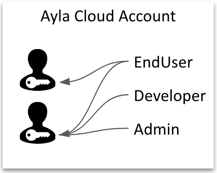
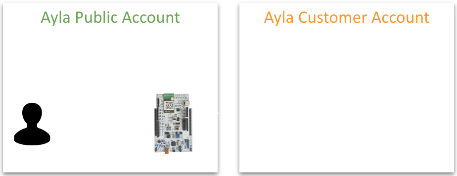
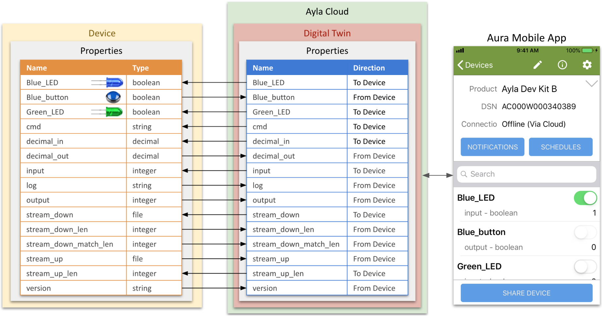

<aside id="pagebar" class="d-xl-block collapse">
  <ul>
    <li><a href="#core-title">Ayla Developer Guide</a></li>
    <li><a href="#accounts">Accounts</a></li>
    <li><a href="#regions">Regions</a></li>
    <li><a href="#architecture">Architecture</a></li>
    <li><a href="#interfaces">Interfaces</a></li>
    <li><a href="#security">Security</a></li>
    <li><a href="#digital-twin">Digital Twin</a></li>
  </ul>
</aside>

Welcome ...

# Accounts

The Ayla Cloud is a collection of Ayla Cloud Accounts, each identified by an oem id and an oem secret:

Each cloud account includes a set of user accounts, each associated with credentials (i.e. username and password):

Each user account belongs to one, and only one, cloud account. So, a human being wanting to access several Ayla cloud accounts must have a separate user account in each cloud account.

Each user account is associated with one or more roles (sets of access rights):

Users access Ayla cloud accounts via apps and portals (e.g. Ayla Developer Portal, Ayla Dashboard Portal, and Aura Mobile App) that talk to the Ayla RESTful API:

Ayla uses a particular Ayla Cloud Account (oem id = 0dfc7900) as a sandbox account. Ayla calls this account the Ayla Public Account. When a human being fills out [this form](https://developer.aylanetworks.com/registrations/new) and clicks OK, Ayla creates for the human being a user account with EndUser access rights in the Ayla Public Account:

Typically, users use the Ayla Public Account to experiment with the Ayla Development Kit:

When the user wants to learn more, Ayla creates for the user's company a dedicated Ayla Cloud Account called an Ayla Customer Account:

Then, Ayla can transfer the user account and device(s) from the Ayla Public Account to the Ayla Customer Account:

# Regions

Ayla Cloud Accounts are grouped into regions within the Ayla Cloud. The United States (US) and China (CN) include development regions:

Each Ayla portal and service has a separate URL for each region:

### Ayla Application Service

<table>
<tr>
<th>region</th>
<th>deployment</th>
<th>domain</th>
</tr>
<tr>
<td rowspan="2">cn</td>
<td>dev</td>
<td>application.ayla.com.cn</td>
</tr>
<tr>
<td>field</td>
<td>app-field.ayla.com.cn</td>
</tr>
<tr>
<td>eu</td>
<td>field</td>
<td>app-field-eu.aylanetworks.com</td>
</tr>
<tr>
<td rowspan="2">us</td>
<td>dev</td>
<td>application.aylanetworks.com</td>
</tr>
<tr>
<td>field</td>
<td>app-field.aylanetworks.com</td>
</tr>
</table>

### Ayla Dashboard Portal

<table>
<tr>
<th>Region</th>
<th>Deployment</th>
<th>Domain</th>
</tr>
<tr>
<td rowspan="2">cn</td>
<td>dev</td>
<td>dashboard-dev.ayla.com.cn</td>
</tr>
<tr>
<td>field</td>
<td>dashboard.ayla.com.cn</td>
</tr>
<tr>
<td>eu</td>
<td>field</td>
<td>dashboard-field-eu.aylanetworks.com</td>
</tr>
<tr>
<td rowspan="2">us</td>
<td>dev</td>
<td>dashboard-dev.aylanetworks.com</td>
</tr>
<tr>
<td>field</td>
<td>dashboard.aylanetworks.com</td>
</tr>
</table>

### Ayla Datastream Service

Use <code>wss</code> for WebSockets, and <code>https</code> for the REST API.

<table>
<tr>
<th>client-type</th>
<th>region</th>
<th>deployment</th>
<th>protocol</th>
<th>datastream-domain</th>
</tr>
<tr>
<td rowspan="10">cloud</td>
<td rowspan="4">cn</td>
<td rowspan="2">dev</td>
<td>wss</td>
<td>stream.ayla.com.cn</td>
</tr>
<tr>
<td>https</td>
<td>stream.ayla.com.cn</td>
</tr>
<tr>
<td rowspan="2">field</td>
<td>wss</td>
<td>stream-field.ayla.com.cn</td>
</tr>
<tr>
<td>https</td>
<td>stream-field.ayla.com.cn</td>
</tr>
<tr>
<td rowspan="2">eu</td>
<td rowspan="2">field</td>
<td>wss</td>
<td>stream-field-eu.aylanetworks.com</td>
</tr>
<tr>
<td>https</td>
<td>stream-field-eu.aylanetworks.com</td>
</tr>
<tr>
<td rowspan="4">us</td>
<td rowspan="2">dev</td>
<td>wss</td>
<td>stream.aylanetworks.com</td>
</tr>
<tr>
<td>https</td>
<td>stream.aylanetworks.com</td>
</tr>
<tr>
<td rowspan="2">field</td>
<td>wss</td>
<td>stream-field.aylanetworks.com</td>
<tr>
<td>https</td>
<td>stream-field.aylanetworks.com</td>
</tr>
</tr>
<tr>
<td rowspan="10">mobile</td>
<td rowspan="4">cn</td>
<td rowspan="2">dev</td>
<td>https</td>
<td>mdss-dev.ayla.com.cn</td>
</tr>
<tr>
<td>wss</td>
<td>mstream-dev.ayla.com.cn</td>
</tr>
<tr>
<td rowspan="2">field</td>
<td>https</td>
<td>mdss-field.ayla.com.cn</td>
</tr>
<tr>
<td>wss</td>
<td>mstream-field.ayla.com.cn</td>
</tr>
<tr>
<td rowspan="2">eu</td>
<td rowspan="2">field</td>
<td>https</td>
<td>mdss-field-eu.aylanetworks.com</td>
</tr>
<tr>
<td>wss</td>
<td>mstream-field-eu.aylanetworks.com</td>
</tr>
<tr>
<td rowspan="4">us</td>
<td rowspan="2">dev</td>
<td>https</td>
<td>mdss-dev.aylanetworks.com</td>
</tr>
<tr>
<td>wss</td>
<td>mstream-dev.aylanetworks.com</td>
</tr>
<tr>
<td rowspan="2">field</td>
<td>https</td>
<td>mdss-field.aylanetworks.com</td>
<tr>
<td>wss</td>
<td>mstream-field.aylanetworks.com</td>
</tr>
</tr>
</table>

### Ayla Developer Portal

<table>
<tr>
<th>region</th>
<th>deployment</th>
<th>domain</th>
</tr>
<tr>
<td rowspan="2">cn</td>
<td>dev</td>
<td>developer.ayla.com.cn</td>
</tr>
<tr>
<td>field</td>
<td>&nbsp;</td>
</tr>
<tr>
<td>eu</td>
<td>field</td>
<td>&nbsp;</td>
</tr>
<tr>
<td rowspan="2">us</td>
<td>dev</td>
<td>developer.aylanetworks.com</td>
</tr>
<tr>
<td>field</td>
<td>&nbsp;</td>
</tr>
</table>

### Ayla Device Service

<table>
<tr>
<th>region</th>
<th>deployment</th>
<th>domain</th>
</tr>
<tr>
<td rowspan="2">cn</td>
<td>dev</td>
<td>ads-dev.ayla.com.cn</td>
</tr>
<tr>
<td>field</td>
<td>ads-field.ayla.com.cn</td>
</tr>
<tr>
<td>eu</td>
<td>field</td>
<td>ads-field-eu.aylanetworks.com</td>
</tr>
<tr>
<td rowspan="2">us</td>
<td>dev</td>
<td>ads-dev.aylanetworks.com</td>
</tr>
<tr>
<td>field</td>
<td>ads-field.aylanetworks.com</td>
</tr>
</table>

### Ayla Factory Proxy Service

<table>
<tr>
<th>region</th>
<th>deployment</th>
<th>domain</th>
</tr>
<tr>
<td rowspan="2">cn</td>
<td>dev</td>
<td>api-dev.ayla.com.cn</td>
</tr>
<tr>
<td>field</td>
<td>api-field.ayla.com.cn</td>
</tr>
<tr>
<td>eu</td>
<td>field</td>
<td>api-field-eu.aylanetworks.com</td>
</tr>
<tr>
<td rowspan="2">us</td>
<td>dev</td>
<td>api-dev.aylanetworks.com</td>
</tr>
<tr>
<td>field</td>
<td>api-field.aylanetworks.com</td>
</tr>
</table>

### Ayla Image Service

<table>
<tr>
<th>region</th>
<th>deployment</th>
<th>domain</th>
</tr>
<tr>
<td rowspan="2">cn</td>
<td>dev</td>
<td>ais.ayla.com.cn</td>
</tr>
<tr>
<td>field</td>
<td>ais-field.ayla.com.cn</td>
</tr>
<tr>
<td>eu</td>
<td>field</td>
<td>ais-field-eu.aylanetworks.com</td>
</tr>
<tr>
<td rowspan="2">us</td>
<td>dev</td>
<td>ais.aylanetworks.com</td>
</tr>
<tr>
<td>field</td>
<td>ais-field.aylanetworks.com</td>
</tr>
</table>

### Ayla Log Service

<table>
<tr>
<th>region</th>
<th>deployment</th>
<th>domain</th>
</tr>
<tr>
<td rowspan="2">cn</td>
<td>dev</td>
<td>log.ayla.com.cn</td>
</tr>
<tr>
<td>field</td>
<td>log-field.ayla.com.cn</td>
</tr>
<tr>
<td>eu</td>
<td>field</td>
<td>log-field-eu.aylanetworks.com</td>
</tr>
<tr>
<td rowspan="2">us</td>
<td>dev</td>
<td>log.aylanetworks.com</td>
</tr>
<tr>
<td>field</td>
<td>log-field.aylanetworks.com</td>
</tr>
</table>

### Ayla Notification Service

<table>
<tr>
<th>region</th>
<th>deployment</th>
<th>domain</th>
</tr>
<tr>
<td rowspan="2">cn</td>
<td>dev</td>
<td>ans.ayla.com.cn</td>
</tr>
<tr>
<td>field</td>
<td>ans-field.ayla.com.cn</td>
</tr>
<tr>
<td>eu</td>
<td>field</td>
<td>ans-field-eu.aylanetworks.com</td>
</tr>
<tr>
<td rowspan="2">us</td>
<td>dev</td>
<td>ans.aylanetworks.com</td>
</tr>
<tr>
<td>field</td>
<td>ans-field.aylanetworks.com</td>
</tr>
</table>

### Ayla Rules Service

<table>
<tr>
<th>region</th>
<th>deployment</th>
<th>domain</th>
</tr>
<tr>
<td rowspan="2">cn</td>
<td>dev</td>
<td>&nbsp;</td>
</tr>
<tr>
<td>field</td>
<td>&nbsp;</td>
</tr>
<tr>
<td>eu</td>
<td>field</td>
<td>&nbsp;</td>
</tr>
<tr>
<td rowspan="2">us</td>
<td>dev</td>
<td>rulesservice-dev.aylanetworks.com</td>
</tr>
<tr>
<td>field</td>
<td>&nbsp;</td>
</tr>
</table>

### Ayla User Service

<table>
<tr>
<th>region</th>
<th>deployment</th>
<th>domain</th>
</tr>
<tr>
<td rowspan="2">cn</td>
<td>dev</td>
<td>user-dev.ayla.com.cn</td>
</tr>
<tr>
<td>field</td>
<td>user-field.ayla.com.cn</td>
</tr>
<tr>
<td>eu</td>
<td>field</td>
<td>user-field-eu.aylanetworks.com</td>
</tr>
<tr>
<td rowspan="2">us</td>
<td>dev</td>
<td>user-dev.aylanetworks.com</td>
</tr>
<tr>
<td>field</td>
<td>user-field.aylanetworks.com</td>
</tr>
</table>

### Ayla Zigbee Service

<table>
<tr>
<th>region</th>
<th>deployment</th>
<th>domain</th>
</tr>
<tr>
<td rowspan="2">cn</td>
<td>dev</td>
<td>zigbee.ayla.com.cn</td>
</tr>
<tr>
<td>field</td>
<td>zigbee-field.ayla.com.cn</td>
</tr>
<tr>
<td>eu</td>
<td>field</td>
<td>zigbee-field-eu.aylanetworks.com</td>
</tr>
<tr>
<td rowspan="2">us</td>
<td>dev</td>
<td>zigbee.aylanetworks.com</td>
</tr>
<tr>
<td>field</td>
<td>zigbee-field.aylanetworks.com</td>
</tr>
</table>

# Architecture

The primary purpose of the Ayla Cloud is to create and maintain, for each connected edge device, a digital twin by which, via APIs, client applications can monitor & control device behavior, and gather & analyze data.

Lorem ipsum dolor sit amet, consectetur adipiscing elit, sed do eiusmod tempor incididunt ut labore et dolore magna aliqua. Ut enim ad minim veniam, quis nostrud exercitation ullamco laboris nisi ut aliquip ex ea commodo consequat. Duis aute irure dolor in reprehenderit in voluptate velit esse cillum dolore eu fugiat nulla pariatur. Excepteur sint occaecat cupidatat non proident, sunt in culpa qui officia deserunt mollit anim id est laborum.

# Interfaces

Lorem ipsum dolor sit amet, consectetur adipiscing elit, sed do eiusmod tempor incididunt ut labore et dolore magna aliqua. Ut enim ad minim veniam, quis nostrud exercitation ullamco laboris nisi ut aliquip ex ea commodo consequat. Duis aute irure dolor in reprehenderit in voluptate velit esse cillum dolore eu fugiat nulla pariatur. Excepteur sint occaecat cupidatat non proident, sunt in culpa qui officia deserunt mollit anim id est laborum.

# Security

Lorem ipsum dolor sit amet, consectetur adipiscing elit, sed do eiusmod tempor incididunt ut labore et dolore magna aliqua. Ut enim ad minim veniam, quis nostrud exercitation ullamco laboris nisi ut aliquip ex ea commodo consequat. Duis aute irure dolor in reprehenderit in voluptate velit esse cillum dolore eu fugiat nulla pariatur. Excepteur sint occaecat cupidatat non proident, sunt in culpa qui officia deserunt mollit anim id est laborum.

# Digital Twin

Composed of properties, a digital twin is a cloud-based model of a device or gateway, the representation that apps and portals see:

When a device connects to the Ayla Cloud, the cloud instantiates a digital twin (to represent the device) from one or more templates it selects based on information supplied by the device. Typically, the cloud instantiates many digital twins from the same template:

