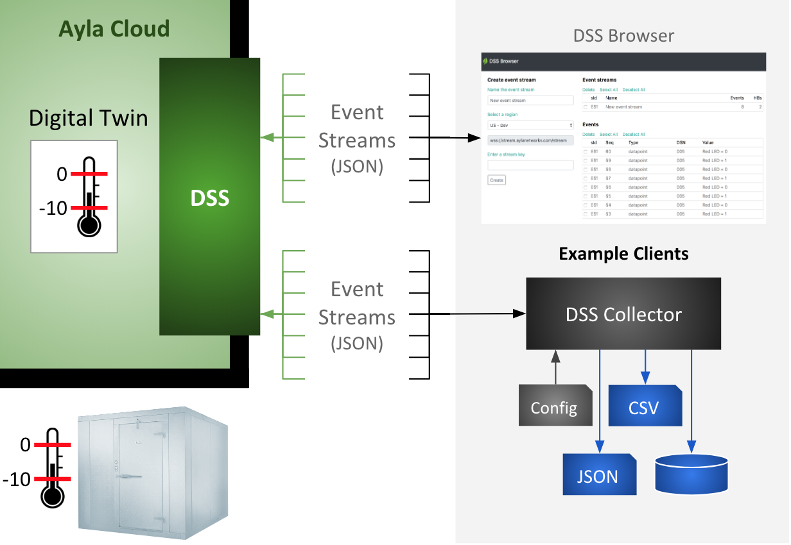
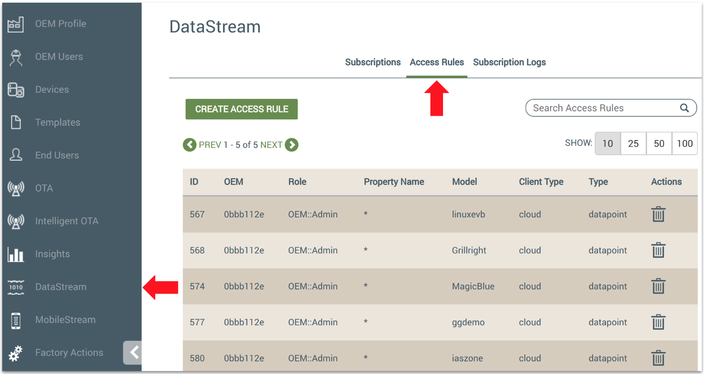
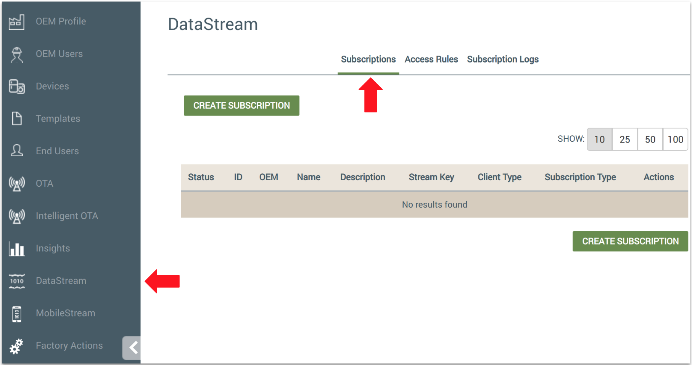
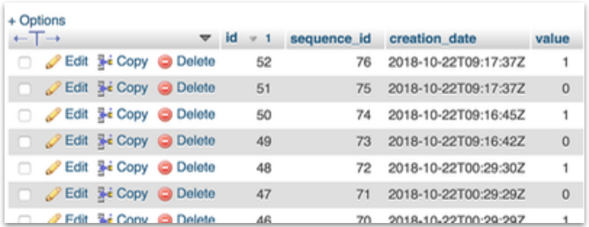

<aside id="pagebar" class="d-xl-block collapse">
  <ul>
    <li><a href="#core-title">Datastream Service</a>
    <ul>
      <li><a href="#events">Events</a>
      <li><a href="#access-rules">Access rules</a>
      <li><a href="#subscriptions">Subscriptions</a>
      <li><a href="#websockets">WebSockets</a>
      <li><a href="#messages">Messages</a>
      <li><a href="#heartbeats">Heartbeats</a>
    </ul>
    </li>
    <li><a href="#hands-on-example">Hands-on example</a>
    <ul>
      <li><a href="#create-a-template">Create a template</a>
      <li><a href="#create-a-virtual-device">Create a virtual device</a>
      <li><a href="#register-the-device">Register the device</a>
      <li><a href="#create-an-access-rule">Create an access rule</a>
      <li><a href="#create-subscriptions">Create subscriptions</a>
    </ul>
    </li>
    <li><a href="#dss-browser">DSS Browser</a></li>
    <li><a href="#dss-collector">DSS Collector</a>
    <ul>
      <li><a href="#install-dss-collector">Install DSS Collector</a>
      <li><a href="#run-dss-collector">Run DSS Collector</a>
      <li><a href="#run-with-forever">Run with Forever</a>
      <li><a href="#save-to-json-file">Save to JSON file</a>
      <li><a href="#save-to-database">Save to database</a>
    </ul>
    </li>
    <li><a href="#api">API</a>
    <ul>
      <li><a href="#create-access-rule">Create Access Rule</a>
      <li><a href="#create-subscription">Create Subscription</a>
      <li><a href="#delete-access-rule">Delete Access Rule</a>
      <li><a href="#delete-subscription">Delete Subscription</a>
      <li><a href="#get-access-rule">Get Access Rule</a>
      <li><a href="#get-access-rules">Get Access Rules</a>
      <li><a href="#get-subscription">Get Subscription</a>
      <li><a href="#get-subscriptions">Get Subscriptions</a>
    </ul>
    </li>
    <li><a href="#regional-domains">Regional Domains</a></li>
  </ul>
</aside>

This page provides a hands-on introduction to the Ayla Datastream Service (DSS), a WebSocket server that pushes device-related event notifications (in near real-time) from the Ayla Cloud to subscribing WebSocket clients. It also introduces two example clients, DSS Browser, a web application that displays event notifications, and DSS Collector, a Node.js application that persists event notifications. The diagram below provides a high-level overview:

In the diagram, the digital twin representing the walk-in freezer includes two properties: The <code>max_temp</code> integer property specifies the maximum safe temperature for the freezer (0oF). The <code>too_warm</code> boolean property (-10oF) indicates whether the temperature inside the freezer is above (true) or below (false) <code>max_temp</code>. Whenever <code>too_warm</code> changes, DSS can be configured to send an event notification to all subscribed WebSocket clients.

## Events

DSS detects the following events, and then sends event notifications to subscribed clients.

|Event|Description|
|-|-|
|connectivity|The Ayla Cloud is able/not able to interact with a registered device.|
|datapoint|A digital twin property value changed.|
|datapointack|An Ayla Agent confirmed to the Ayla Cloud that a device property value changed.|
|location|A digital twin latitute/longitude value changed.|
|registration|The Ayla Cloud registered/unregistered a device.|

The JSON formats of the notifications are seen below:

### Connectivity Format

<pre>
{
  "seq": "1",
  "metadata": {
    "oem_id": "0dfc7900",
    "oem_model": "ledevb",
    "dsn": "AC000W000340649",
    "resource_tags": [],
    "event_type": "connectivity"
  },
  "connection": {
    "event_time": "2018-09-24T10:26:37Z",
    "user_uuid": "00000000-0000-0000-0000-000000000000",
    "status": "Online"
  }
} 
</pre>

### Datapoint Format

<pre>
{
  "seq": "13",
  "metadata": {
    "oem_id": "0dfc7900",
    "oem_model": "linuxevb",
    "dsn": "AC000W005606115",
    "property_name": "Blue_LED",
    "display_name": "Blue_LED",
    "base_type": "boolean",
    "resource_tags": [],
    "event_type": "datapoint"
  },
  "datapoint": {
    "id": "1ff9b91c-bfe4-11e8-1261-67d251d3ec96",
    "created_at_from_device": null,
    "updated_at": "2018-09-24T10:25:14Z",
    "created_at": "2018-09-24T10:25:14Z",
    "user_uuid": "00000000-0000-0000-0000-000000000000",
    "echo": true,
    "closed": false,
    "value": 0,
    "metadata": {}
  }
}
</pre>

### Datapointack Format

<pre>
{
  "seq": "2",
  "metadata": {
    "oem_id": "0dfc7900",
    "oem_model": "linuxevb",
    "dsn": "AC000W005606115",
    "property_name": "Blue_LED",
    "display_name": "Blue_LED",
    "base_type": "boolean",
    "resource_tags": [],
    "event_type": "datapointack"
  },
  "datapoint": {
    "id": "15af3cfc-bfe4-11e8-f2f0-9aab1d61f636",
    "created_at_from_device": null,
    "updated_at": "2018-09-24T10:24:57Z",
    "created_at": "2018-09-24T10:24:57Z",
    "user_uuid": "00000000-0000-0000-0000-000000000000",
    "echo": false,
    "closed": false,
    "value": 1,
    "ack_message": 0,
    "ack_status": 200,
    "ack_id": "160c8c90-bfe4-11e8-87f4-8d732085e587",
    "acked_at": "2018-09-24T10:24:57Z",
    "metadata": {}
  }
}
</pre>

### Location Format

<pre>
{
  "seq": "1",
  "metadata": {
    "oem_id": "0dfc7900",
    "oem_model": "ledevb",
    "dsn": "AC000W000340779",
    "resource_tags": [],
    "event_type": "location"
  },
  "location_event": {
    "dsn": "AC000W000340779",
    "ip": "67.255.234.73",
    "lat": " 44.769500",
    "long": "-69.428300",
    "provider": "ip-based",
    "user_uuid": "00000000-0000-0000-0000-000000000000",
    "created_at": "2018-09-24T11:04:07Z"
  }
}
</pre>

### Registration Format

<pre>
{
  "seq": "1",
  "metadata": {
    "oem_id": "0dfc7900",
    "oem_model": "ledevb",
    "dsn": "AC000W000340649",
    "resource_tags": [],
    "event_type": "registration"
  },
  "registration_event": {
    "dsn": "AC000W000340649",
    "user_uuid": null,
    "registered": false,
    "registration_type": "AP-Mode",
    "unregistered_at": "2018-09-24T10:29:50Z"
  }
}
</pre>

## Access rules

To receive event notifications, a user must be a member of a role (e.g. Admin, Staff, SupportEngineer) associated with a DSS event type. Admins can create access rules using the Ayla Dashboard Portal (as seen below) or via the [API](#api).

## Subscriptions

To receive event notifications, clients must also possess a subscription key associated with a DSS event type. Admins can create subscription keys using the Ayla Dashboard Portal (as seen below) or via the [API](#api).

Once created, a subscription looks like this:

<pre>
{
  "subscription": {
    "id": 50155,
    "oem": "abcd1234",
    "dsn": "*",
    "name": "Test",
    "description": "",
    "property_name": "*",
    "connection_status": "Offline",
    "batch_size": 1,
    "is_suspended": false,
    "created_at": "2018-10-24T14:40:57Z",
    "updated_at": "2018-10-24T14:40:57Z",
    "date_suspended": null,
    "user_uuid": "12345000-1234-1234-1234-000000012345",
    "oem_model": "freezer-model",
    "stream_key": "abcdef01234567890000000000000001",
    "client_type": "cloud",
    "subscription_type": "datapoint"
  }
}
</pre>

A subscription defines the following:

1. The type of event that Ayla DSS will push on a particular event stream (connectivity, datapoint, etc.).
1. Filters to limit events of the specified type (OEM, OEM models, DSNs, properties). 
1. A user whose access rules further restrict events.
1. A subscription key (similar to an Auth Token) that clients use when opening a WebSocket.

## WebSockets

A WebSocket enables sustained, bidirectional communication over HTTP. Ayla DSS is a WebSocket server that sends events and heartbeats to WebSocket clients that receive the events and acknowledge the heartbeats. A Javascript client might instantiate a WebSocket in this manner: 

<pre>
let socket = new WebSocket(url + '?stream_key=' + key)
</pre>

There are several instances of Ayla DSS throughout the world, and the <code>url</code> parameter indicates the appropriate instance for your region and deployment type (see [Regional Domains](#regional-domains)). The <code>key</code> parameter specifies the subscription key. Once constructed, a WebSocket client listens for events with a set of callback functions similar to the following:

<pre>
socket.onopen = function(msg){}
socket.onerror = function(msg){}
socket.onmessage = function(msg){}
socket.onclose = function(msg){}
</pre>

See [DSS Browser](#dss-browser) or [DSS Collector](#dss-collector) for examples of full implementations.

## Messages

A WebSocket onmessage function receives MessageEvent objects that encapsulate heartbeats or DSS events. A MessageEvent object might include key/value pairs similar to the following: 

<pre>
bubbles: false
cancelBubble: false
cancelable: false
composed: false
currentTarget: WebSocket {}
data: "1|Z"
defaultPrevented: false
eventPhase: 0
isTrusted: true
lastEventId: ""
origin: "wss://stream.aylanetworks.com"
path: []
ports: []
returnValue: true
source: null
srcElement: WebSocket {}
target: WebSocket {}
timeStamp: 192795.29999988154
type: "message"
</pre>

The key/value pair of interest is <code>data:"1&#124;Z"</code>. The key is <code>data</code>. The value, <code>"1&#124;Z"</code>, indicates that this MessageEvent is a DSS heartbeat. If the MessageEvent had been an actual event (connectivity, datapoint, etc.), the value would have been similar to <code>data:"481&#124;{}"</code>. The number <code>481</code> represents the length of the JSON event string within the curly braces. The "&#124;" is useful for splitting the string into length and event. And, the curly braces, <code>{}</code>, encapsulate the actual JSON event string which might look like this:

<pre>
{
  "seq": "13",
  "metadata": {
    "oem_id": "0dfc7900",
    "oem_model": "linuxevb",
    "dsn": "AC000W005606115",
    "property_name": "Blue_LED",
    "display_name": "Blue_LED",
    "base_type": "boolean",
    "resource_tags": [],
    "event_type": "datapoint"
  },
  "datapoint": {
    "id": "1ff9b91c-bfe4-11e8-1261-67d251d3ec96",
    "created_at_from_device": null,
    "updated_at": "2018-09-24T10:25:14Z",
    "created_at": "2018-09-24T10:25:14Z",
    "user_uuid": "00000000-0000-0000-0000-000000000000",
    "echo": true,
    "closed": false,
    "value": 0,
    "metadata": {}
  }
}
</pre>

## Heartbeats

A DSS client onmessage function must, therefore, (1) determine if a MessageEvent is a heartbeat or a DSS event, (2) respond if it's a heartbeat, and (3) process if it's a DSS event: 

<pre>
socket.onmessage = function(msg) {
  if(msg.data.includes('|Z')) {
    stream.socket.send('Z')
  }
  else {
    var arr = msg.data.split('|')
    let event = JSON.parse(arr[1])
    process(event)
  }
}
</pre>

# Hands-on example

This section shows you a simple way to trigger DSS events based on the freezer example.

## Create a template

1. In Developer Portal, click <code>View My Devices > Templates</code>.
1. Click <code>Add</code>, and create a template with the following parameters:
<table>
<tr><th>Visibility:</th><td>oem</td></tr>
<tr><th>Name:</th><td>Freezer</td></tr>
<tr><th>Description:</th><td>Walk-in freezer</td></tr>
<tr><th>Registation Type:</th><td>Same-LAN</td></tr>
<tr><th>Model:</th><td>freezer-model</td></tr>
<tr><th>Product Name:</th><td>freezer-product</td></tr>
</table>
1. On the template list, find and click your new template.
1. Click <code>Properties</code>.
1. Click <code>Add</code>, and create a property with the following parameters:
<table>
<tr><th>Property Type:</th><td>TemplateProperty</td></tr>
<tr><th>Name:</th><td>max_temp</td></tr>
<tr><th>Display Name:</th><td>Max Temp</td></tr>
<tr><th>Base Type:</th><td>integer</td></tr>
<tr><th>Direction:</th><td>To Device</td></tr>
<tr><th>Scope:</th><td>oem</td></tr>
</table>
1. Click <code>Add</code>, and create another property with the following parameters:
<table>
<tr><th>Property Type:</th><td>TemplateProperty</td></tr>
<tr><th>Name:</th><td>too_warm</td></tr>
<tr><th>Display Name:</th><td>Too Warm</td></tr>
<tr><th>Base Type:</th><td>boolean</td></tr>
<tr><th>Direction:</th><td>From Device</td></tr>
<tr><th>Scope:</th><td>oem</td></tr>
</table>

## Create a virtual device

1. In Dashboard Portal, click <code>Devices > Virtual Devices</code>.
1. Click <code>Create Virtual Device</code>, and create one with the following parameters:
<table>
<tr><th>Product Name:</th><td>Freezer</td></tr>
<tr><th>OEM Model:</th><td>freezer-model</td></tr>
</table>
1. On the Virtual Devices list, find and click your new device.
1. Click <code>Template</code>.
1. Click <code>Edit</code>, select <code>Freezer</code> from <code>Associate a template</code>, and click <code>Update</code>.

## Register the device

1. In Dashboard Portal, click <code>Devices > Virtual Devices</code>.
1. On the Virtual Devices list, select the checkbox for the <code>Freezer</code> device.
1. Click <code>Assign/Change User</code>, fill in the form, and click <code>Update</code>.
1. Browse to Developer Portal to view your new <code>Freezer</code> device.
1. Click the device <code>Serial Number</code> to view the <code>Max Temp</code> and <code>Too Warm</code> properties.

## Create an access rule

1. In Dashboard Portal, click <code>DataStream</code>.
1. Click <code>Access Rules</code>.
1. Click <code>Create Access Rule</code>, and create one with the following parameters:
<table>
<tr><th>Role:</th><td>OEM::Admin (or your role)</td></tr>
<tr><th>Model:</th><td>freezer-model</td></tr>
<tr><th>Client Type:</th><td>cloud</td></tr>
<tr><th>Type:</th><td>datapoint</td></tr>
</table>

## Create subscriptions

Include how to create subscriptions programmatically using the REST API. Refer to the REST API section.

1. In Dashboard Portal, click <code>DataStream</code>.
1. Click <code>Subscriptions</code>.
1. Click <code>Create Subscription</code>, and create one with the following parameters:
<table>
<tr><th>Name:</th><td>Freezer too_warm for DSS Browser</td></tr>
<tr><th>Property Name:</th><td>too_warm</td></tr>
<tr><th>OEM Model:</th><td>freezer-model</td></tr>
<tr><th>Client Type:</th><td>cloud</td></tr>
<tr><th>Subscription Type:</th><td>datapoint</td></tr>
</table>
1. Create a second subscription with the following parameters:
<table>
<tr><th>Name:</th><td>Freezer too_warm for DSS Collector</td></tr>
<tr><th>Property Name:</th><td>too_warm</td></tr>
<tr><th>OEM Model:</th><td>freezer-model</td></tr>
<tr><th>Client Type:</th><td>cloud</td></tr>
<tr><th>Subscription Type:</th><td>datapoint</td></tr>
</table>
1. Create a third subscription with the following parameters:
<table>
<tr><th>Name:</th><td>Freezer max_temp for DSS Collector</td></tr>
<tr><th>Property Name:</th><td>max_temp</td></tr>
<tr><th>OEM Model:</th><td>freezer-model</td></tr>
<tr><th>Client Type:</th><td>cloud</td></tr>
<tr><th>Subscription Type:</th><td>datapoint</td></tr>
</table>

# DSS Browser

<a href="dss-browser/client.html" target="_blank">DSS Browser</a> is an example, browser-based, single-page, WebSocket client that detects and displays DSS events. It consists of three files: <a href="dss-browser/client.html" target="_blank">client.html</a>, <a href="dss-browser/client.css" target="_blank">client.css</a>, and <a href="dss-browser/client.js" target="_blank">client.js</a>. The following directions (based on the [Example Scenario](#example-scenario)) show you how to use DSS Browser to detect and display datapoint events:

1. Run <a href="dss-browser/client.html" target="_blank">DSS Browser</a>.
1. For <code>Name the event stream</code>, enter <code>Freezer too_warm for DSS Browser</code>.
1. For <code>Enter a stream key</code>, enter the appropriate subscription stream key that you defined in your Dashboard Portal.
1. Click <code>Create</code>.
1. Notice the new event stream on the Event Stream list.
1. Notice the heartbeat counter (HBs) incrementing every 30 seconds or so.
1. Click the new event stream to reveal details. Click again to hide details.
1. In Developer Portal, change the value of the too_warm property several times.
1. In DSS Browser, notice the new events on the Events list.
1. Notice that the Event Stream event counter has incremented.
1. Click an event row to reveal the JSON composition of a DSS "datapoint" event.
1. Attempt to create another event stream with the same stream key. Close the message box.
1. Delete the event stream and the events.
1. Create another event stream using the same stream key, but enter "0" in the <code>First Seq ID</code> field. DSS resends all events associated with the stream key starting with seq == 0. Start again, but this time include both a <code>First Seq ID</code> and a <code>Last Seq ID</code>.

<a data-toggle="collapse" href="#create-event-stream-form" role="button" aria-expanded="false" aria-controls="create-event-stream-form">View workflow approach</a>

<form id="create-event-stream-form" class="collapse" action="javascript:void(0);">
  <ol>
    <li><input id="event-stream-name" type="text" class="form-control form-control-sm mb-3" placeholder="Name the event stream" style="max-width: 300px;"></li>
    <li><input id="stream-key" type="text" class="form-control form-control-sm mb-3" placeholder="Enter a DSS stream key" style="max-width: 300px;"></li>
    </li>
    <li><button type="submit" class="btn btn-secondary btn-sm">Create the event stream</button>
      <table id="dss-event-streams" class="dss-browser-table">
        <thead>
          <tr>
            <th>&nbsp;</th>
            <th>ES</th>
            <th>Name</th>
            <th>Events</th>
            <th>HBs</th>
          </tr>
        </thead>
        <tbody></tbody>
      </table>
    </li>
    <li>Toggle property value (not implemented yet; use Aura): 
      <label class="switch"><input id="property-value" type="checkbox" value=""></label>
      <table id="dss-events" class="dss-browser-table">
        <thead>
          <tr>
            <th>&nbsp;</th>
            <th>ES</th>
            <th>Seq</th>
            <th>Type</th>
            <th>DSN</th>
            <th>Value</th>
          </tr>
        </thead>
        <tbody></tbody>
      </table>
    </li>
  </ol>
</form>

# DSS Collector

DSS Collector is an example Node.js WebSocket client that detects and displays DSS events. It consists of one source file (<a href="dss-collector/collector.js" target="_blank">collector.js</a>) and one configuration file (<a href="dss-collector/config.json" target="_blank">config.json</a>). The directions below show you how to install, run, and modify DSS Collector:

## Install DSS Collector

1. Create a project directory, and change to the new directory:
<pre>$ mkdir dss-collector
$ cd dss-collector</pre>
1. Initialize the project, install the [ws](https://www.npmjs.com/package/ws), [fs-extra](https://github.com/jprichardson/node-fs-extra), [mysql](https://www.npmjs.com/package/mysql) modules, and create a subdirectory:
<pre>$ npm init -y
$ npm install --save ws fs-extra mysql
$ mkdir events</pre>
1. Create a <a href="dss-collector/collector.js" target="_blank">collector.js</a> file in the current directory.</li>
1. Create a <a href="dss-collector/config.json" target="_blank">config.json</a> file in the current directory, and replace the two placeholder stream keys with your own.</li>

## Run DSS Collector

<ol>
</li>
<li>Run DSS Collector:
<pre>$ node collector.js</pre>

DSS Collector displays the config file, opens two streams, and begins to receive heartbeats from Ayla DSS:

<pre>Running DSS Collector
CONFIG.JSON:
[
  {
    "id": "ES1",
    "name": "Freezer too_warm for DSS Collector",
    "url": "wss://stream.aylanetworks.com/stream",
    "key": "abcdef01234567890000000000000001",
    "persistence": {
      "json": false,
      "relational": false
    }
  },
  {
    "id": "ES2",
    "name": "Freezer max_temp for DSS Collector",
    "url": "wss://stream.aylanetworks.com/stream",
    "key": "abcdef01234567890000000000000002",
    "persistence": {
      "json": false,
      "relational": false
    }
  }
]
onopen for stream key abcdef01234567890000000000000001
onopen for stream key abcdef01234567890000000000000002
--> HEARTBEAT: Freezer max_temp for DSS Collector
--> HEARTBEAT: Freezer too_warm for DSS Collector
</pre>
</li>
<li>Use Developer Portal to modify the too_warm property value of the Freezer device several times.</li>
<li>View DSS Collector output:
<pre>--> DATAPOINT
Data: {"seq":"81","metadata":{"oem_id":"0bbb112e","oem_model":"freezer-model","dsn":"VD0bbb112e0000011","property_name":"too_warm","display_name":"Too Warm","base_type":"boolean","event_type":"datapoint"},"datapoint":{"id":"858ec04e-d5e0-11e8-0cb4-cf62cbb7102b","created_at_from_device":null,"updated_at":"2018-10-22T09:54:52Z","created_at":"2018-10-22T09:54:52Z","user_uuid":"00000000-0000-0000-0000-000000000000","echo":false,"closed":false,"value":0,"metadata":{"key1":"","key2":""}}}
--> DATAPOINT
Data: {"seq":"82","metadata":{"oem_id":"0bbb112e","oem_model":"freezer-model","dsn":"VD0bbb112e0000011","property_name":"too_warm","display_name":"Too Warm","base_type":"boolean","event_type":"datapoint"},"datapoint":{"id":"85ce5826-d5e0-11e8-a7f6-245134964eb9","created_at_from_device":null,"updated_at":"2018-10-22T09:54:52Z","created_at":"2018-10-22T09:54:52Z","user_uuid":"00000000-0000-0000-0000-000000000000","echo":false,"closed":false,"value":1,"metadata":{"key1":"","key2":""}}}
--> DATAPOINT
Data: {"seq":"83","metadata":{"oem_id":"0bbb112e","oem_model":"freezer-model","dsn":"VD0bbb112e0000011","property_name":"too_warm","display_name":"Too Warm","base_type":"boolean","event_type":"datapoint"},"datapoint":{"id":"861c4dc4-d5e0-11e8-aa46-f866d707a973","created_at_from_device":null,"updated_at":"2018-10-22T09:54:53Z","created_at":"2018-10-22T09:54:53Z","user_uuid":"00000000-0000-0000-0000-000000000000","echo":false,"closed":false,"value":0,"metadata":{"key1":"","key2":""}}}
</pre>
</li>
<li>Do the same with the max_temp property:
<pre>--> DATAPOINT
Data: {"seq":"10","metadata":{"oem_id":"0bbb112e","oem_model":"freezer-model","dsn":"VD0bbb112e0000011","property_name":"max_temp","display_name":"Max Temp","base_type":"integer","event_type":"datapoint"},"datapoint":{"id":"ba239578-d5e0-11e8-8766-b73b1765d576","created_at_from_device":null,"updated_at":"2018-10-22T09:56:20Z","created_at":"2018-10-22T09:56:20Z","user_uuid":"00000000-0000-0000-0000-000000000000","echo":false,"closed":false,"value":-5,"metadata":{}}}
--> HEARTBEAT: Freezer too_warm for DSS Collector
--> DATAPOINT
Data: {"seq":"11","metadata":{"oem_id":"0bbb112e","oem_model":"freezer-model","dsn":"VD0bbb112e0000011","property_name":"max_temp","display_name":"Max Temp","base_type":"integer","event_type":"datapoint"},"datapoint":{"id":"bddb9ed6-d5e0-11e8-b35c-ff397f60f4a0","created_at_from_device":null,"updated_at":"2018-10-22T09:56:26Z","created_at":"2018-10-22T09:56:26Z","user_uuid":"00000000-0000-0000-0000-000000000000","echo":false,"closed":false,"value":-6,"metadata":{}}}
--> DATAPOINT
Data: {"seq":"12","metadata":{"oem_id":"0bbb112e","oem_model":"freezer-model","dsn":"VD0bbb112e0000011","property_name":"max_temp","display_name":"Max Temp","base_type":"integer","event_type":"datapoint"},"datapoint":{"id":"c11eb01a-d5e0-11e8-67d7-066dff484cc1","created_at_from_device":null,"updated_at":"2018-10-22T09:56:32Z","created_at":"2018-10-22T09:56:32Z","user_uuid":"00000000-0000-0000-0000-000000000000","echo":false,"closed":false,"value":-7,"metadata":{}}}
</pre>
</li>
<li>Stop DSS Collector using <code>Ctl-c</code>.</li>
</ol>

## Run with Forever

If <a href="https://www.npmjs.com/package/forever" target="_blank">forever</a> is installed in your runtime environment, you can use the following commands:

Start the service:

<pre>
$ forever -o output.log -e error.log --minUptime 1000ms --spinSleepTime 1000ms start collector.js
</pre>

View the service:

<pre>
$ forever list
info:    Forever processes running
data:        uid  command                                          script       forever pid   id logfile                         uptime     
data:    [0] WsJb /home/bitnami/.nvm/versions/node/v9.8.0/bin/node collector.js 22736   22746    /home/bitnami/.forever/WsJb.log 0:0:0:8.52
</pre>

Tail the service log files with the forever utility:

<pre>
$ forever logs 0
...
</pre>

Tail the service log files with tail:

<pre>
$ tail -f output.log
...
</pre>

Stop the service:

<pre>
$ forever stop &lt;Id|Uid|Pid|Index|Script&gt;
</pre>

## Save to JSON file

<ol>
<li>Open config.json, and change <code>false</code> to <code>true</code> for both <code>json</code> keys.
<pre>
"persistence": {
  "json": true,
  "relational": false
}
</pre>
</li>
<li>Run DSS Collector, and generate max_temp and too_warm events.</li>
<li>In a second terminal, change directory to <code>events</code>.
<pre>$ cd events/</pre>
</li>
<li>List the directory contents:
<pre>
$ ls -1
ES1-datapoint.json
ES2-datapoint.json
</pre>
</li>
<li><code>cat</code> or <code>tail</code> one of the files:
<pre>
$ tail ES1-datapoint.json 
{"seq":"86","metadata":{"oem_id":"0bbb112e","oem_model":"freezer-model","dsn":"VD0bbb112e0000011","property_name":"too_warm","display_name":"Too Warm","base_type":"boolean","event_type":"datapoint"},"datapoint":{"id":"497868f0-d5e8-11e8-0e75-3f195033d92c","created_at_from_device":null,"updated_at":"2018-10-22T10:50:27Z","created_at":"2018-10-22T10:50:27Z","user_uuid":"b95384c0-8165-11e8-929b-0a27c1b236f4","echo":false,"closed":false,"value":1,"metadata":{"key1":"","key2":""}}}
{"seq":"87","metadata":{"oem_id":"0bbb112e","oem_model":"freezer-model","dsn":"VD0bbb112e0000011","property_name":"too_warm","display_name":"Too Warm","base_type":"boolean","event_type":"datapoint"},"datapoint":{"id":"499b5a90-d5e8-11e8-6118-87a6f989b19f","created_at_from_device":null,"updated_at":"2018-10-22T10:50:27Z","created_at":"2018-10-22T10:50:27Z","user_uuid":"b95384c0-8165-11e8-929b-0a27c1b236f4","echo":false,"closed":false,"value":0,"metadata":{"key1":"","key2":""}}}
{"seq":"88","metadata":{"oem_id":"0bbb112e","oem_model":"freezer-model","dsn":"VD0bbb112e0000011","property_name":"too_warm","display_name":"Too Warm","base_type":"boolean","event_type":"datapoint"},"datapoint":{"id":"49cfb376-d5e8-11e8-5ffb-d412e49bfd18","created_at_from_device":null,"updated_at":"2018-10-22T10:50:28Z","created_at":"2018-10-22T10:50:28Z","user_uuid":"b95384c0-8165-11e8-929b-0a27c1b236f4","echo":false,"closed":false,"value":1,"metadata":{"key1":"","key2":""}}}
{"seq":"89","metadata":{"oem_id":"0bbb112e","oem_model":"freezer-model","dsn":"VD0bbb112e0000011","property_name":"too_warm","display_name":"Too Warm","base_type":"boolean","event_type":"datapoint"},"datapoint":{"id":"49f9dc8c-d5e8-11e8-64b2-2c35b108a89e","created_at_from_device":null,"updated_at":"2018-10-22T10:50:28Z","created_at":"2018-10-22T10:50:28Z","user_uuid":"b95384c0-8165-11e8-929b-0a27c1b236f4","echo":false,"closed":false,"value":0,"metadata":{"key1":"","key2":""}}}
</pre>
</li>
</ol>

## Save to database

<ol>
<li>Create a database table:
<pre>
DROP TABLE IF EXISTS too_warm;
CREATE TABLE too_warm(
  id int NOT NULL AUTO_INCREMENT,
  sequence_id INT,
  creation_date VARCHAR(24),
  value BOOLEAN,
  PRIMARY KEY (id)
);
</pre>
</li>
<li>Test the table by adding a fake record:
<pre>
INSERT INTO too_warm (sequence_id, creation_date, value) VALUES ('0', '2018-10-21T21:46:22Z', '1');
</pre>
</li>
<li>Open collector.js, and modify <code>mysql.createPool</code> appropriately:
<pre>
const pool = mysql.createPool({
  connectionLimit : 10,
  host: 'localhost',
  user: 'root',
  password: 'abc123',
  database: 'dss'
})
</pre>
</li>
<li>Open config.json, and change <code>false</code> to <code>true</code> for the <code>relational</code> key of the <code>too_warm</code> entry.
<pre>
{
  "id" : "ES1",
  "name": "Freezer too_warm for DSS Collector",
  "url": "wss://stream.aylanetworks.com/stream",
  "key": "abcdef01234567890000000000000001",
  "persistence": {
    "json": true,
    "relational": true
  }
}
</pre>
</li>
<li>Run DSS Collector, and generate too_warm events.</li>
<li>Use phpMyAdmin (or similar) to check results:

</li>
</ol>

# API

In addition to the WebSocket service for streaming events (described in the preceding sections), DSS provides a REST API for managing DSS subscriptions programmatically. Operations include the following:

* [Create Access Rule](#create-access-rule)
* [Create Subscription](#create-subscription)
* [Delete Access Rule](#delete-access-rule)
* [Delete Subscription](#delete-subscription)
* [Get Access Rule](#get-access-rule)
* [Get Access Rules](#get-access-rules)
* [Get Subscription](#get-subscription)
* [Get Subscriptions](#get-subscriptions)

## Create Access Rule

Creates a DSS access rule which is required before obtaining a DSS subscription.

### Request

<pre>POST https://&lt;DSS Domain&gt;/api/v1/oemAccessRules</pre>

<table>
  <tr>
    <th>Authorization</th>
    <td>auth_token abcdef0123456789abcdef0123456789</td>
  </tr>
  <tr>
    <th>Content-Type</th>
    <td>application/json</td>
  </tr>
  <tr>
    <th>Accept</th>
    <td>application/json</td>
  </tr>
</table>

<pre>
{
  "role": "",
  "oem_model": "",
  "property_name": "",
  "client_type": "",
  "subscription_type": ""
}
</pre>

|Parameter|Type|Necessity|Description|
|-|-|-|
|role|string|Required|OEM::Admin, OEM::Staff, OEM::SupportEngineer, OEM::SupportManager|
|oem_model|string|&nbsp;|* or a comma-separated list of oem models|
|property_name|string|&nbsp;|* or a comma-separated list of property names|
|client_type|string|Required|cloud or user_opt_in|
|subscription_type|string|Required|connectivity, datapoint, datapointack, location, or registration|

### Response

<table>
  <tr>
    <th>201</th>
    <td>Created</td>
  </tr>
</table>

<pre>
{
  "OemAccessRule": {
    "id": 755,
    "role": "OEM::Admin",
    "oem": "abcd1234",
    "property_name": "*",
    "oem_model": "*",
    "client_type": "cloud",
    "subscription_type": "datapoint",
    "access_grant": true,
    "created_at": "2019-09-11T15:37:47Z",
    "updated_at": "2019-09-11T15:37:47Z"
  }
}
</pre>

### Example

<pre>
curl -X POST \
  https://stream.aylanetworks.com/api/v1/oemaccessrules \
  -H 'Accept: application/json' \
  -H 'Authorization: auth_token abcdef0123456789abcdef0123456789' \
  -H 'Content-Type: application/json' \
  -H 'cache-control: no-cache' \
  -d '{
  "role": "OEM::Admin",
  "oem_model": "*",
  "property_name": "*",
  "client_type": "cloud",
  "subscription_type": "datapoint"
}'
</pre>

## Create Subscription

Creates a DSS subscription including a stream key which is requred by a client to open a WebSocket.

### Request

<pre>POST https://&lt;DSS Domain&gt;/api/v1/subscriptions.json</pre>

<table>
  <tr>
    <th>Authorization</th>
    <td>auth_token abcdef0123456789abcdef0123456789</td>
  </tr>
  <tr>
    <th>Content-Type</th>
    <td>application/json</td>
  </tr>
</table>

<pre>
{
  "name": "",
  "description": "",
  "oem_model": "",
  "dsn": "",
  "property_name": "",
  "client_type": "",
  "subscription_type": ""
}
</pre>

<table>
  <tr>
    <th>Parameter</th>
    <th>Type</th>
    <th>Necessity</th>
    <th>Description</th>
  </tr>
  <tr>
    <td>name</td>
    <td>string</td>
    <td>&nbsp;</td>
    <td>A name meaningful to the user</td>
  </tr>
  <tr>
    <td>description</td>
    <td>string</td>
    <td>&nbsp;</td>
    <td>A description meaningful to user</td>
  </tr>
  <tr>
    <td>oem_model</td>
    <td>string</td>
    <td>Required</td>
    <td>&#42; or a comma-separated list of oem models</td>
  </tr>
  <tr>
    <td>dsn</td>
    <td>string</td>
    <td>Required</td>
    <td>&#42; or a comma-separated list of dsns. Required if oem_model == &#42;</td>
  </tr>
  <tr>
    <td>property_name</td>
    <td>string</td>
    <td>Required</td>
    <td>&#42; or a comma-separated list of property names</td>
  </tr>
  <tr>
    <td>client_type</td>
    <td>string</td>
    <td>Required</td>
    <td>cloud or user_opt_in</td>
  </tr>
  <tr>
    <td>subscription_type</td>
    <td>string</td>
    <td>Required</td>
    <td>connectivity, datapoint, datapointack, location, or registration</td>
  </tr>
</table>

### Response

<table>
  <tr>
    <th>201</th>
    <td>Created</td>
  </tr>
</table>

<pre>
{
  "subscription": {
    "id": 50155,
    "oem": "abcd1234",
    "dsn": "*",
    "name": "Test",
    "description": "",
    "property_name": "*",
    "connection_status": "Offline",
    "batch_size": 1,
    "is_suspended": false,
    "created_at": "2018-10-24T14:40:56Z",
    "updated_at": "2018-10-24T14:40:56Z",
    "date_suspended": null,
    "user_uuid": "00000000-0000-0000-0000-000000000000",
    "oem_model": "freezer-model",
    "stream_key": "abcdef01234567890000000000000001",
    "client_type": "cloud",
    "subscription_type": "datapoint"
  }
}
</pre>

### Example

<pre>
curl -X POST \
  https://stream.aylanetworks.com/api/v1/subscriptions.json \
  -H 'Accept: application/json' \
  -H 'Authorization: auth_token abcdef0123456789abcdef0123456789' \
  -H 'Cache-Control: no-cache' \
  -H 'Content-Type: application/json'
  -d '{
  "name": "Test",
  "description": "",
  "oem_model": "freezer-model",
  "dsn": "*",
  "property_name": "*",
  "client_type": "cloud",
  "subscription_type": "datapoint"
}'
</pre>

## Delete Access Rule

Deletes the access rule specified by a access rule id.

### Request

<pre>DELETE https://&lt;DSS Domain&gt;/api/v1/oemAccessRules/:accessRuleId</pre>

<table>
  <tr>
    <th>Authorization</th>
    <td>auth_token abcdef0123456789abcdef0123456789</td>
  </tr>
</table>

No request data.

### Response

<table>
  <tr>
    <th>204</th>
    <td>No Content</td>
  </tr>
</table>

No response data.

### Example

<pre>
curl -X DELETE \
  https://stream.aylanetworks.com/api/v1/oemAccessRules/567 \
  -H 'Accept: application/json' \
  -H 'Authorization: auth_token abcdef0123456789abcdef0123456789' \
  -H 'cache-control: no-cache'
</pre>

## Delete Subscription

Deletes the subscription specified by a subscription id.

### Request

<pre>DELETE https://&lt;DSS Domain&gt;/api/v1/subscriptions/:subscriptionId.json</pre>

<table>
  <tr>
    <th>Authorization</th>
    <td>auth_token abcdef0123456789abcdef0123456789</td>
  </tr>
</table>

No request data.

### Response

<table>
  <tr>
    <th>204</th>
    <td>No Content</td>
  </tr>
</table>

No response data.

### Example

<pre>
curl -X DELETE \
  https://stream.aylanetworks.com/api/v1/subscriptions/50155.json \
  -H 'Accept: application/json' \
  -H 'Authorization: auth_token abcdef0123456789abcdef0123456789' \
  -H 'Cache-Control: no-cache' \
  -H 'Content-Type: application/json'
</pre>

## Get Access Rule

Gets the access rule specified by an access rule Id.

### Request

<pre>GET https://&lt;DSS Domain&gt;/api/v1/oemAccessRules/:accessRuleId</pre>

<table>
  <tr>
    <th>Authorization</th>
    <td>auth_token abcdef0123456789abcdef0123456789</td>
  </tr>
  <tr>
    <th>Accept</th>
    <td>application/json</td>
  </tr>
</table>

No request data.

### Response

<table>
  <tr>
    <th>200</th>
    <td>OK</td>
  </tr>
</table>

<pre>
{
  "OemAccessRule": {
      "id": 567,
      "role": "OEM::Admin",
      "oem": "abcd1234",
      "property_name": "*",
      "oem_model": "linuxevb",
      "client_type": "cloud",
      "subscription_type": "datapoint",
      "access_grant": true,
      "created_at": "2018-11-20T15:36:59Z",
      "updated_at": "2018-11-20T15:36:59Z"
  }
}
</pre>

### Example

<pre>
curl -X GET \
  https://stream.aylanetworks.com/api/v1/oemAccessRules/567 \
  -H 'Accept: application/json' \
  -H 'Authorization: auth_token abcdef0123456789abcdef0123456789' \
  -H 'cache-control: no-cache'
</pre>

## Get Access Rules

Gets all access rules for the user associated with the auth token.

### Request

<pre>GET https://&lt;DSS Domain&gt;/api/v1/oemAccessRules</pre>

<table>
  <tr>
    <th>Authorization</th>
    <td>auth_token abcdef0123456789abcdef0123456789</td>
  </tr>
  <tr>
    <th>Accept</th>
    <td>application/json</td>
  </tr>
</table>

No request data.

### Response

<table>
  <tr>
    <th>200</th>
    <td>OK</td>
  </tr>
</table>

<pre>
[
  {
    "OemAccessRule": {
        "id": 567,
        "role": "OEM::Admin",
        "oem": "abcd1234",
        "property_name": "*",
        "oem_model": "linuxevb",
        "client_type": "cloud",
        "subscription_type": "datapoint",
        "access_grant": true,
        "created_at": "2018-11-20T15:36:59Z",
        "updated_at": "2018-11-20T15:36:59Z"
    }
  },
  {
    "OemAccessRule": {
        "id": 757,
        "role": "OEM::Admin",
        "oem": "abcd1234",
        "property_name": "*",
        "oem_model": "*",
        "client_type": "cloud",
        "subscription_type": "connectivity",
        "access_grant": true,
        "created_at": "2019-09-11T15:44:52Z",
        "updated_at": "2019-09-11T15:44:52Z"
    }
  }
]
</pre>

### Example

<pre>
curl -X GET \
  https://stream.aylanetworks.com/api/v1/oemAccessRules \
  -H 'Accept: application/json' \
  -H 'Authorization: auth_token abcdef0123456789abcdef0123456789' \
  -H 'cache-control: no-cache' \
  -d ''
</pre>

## Get Subscription

Gets the subscription specified by a subscription id.

### Request

<pre>GET https://&lt;DSS Domain&gt;/api/v1/subscriptions/:subscriptionId.json</pre>

<table>
  <tr>
    <th>Authorization</th>
    <td>auth_token abcdef0123456789abcdef0123456789</td>
  </tr>
  <tr>
    <th>Accept</th>
    <td>application/json</td>
  </tr>
</table>

No request data.

### Response

<table>
  <tr>
    <th>200</th>
    <td>OK</td>
  </tr>
</table>

<pre>
{
  "subscription": {
    "id": 50155,
    "oem": "abcd1234",
    "dsn": "*",
    "name": "Test",
    "description": "",
    "property_name": "*",
    "connection_status": "Offline",
    "batch_size": 1,
    "is_suspended": false,
    "created_at": "2018-10-24T14:40:57Z",
    "updated_at": "2018-10-24T14:40:57Z",
    "date_suspended": null,
    "user_uuid": "00000000-0000-0000-0000-000000000000",
    "oem_model": "freezer-model",
    "stream_key": "abcdef01234567890000000000000001",
    "client_type": "cloud",
    "subscription_type": "datapoint"
  }
}
</pre>

### Example

<pre>
curl -X GET \
  https://stream.aylanetworks.com/api/v1/subscriptions/50155.json \
  -H 'Accept: application/json' \
  -H 'Authorization: auth_token abcdef01234567890000000000000001' \
  -H 'Cache-Control: no-cache' \
  -H 'Content-Type: application/json'
</pre>

## Get Subscriptions

Gets all subscriptions for the user associated with the auth token.

### Request

<pre>GET https://&lt;DSS Domain&gt;/api/v1/subscriptions.json</pre>

<table>
  <tr>
    <th>Authorization</th>
    <td>auth_token abcdef0123456789abcdef0123456789</td>
  </tr>
  <tr>
    <th>Accept</th>
    <td>application/json</td>
  </tr>
</table>

No request data.

### Response

<table>
  <tr>
    <th>200</th>
    <td>OK</td>
  </tr>
</table>

<pre>
[
  {
    "subscription": {
      "id": 50135,
      "oem": "abcd1234",
      "dsn": "*",
      "name": "Freezer too_warm for DSS Browser",
      "description": null,
      "property_name": "too_warm",
      "connection_status": "Offline",
      "batch_size": 1,
      "is_suspended": false,
      "created_at": "2018-10-21T14:38:55Z",
      "updated_at": "2018-10-21T14:38:55Z",
      "date_suspended": null,
      "user_uuid": "00000000-0000-0000-0000-000000000000",
      "oem_model": "freezer-model",
      "stream_key": "abcdef01234567890000000000000002",
      "client_type": "cloud",
      "subscription_type": "datapoint"
    }
  },
  {
    "subscription": {
      "id": 50155,
      "oem": "abcd1234",
      "dsn": "*",
      "name": "Test",
      "description": "",
      "property_name": "*",
      "connection_status": "Offline",
      "batch_size": 1,
      "is_suspended": false,
      "created_at": "2018-10-24T14:40:57Z",
      "updated_at": "2018-10-24T14:40:57Z",
      "date_suspended": null,
      "user_uuid": "00000000-0000-0000-0000-000000000000",
      "oem_model": "freezer-model",
      "stream_key": "abcdef01234567890000000000000001",
      "client_type": "cloud",
      "subscription_type": "datapoint"
    }
  }
]
</pre>

### Example

<pre>
curl -X GET \
  https://stream.aylanetworks.com/api/v1/subscriptions.json \
  -H 'Accept: application/json' \
  -H 'Authorization: auth_token abcdef01234567890000000000000001' \
  -H 'Cache-Control: no-cache' \
  -H 'Content-Type: application/json'
</pre>

# Regional Domains

Use <code>wss</code> for WebSockets, and <code>https</code> for the REST API.

<table>
<tr>
<th>client-type</th>
<th>region</th>
<th>deployment</th>
<th>protocol</th>
<th>datastream-domain</th>
</tr>
<tr>
<td rowspan="10">cloud</td>
<td rowspan="4">cn</td>
<td rowspan="2">dev</td>
<td>wss</td>
<td>stream.ayla.com.cn</td>
</tr>
<tr>
<td>https</td>
<td><a href="https://stream.ayla.com.cn/stream" target="_blank">stream.ayla.com.cn</a></td>
</tr>
<tr>
<td rowspan="2">field</td>
<td>wss</td>
<td>stream-field.ayla.com.cn</td>
</tr>
<tr>
<td>https</td>
<td><a href="https://stream-field.ayla.com.cn/stream" target="_blank">stream-field.ayla.com.cn</a></td>
</tr>
<tr>
<td rowspan="2">eu</td>
<td rowspan="2">field</td>
<td>wss</td>
<td>stream-field-eu.aylanetworks.com</td>
</tr>
<tr>
<td>https</td>
<td><a href="https://stream-field-eu.aylanetworks.com/stream" target="_blank">stream-field-eu.aylanetworks.com</a></td>
</tr>
<tr>
<td rowspan="4">us</td>
<td rowspan="2">dev</td>
<td>wss</td>
<td>stream.aylanetworks.com</td>
</tr>
<tr>
<td>https</td>
<td><a href="https://stream.aylanetworks.com/stream" target="_blank">stream.aylanetworks.com</a></td>
</tr>
<tr>
<td rowspan="2">field</td>
<td>wss</td>
<td>stream-field.aylanetworks.com</td>
<tr>
<td>https</td>
<td><a href="https://stream-field.aylanetworks.com/stream" target="_blank">stream-field.aylanetworks.com</a></td>
</tr>
</tr>
<tr>
<td rowspan="10">mobile</td>
<td rowspan="4">cn</td>
<td rowspan="2">dev</td>
<td>https</td>
<td><a href="https://mdss-dev.ayla.com.cn/" target="_blank">mdss-dev.ayla.com.cn</a></td>
</tr>
<tr>
<td>wss</td>
<td>mstream-dev.ayla.com.cn</td>
</tr>
<tr>
<td rowspan="2">field</td>
<td>https</td>
<td><a href="https://mdss-field.ayla.com.cn/" target="_blank">mdss-field.ayla.com.cn</a></td>
</tr>
<tr>
<td>wss</td>
<td>mstream-field.ayla.com.cn</td>
</tr>
<tr>
<td rowspan="2">eu</td>
<td rowspan="2">field</td>
<td>https</td>
<td>mdss-field-eu.aylanetworks.com</td>
</tr>
<tr>
<td>wss</td>
<td>mstream-field-eu.aylanetworks.com</td>
</tr>
<tr>
<td rowspan="4">us</td>
<td rowspan="2">dev</td>
<td>https</td>
<td>mdss-dev.aylanetworks.com</td>
</tr>
<tr>
<td>wss</td>
<td>mstream-dev.aylanetworks.com</td>
</tr>
<tr>
<td rowspan="2">field</td>
<td>https</td>
<td>mdss-field.aylanetworks.com</td>
<tr>
<td>wss</td>
<td>mstream-field.aylanetworks.com</td>
</tr>
</tr>
</table>

