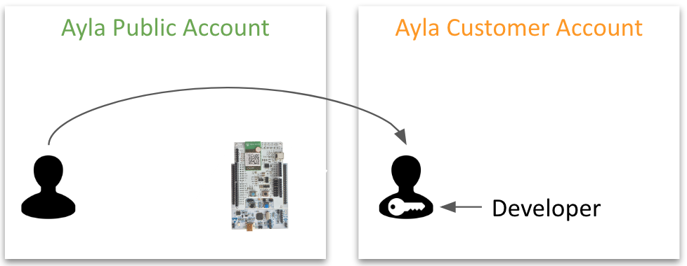
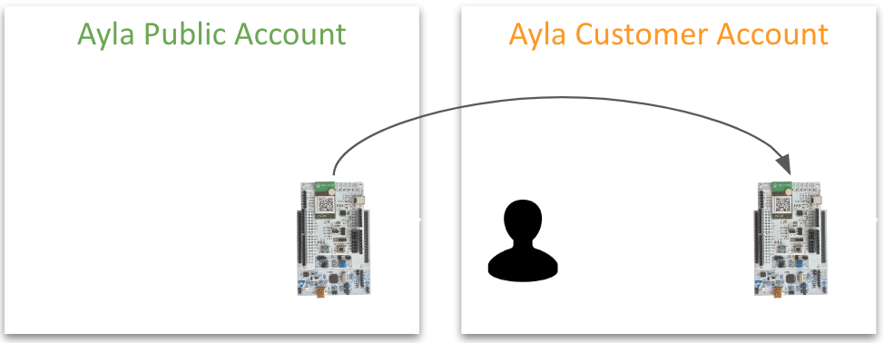
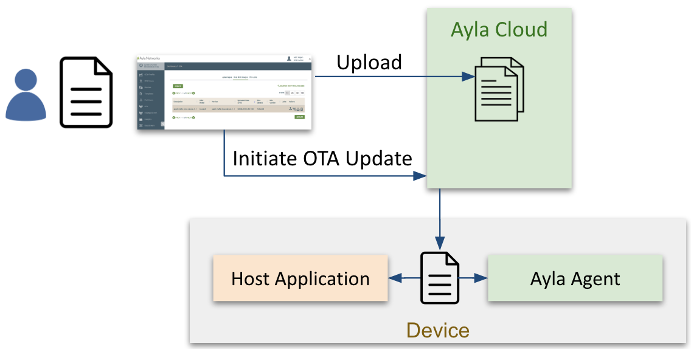
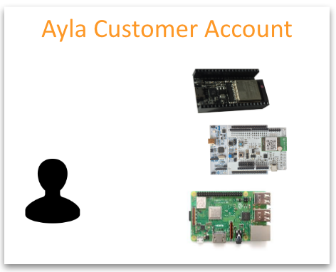
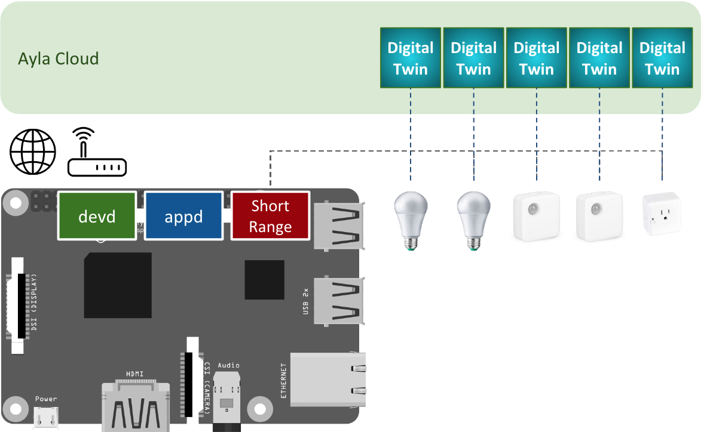
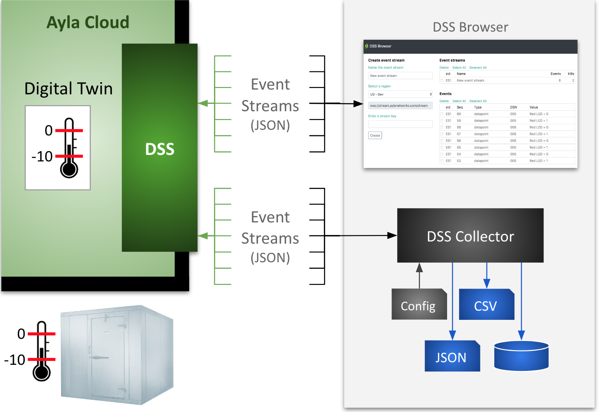

Under construction.

This guide shows you how to work with Ayla Support to create an Ayla Customer Account for your company, migrate your user account, and receive additional access rights. 

Then, you can migrate your kit:

With an Ayla Customer Account, you can explore additional Ayla capabilities such as OTA updates of the Ayla Agent and/or host application:

You can experiment with a range of [edge solutions](/content/ayla-edge-solutions):

You can create gateways for Bluetooth, Zigbee, and other short-range wireless devices:

You can use the Ayla DataStream Service (DSS) to move data from the Ayla Cloud to business systems for analysis:

