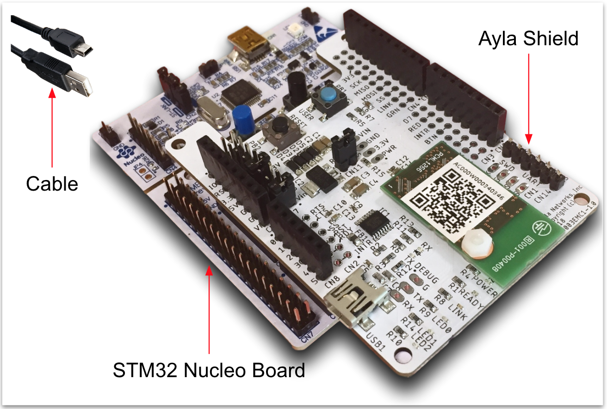
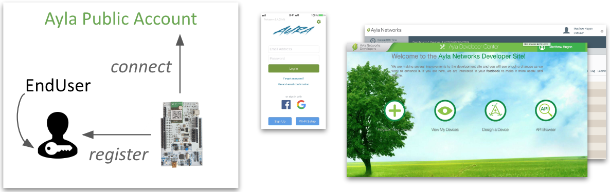
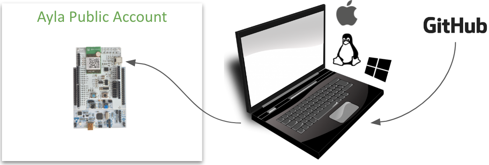
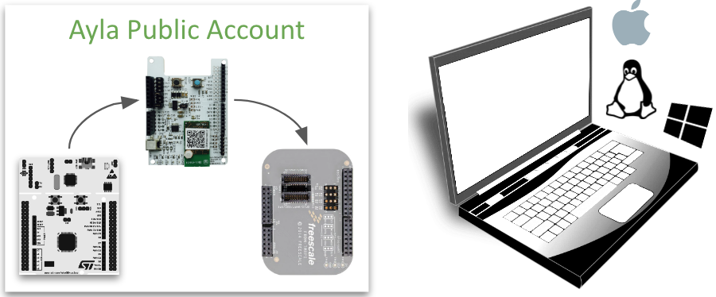
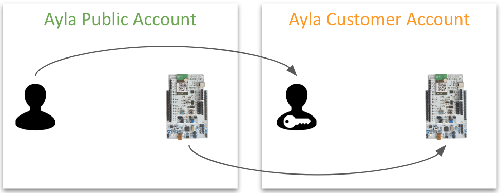

Welcome, developers!

The Ayla Development Kit is designed to help you explore the [Ayla IoT Cloud](https://www.aylanetworks.com/) in preparation for connecting your own devices.

The kit consists of a [STM32 Nucleo Board](https://www.digikey.com/product-detail/en/stmicro/NUCLEO-F303RE/497-15105-ND/5052640&?gclid=EAIaIQobChMI8OT89a6E4QIVQtbACh3BJQLNEAkYBCABEgLKl_D_BwE) with an Ayla Shield, and a USB 2.0 A-Male to Mini-B Cable. To obtain a kit, email <code>support&#64;aylanetworks.com</code> with the subject "Ayla Development Kit." Then, follow the guides:

**Step 1.** The [User Guide](user-guide) helps you create an Ayla account, and connect, register, and explore your kit using Ayla apps and portals:

Important: If you already have a user account in an Ayla <u>Customer</u> Account, then connect the kit to your customer account, and register it to your corresponding user account. There is no requirement to work with the Ayla Public Account.

**Step 2.** The [Developer Guide](developer-guide) helps you establish a Windows, Mac, or Linux development environment, download the Host Application Reference Code from the Ayla Github repository, and modify, build, flash, and run the code:

**Step 3.** The [Porting Guide](porting-guide) helps you move the Ayla Shield to another host board, and port the Host Application Reference Code to the corresponding chipset.

**Step 4.** The [Account Guide](account-guide) shows you how to work with Ayla Support to create an Ayla Customer Account for your company, migrate your user account, and receive additional access rights. Then, you can migrate your kit to the new account where you can explore OTA updates, business system integrations, and additional edge solutions.

