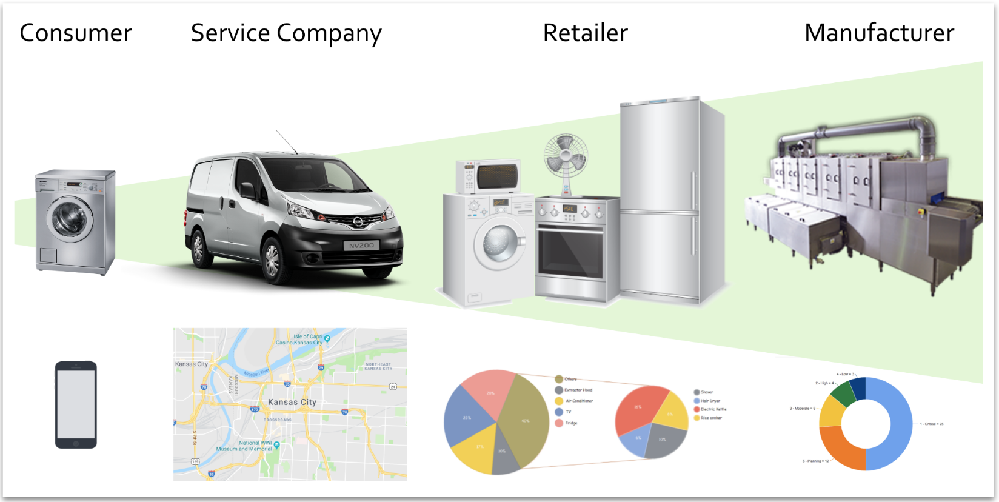
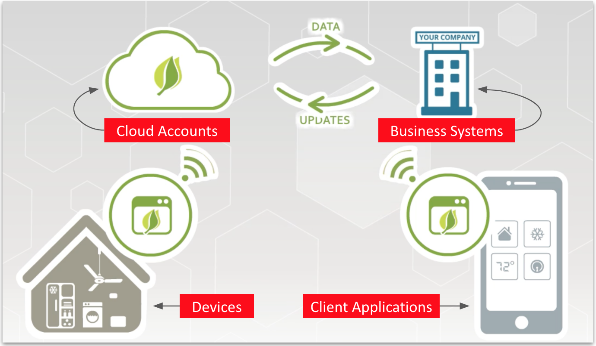
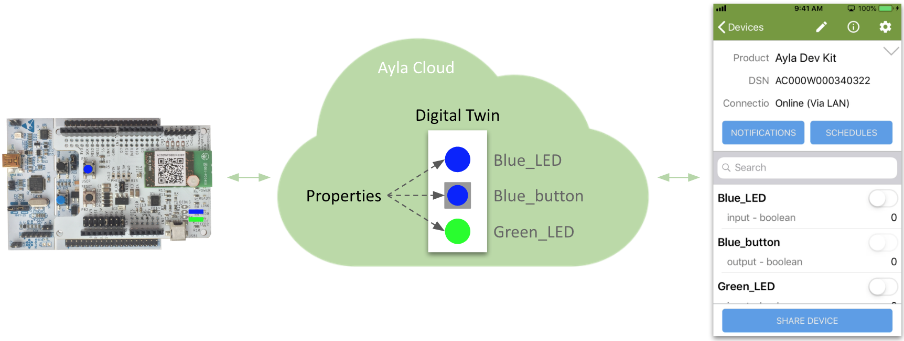
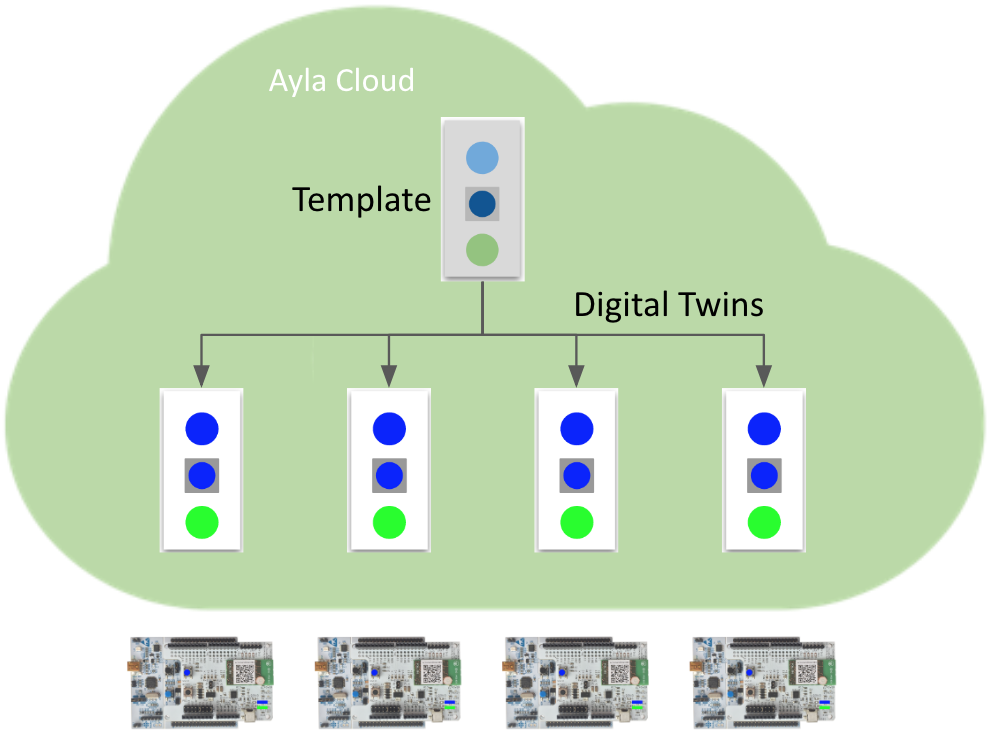
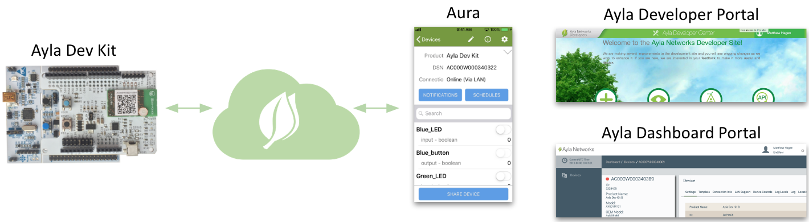

### Ayla Value

Ayla provides value to consumers, service companies, retailers, and manufacturers. Home and business consumers gain control over local devices. Service companies predict and balance service calls. Retailers offer value-added services. Manufacturers base decisions on aggregate data.

### Ayla Architecture

Ayla provides value by connecting devices, cloud accounts, client applications, and business systems as described in the [Ayla Overview](/getting-started/ayla-overview):

### Ayla Agents

Several types of Ayla software agents provide secure connectivity to the Ayla Cloud for a variety of devices:

* [Ayla Production Modules](/devices/ayla-production-modules)
* [Ayla Integrated Agents](/devices/ayla-integrated-agents)
* [Ayla Portable Agent](/devices/ayla-portable-agent)
* [Ayla Linux Agent](/devices/ayla-linux-agent)
* [Ayla Android Agent](/devices/ayla-android-agent)
* [Ayla Dynamic Gateway Agent](/devices/ayla-dynamic-gateway-agent)
* [Ayla Static Gateway Agent](/devices/ayla-static-gateway-agent)

Ayla provides reference host applications (including source code) for each type of Ayla agent. In some cases, the host application communicates with the Ayla agent via SPI or UART (e.g. Ayla Development Kit). In other cases, the host application is linked with the Ayla agent. Developers customize these host applications according to  use case and hardware.

### Digital Twins

To represent a device, the Ayla Cloud creates a digital twin with all the essential characteristics of the device including properties, schedules, and notifications. Client applications like the Aura Mobile App interact with this digital twin: 

### Templates

The Ayla Cloud instantiates a digital twin from a template much like an object-oriented programming language instantiates an object from a class. 

### Apps and portals

The [Aura Mobile App](../aura-mobile-app), [Ayla Developer Portal](../ayla-developer-portal), and [Ayla Dashboard Portal](../ayla-dashboard-portal) enable you to control any device in any Ayla [account and region](../accounts-and-regions). Functionality is limited by access rights associated with user accounts. 

### OTA updates

Ayla provides a mechanism for performing over-the-air (OTA) updates in order to replace the Ayla Agent software and/or the host application software running on your device with different (usually newer) versions.

### Integrations

The Ayla Cloud integrates with business systems via a WebSocket interface called the Datastream Service (DSS):

In this example, the Ayla Cloud generates an event when the freezer temperature crosses a threshold. The black arrows represent heartbeats and events, and the green arrows represents heartbeat responses.