This page introduces the **Ayla Developer Portal**, one of the three primary clients for Ayla users.

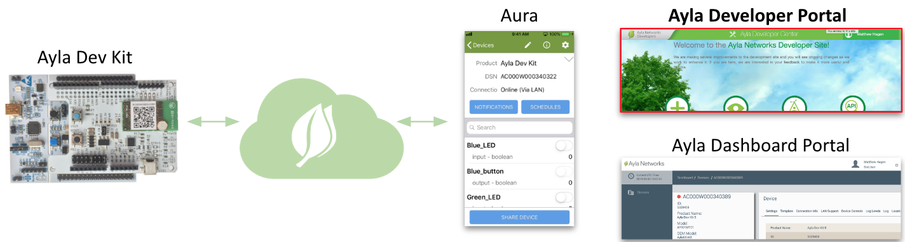

The Developer Portal enables engineers to work with the Ayla Cloud especially during development. It includes a superset of Aura capabilities except sharing, and it's the only Ayla client that enables you to create [templates](../../developer-guide/templates). In addition to Developer Portal menus, this page touches on file properties and email/text notifications, topics better demonstrated here than in Aura.

## Menus

1. Browse to the [Ayla Developer Portal](/content/ayla-developer-portal), log in, and click View My Devices. The Main Menu appears with the Devices tab active:
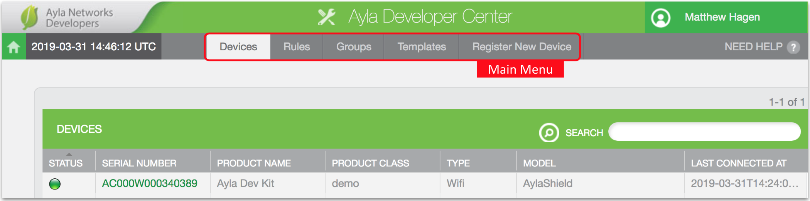
1. Click the Serial Number of your dev kit. The Device Menu appears with the Properties tab active:
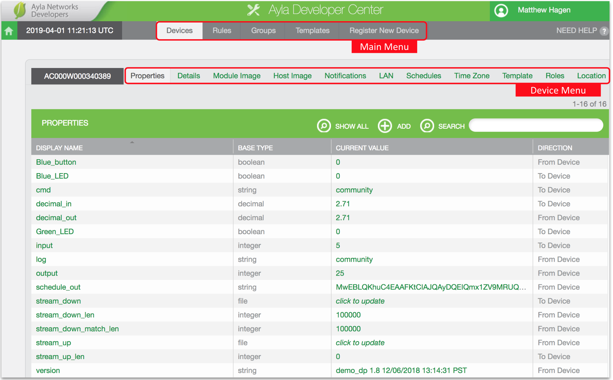
You can click on any property's Current Value to change it.
1. Click Green_LED. The Property Menu appears with the Details tab active:
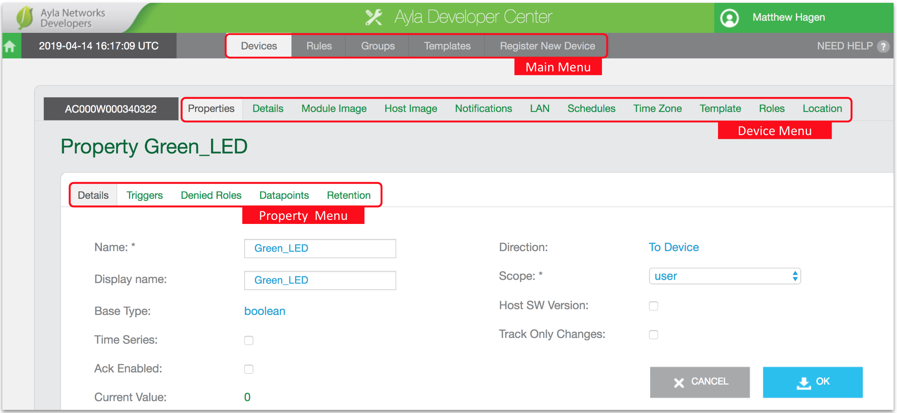
1. Click the Datapoints tab. A datapoints list appears. A datapoint is a time-stamped property value.
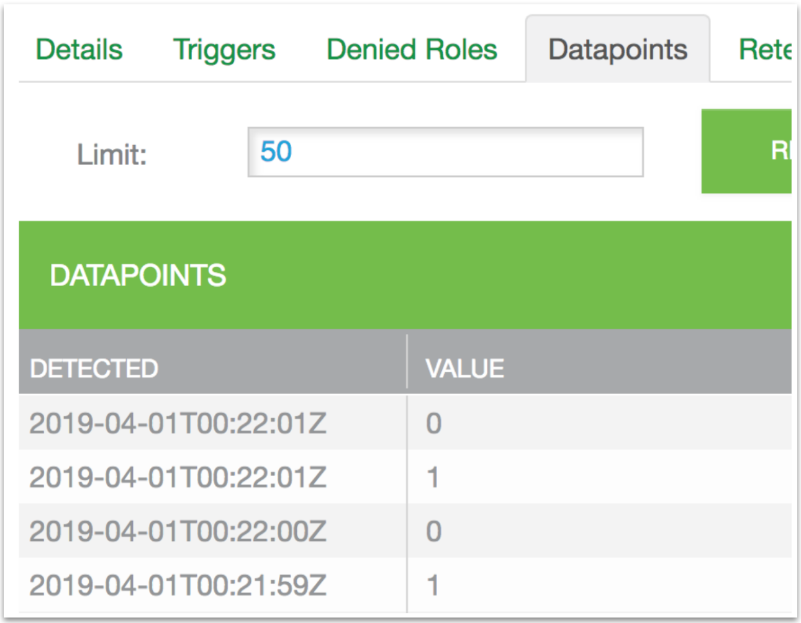
1. Click the Device Details tab:
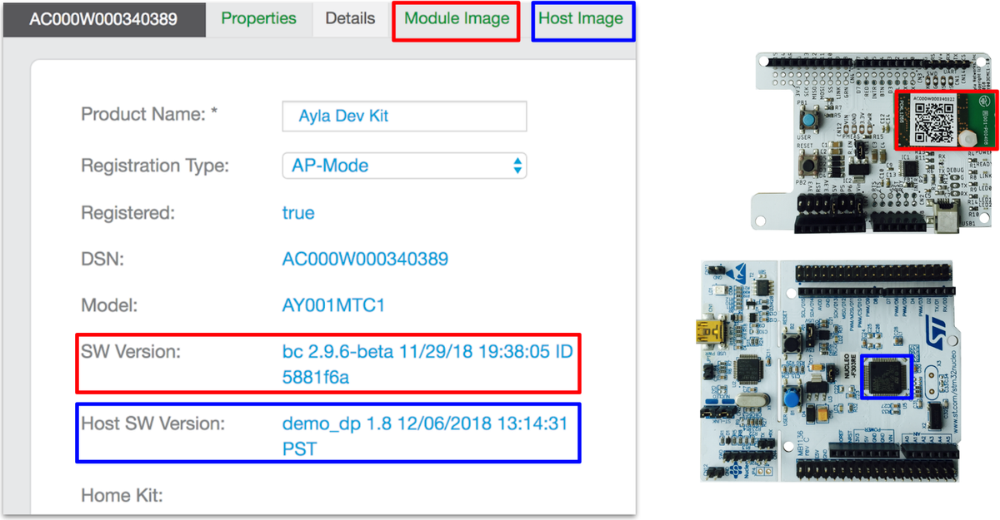
SW Version refers to the version of the Ayla Agent software running on the [Ayla Production Module](/content/ayla-edge-solutions-2019-02/production-modules) on the Ayla Shield of the dev kit. Host SW Version refers to the version of the host application running on the Nucleo board MCU of the dev kit. 

## File properties

The [Properties](../properties) page of this guide provides directions for exploring all types of device properties except File properties. Directions for exploring File properties are provided here:

1. On the Device Menu, click the Properties tab to display the "stream" properties:
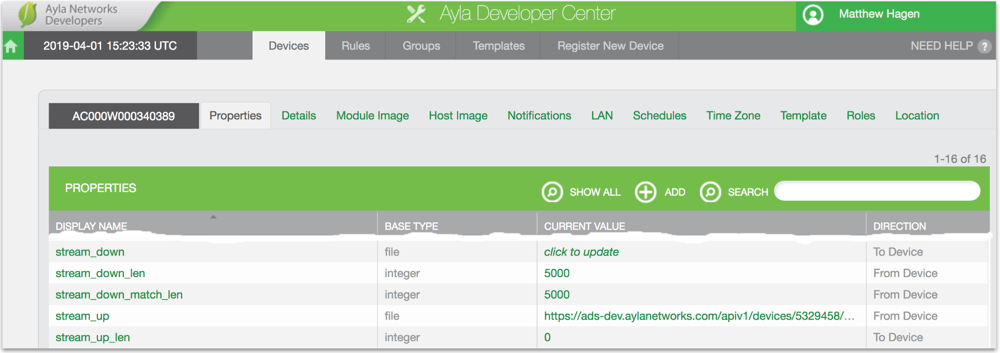
1. Set *stream_up_len* to 5000. The value will (almost immediately) change to zero. Setting *stream_up_len* to 5000 causes the Ayla Cloud to send the value 5000 to the host application on the dev kit. The host application responds by streaming 5000 bytes to the *stream_up* property in the Ayla Cloud. The 5000 bytes conform to a pattern similar to the following:
<pre>
"3D"3E"3F"3G"3H"3I"3J"...
</pre>
1. In the Display Name column, click the *stream_up* property.
1. Click Download, and download the generated file to your computer.
1. Open the file with a text editor to verify the pattern.
1. In the Current Value column of the *stream_down* row, click *click to update*.
1. Click Choose File, select the file you just downloaded, and click OK. The Ayla Cloud streams the file down to the host application on the dev kit. The host application does not store the file. Instead, it counts the number of bytes received, and sets *stream_down_len* to that count. It sets *stream_down_match_len* to the number of bytes that match the pattern originally uploaded. Both should be 5000. This behavior merely demonstrates file properties. You can customize this functionality in your own host application implementation.

## Notifications & Triggers

The [Properties](../properties) page of this guide provides directions for exploring push notifications. Directions for exploring email and text notifications are provided here. Navigate to the Properties tab, and note the Notifications and Triggers tabs:
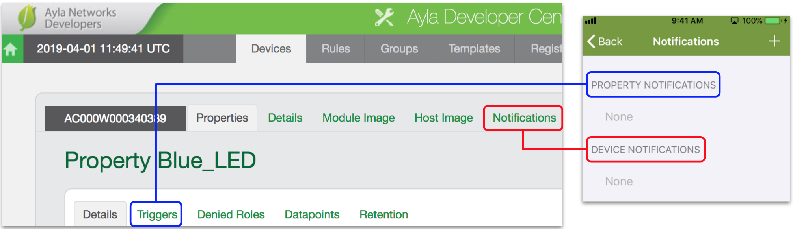
Triggers = Aura Property Notifications. Notifications = Aura Device Notifications.

### Triggers (Aura property notifications)

1. Click the Triggers tab for the Green_LED property. A triggers list appears with (probably) one trigger:
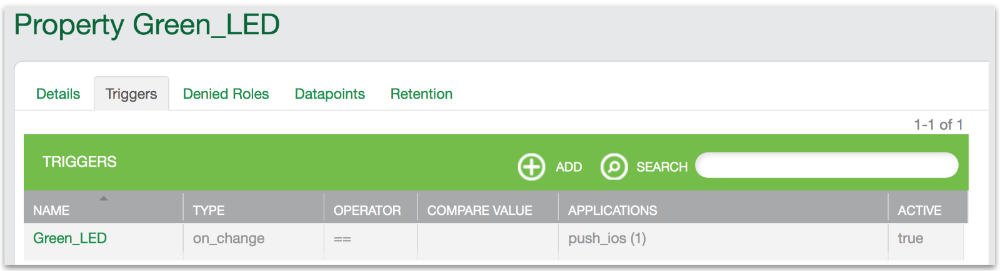
1. Click Green_LED on the Triggers list. An applications list appears with (probably) one application:
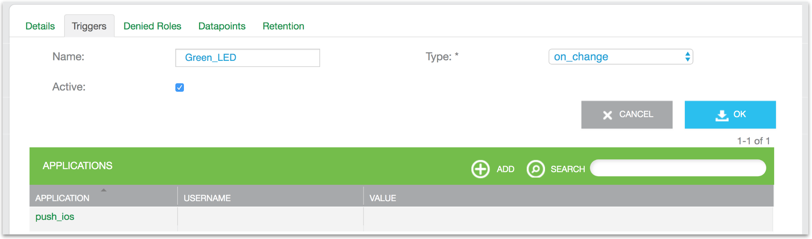
1. Click push_ios. An Edit Application window appears representing the Aura <u>property</u> notification created in [Notifications](../notifications).
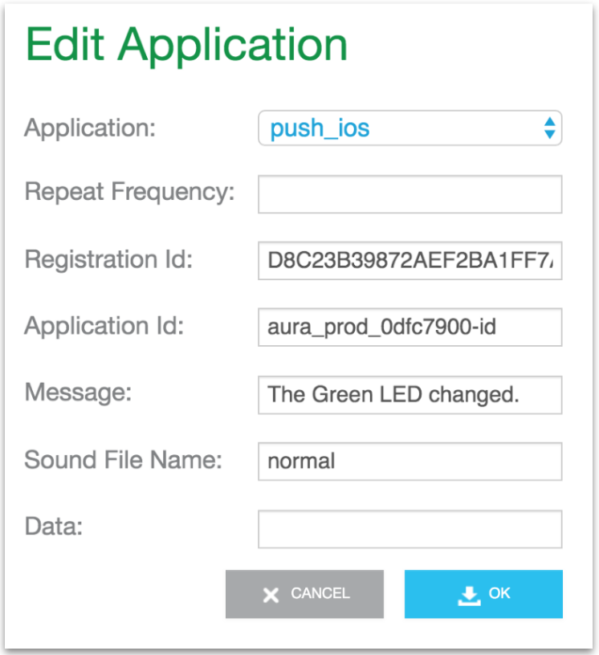
1. Click Cancel. Then, click Add, create an email application similar to the following (substitute an email), and click OK.
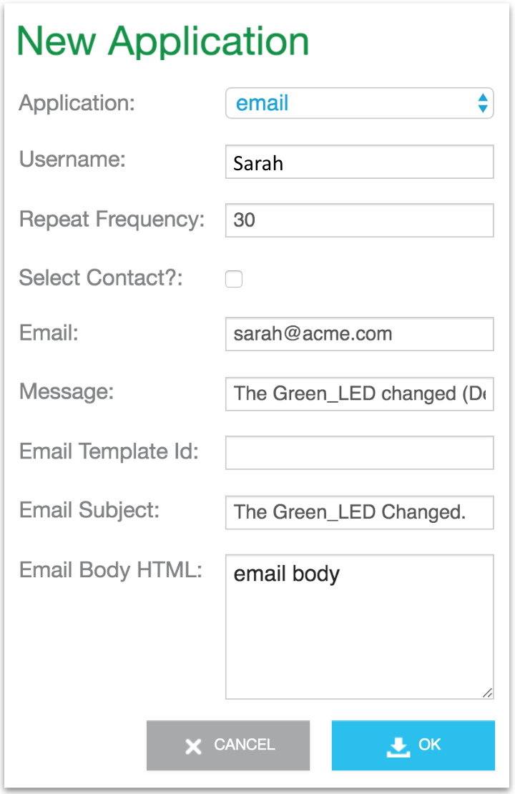
The new application appears on the list:
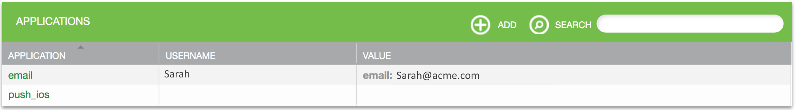
1. Toggle the Green_LED property value.
1. Check your email. You should receive one similar to the following:
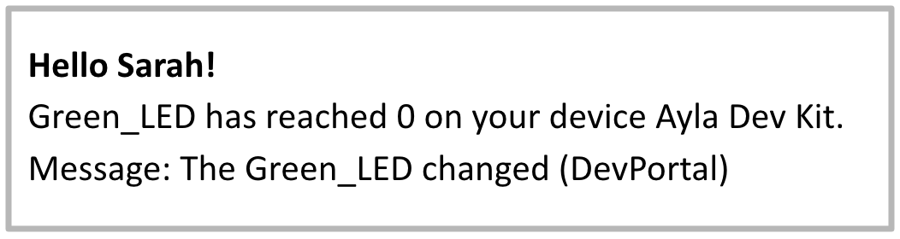

### Notifications (Aura device notifications)

<table><tr><td class="under-review">Functionality under review. Beta Testers, please add comments to [AD-54](https://aylanetworks.atlassian.net/browse/AD-54), or [Contact](/contact) us.</td></tr></table>

1. Click the Notifications tab. The notifications list appears with (probably) one notification:

1. Click on_connection_lost on the list. An application list appears with (probably) one application:

1. Click push_ios. An Edit Application window appears representing the Aura <u>device</u> notification created in [Notifications](../notifications).
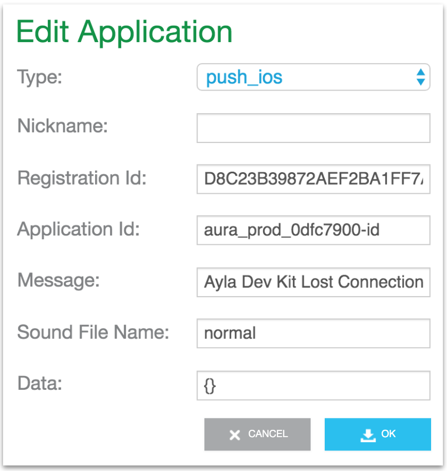
1. Click Cancel. Then, click Add, create an email application similar to the following (substitute an email), and click OK.

The new application appears on the list:
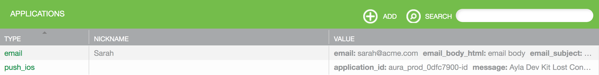
1. Power-off your dev kit, and wait for a few minutes.
1. Check your email. You should receive one similar to the following:
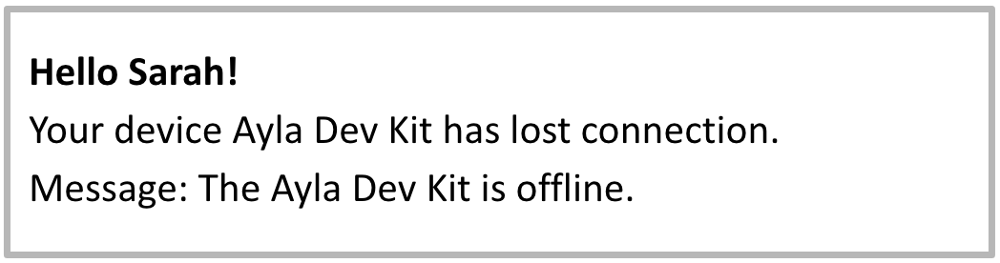
