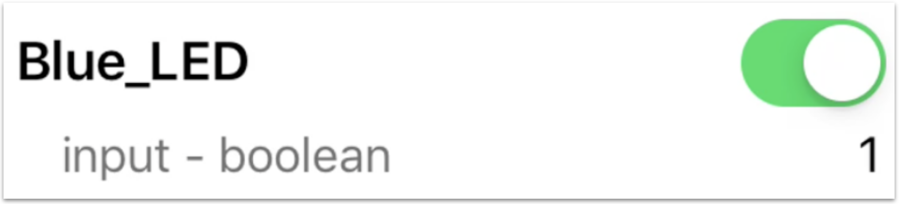
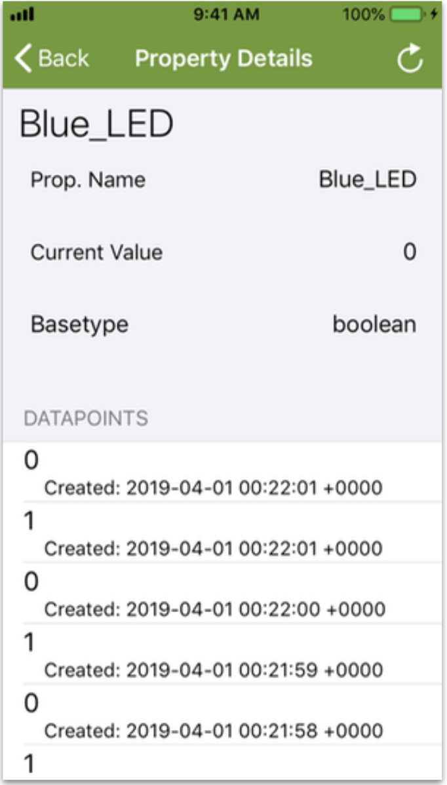
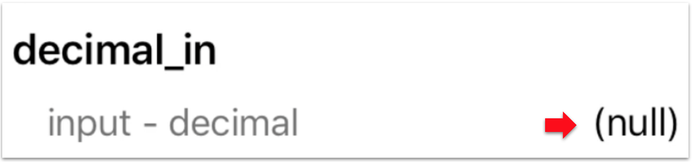
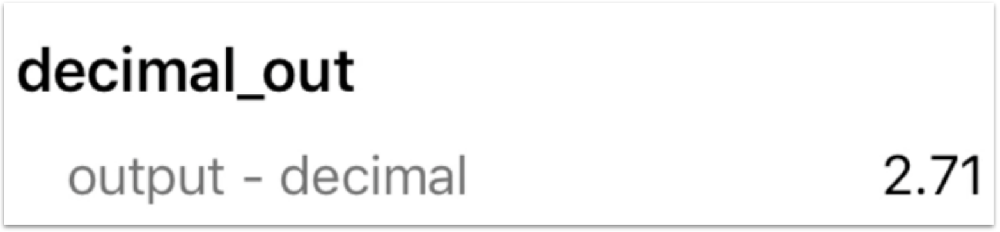

This page helps you explore Ayla device properties. To start with, the Ayla Shield on your Ayla Development Kit has several important landmarks:

If you were the manufacturer of this device, you would decide which of these landmarks should be modeled in the Ayla Cloud. You might want the cloud to be aware when a user presses the blue button. And, you might want to cloud to be able to turn on/off the blue and green LEDs. So, you would designate these landmarks as device properties. The Ayla Cloud sees your Ayla Development Kit as a set of properties bundled into a digital twin:

Some of these properties (e.g. Blue_LED) do, indeed, represent device landmarks. Others (e.g. input & output) exist simply to demonstrate various property types: boolean, string, integer, decimal, and file. The following sections help you explore these properties.

## Boolean properties

1. Tap the Blue_LED property slider:

The Blue LED on the dev kit illuminates. Tapping the slider sends an update *to the device*.

1. Tap the Blue_LED slider On/Off several times to generate a history of values.
1. Tap the Blue_LED name. The Property details screen appears. Pull down on the screen momentarily. The Datapoints list appears:

A datapoint is a time-stamped property value.
1. Tap the Green_LED property slider:

The Green LED on the dev kit illuminates. Tapping this slider also sends an update *to the device*.

1. Press the light-blue button on the Ayla Shield of the dev kit:

The Blue_button property slider slides on.

So, pressing the button on the kit sends an update *from the device*.

## String properties

1. Tap the white space to the right of the cmd property:

1. Enter a string like <code>community</code>, and tap Update Value.

Setting the cmd property sends a string value *to the device*.
1. View the log property:

The host app (on the device) sets <code>log = cmd</code>, and sends the string *from the device*.
1. Tap the version property name:

The Property Details screen displays three property attributes:

The *Current Value* attribute represents the host (application) software version because another attribute (not seen on this screen), <code>host_sw_version</code>, is set to <code>true</code>. The name <code>version</code> is non-essential.

## Integer properties

1. Tap the value to the right of the input property:

A dialog box appears.
1. Enter an integer like <code>5</code>, and tap Update Value.

Setting the input property sends an integer value *to the device*.
1. View the output property:

The host app (on the device) sets <code>output = input &#42; input</code>, and sends the integer *from the device*.

## Decimal properties

1. Tap the value to the right of the decimal_in property:

A dialog box appears.
1. Enter a decimal like <code>2.71</code>, and tap Update Value.

Setting the decimal_in property sends a decimal value *to the device*.
1. View the decimal_out property:

The host app (on the device) sets <code>decimal_out = decimal_in</code>, and sends the decimal *from the device*.

## File properties

To explore File properties, see the **File properties** section on the [Ayla Developer Portal](../ayla-developer-portal) page.

