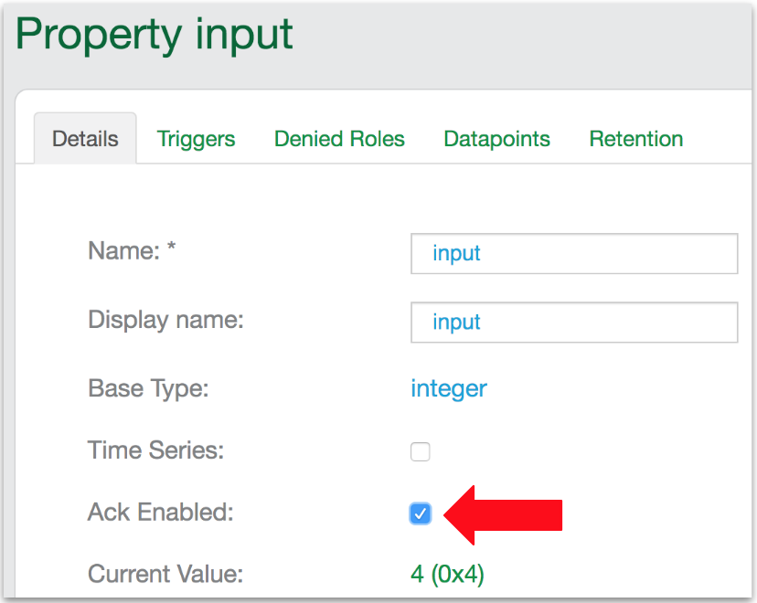
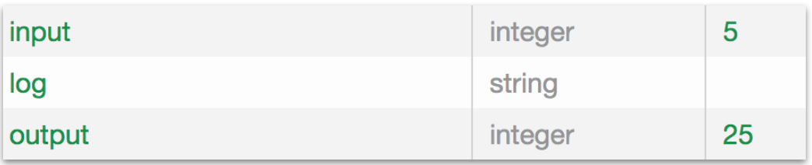
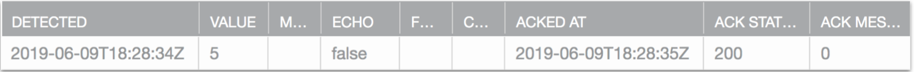
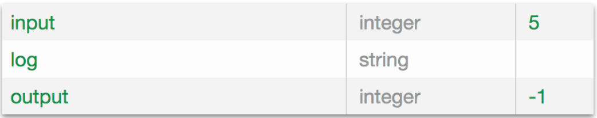
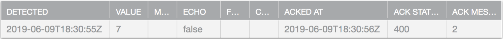

This example shows how to report to the Ayla Cloud the status of a property update just received from the Ayla Cloud. The example implements the <code>input</code> and <code>output</code> properties mentioned in [Build environment test](../build-environment-test), but limits permissible <code>input</code> values to between 5 and -5 inclusive, so that the greatest permissible <code>output</code> value is <code>5 &ast; 5 = 25</code>. In the example, the yellow lines, which implement acknowledgement functionality, are additions to the [Baseline example](../baseline-example).

<pre class="numbered">
#include &lt;string.h&gt;
#include &lt;ayla/utypes.h&gt;
#include &lt;ayla/host_lib.h&gt;
#include &lt;arch/board.h&gt;
#include &lt;mcu_io.h&gt;
#include &lt;toolchain/attributes.h&gt;
#include &lt;ayla/ayla_proto_mcu.h&gt;
#include &lt;ayla/props.h&gt;
#include &lt;demo/demo.h&gt;

#define DEMO_SUFFIX ""
#define DEMO_NAME "demo"
#define DEMO_VERSION "2.0"

const char version[] ATTRIB_VERSION = DEMO_NAME DEMO_SUFFIX " " DEMO_VERSION " " BUILD_VERSION;
static char template_version[] = DEMO_NAME DEMO_SUFFIX " 1.9";

static u8 blue_button;
static s32 input;
static s32 output;

enum demo_val_err {VAL_NO_ERR = 0, VAL_BAD_LEN, VAL_OUT_OF_RNG};

static void set_led(struct prop &ast;prop, void &ast;arg, void &ast;valp, size_t len) {
  u8 val = &ast;(u8 &ast;)valp;
  u32 led = (u32)arg;
  board_led_set(led, val);
}

static int send_led(struct prop &ast;prop, void &ast;arg) {
  u32 led = (u32)prop-&gt;arg;
  u8 val = board_led_get(led);
  return prop_send(prop, &val, sizeof(val), arg);
}

static int send_version(struct prop &ast;prop, void &ast;arg) {
  return prop_send(prop, version, strlen(version), arg);
}

static void set_input(struct prop *prop, void *arg, void *valp, size_t len) {
  s32 i = *(s32 *)valp;
  if (len != sizeof(s32)) {
    prop->ack.ack_status = 1;
    prop->ack.ack_message = VAL_BAD_LEN;
    return;
  }
  if (i > 5 || i < -5) {
    output = -1;
    prop->ack.ack_status = 1;
    prop->ack.ack_message = VAL_OUT_OF_RNG;
  } else {
    input = i;
    output = i * i;
    prop->ack.ack_status = 0;
    prop->ack.ack_message = VAL_NO_ERR;
  }
  demo_log("proposed %s = %ld", prop->name, (long)i);
  demo_log("%s = %ld", prop->name, (long)input);
  demo_log("output = %ld", (long)output);
  prop_send_req("output");
}

static struct prop prop_table[] = {
  {"Blue_button", ATLV_BOOL, NULL, prop_send_generic, &blue_button, sizeof(blue_button)},
  {"Green_LED", ATLV_BOOL, set_led, send_led, (void &ast;)LED1, 1},
  {"input", ATLV_INT, set_input, prop_send_generic, &input, sizeof(input)},
  {"output", ATLV_INT, NULL, prop_send_generic, &output, sizeof(output)},
  {"version", ATLV_UTF8, NULL, send_version, NULL, 0},
  {"oem_host_version", ATLV_UTF8, NULL, prop_send_generic, template_version, sizeof(template_version) - 1},
};

static struct prop_table demo_prop_table = PROP_TABLE_INIT(prop_table);

static void demo_set_button_state(u32 button, u32 button_value) {
  blue_button = button_value;
  prop_send_req("Blue_button");
}

int main(int argc, char &ast;&ast;argv) {
  board_init(argc, argv);
  ayla_host_lib_init();
  atty_init(console_cli);
  board_module_reset();
  demo_factory_reset_handle();
  mcu_button_handler_set(0, demo_set_button_state);
  prop_table_add(&demo_prop_table);
  prop_send_req_to_ads_only("version");
  prop_request_value(NULL);

  for (;;) {
    demo_poll();
  }
}
</pre>

## Run the example

<ol>
<li><code>cd ~/Ayla-host-lib-2.0-rc1</code>.</li>
<li><code>nano example/app/ledevb/demo.c</code>, and replace the contents with the example.</li>
<li><code>make</code> and <code>make download</code>.
<li>Open a screen session with <code>screen /dev/ttyACM0 115200</code> or similar.</li>
<li>Press/release the black button on the host board.</li>
<li>View the output in your screen session:
<pre>
ADS connection DOWN
ADS connection DOWN
ADS connection UP
demo: cloud set input to 4
demo: set output to 16
pushed output
pushed version
</pre>
</li>
<li>Browse to the [Ayla Developer Portal](/content/ayla-developer-portal), click on the <code>input</code> property of your device, check <code>Ack Enabled</code>, and click OK:

</li>
<li>In the Ayla Developer Portal, set <code>input</code> to <code>5</code>:

<code>5</code> is a permissible number, so the host app squares it.
</li>
<li>Check the serial console:
<pre>
demo: proposed input = 5
demo: input = 5
demo: output = 25
pushed output
</pre>
</li>
<li>Check the <code>input</code> datapoint tab:

</li>
<li>Then, set <code>input</code> to <code>7</code>:

<code>7</code> is not a permissible number, so, after receiving the negative ack from the host app, the cloud resets to the previous value.
</li>
<li>Check the serial console:
<pre>
demo: proposed input = 7
demo: input = 5
demo: output = -1
pushed output
</pre>
</li>
<li>Check the <code>input</code> datapoint tab:

</li>
</ol>