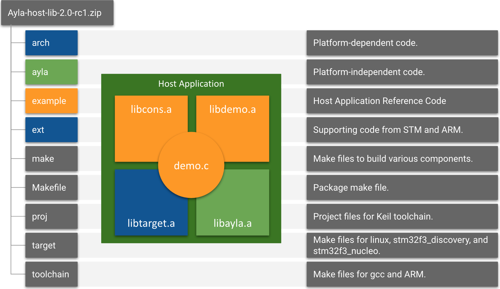

The Ayla Host Library contains the source code and supporting files needed to customize, compile, link, download, and run the host application (<code>ledevb.img</code>) on the Ayla Dev Kit. See the [Build Environment](../build-environment-setup) page to download the Ayla Host Library, and set up your development environment. The following diagram illustrates Ayla Host Library organization:

The following table provides an introductory description of the components that make up the host application. See [API](../../reference/api) for details.

<table>
<tr>
<th nowrap>Component</th>
<th>Description and Source Files</th>
</tr>
<tr>
<td rowspan="2" nowrap><code>demo.c</code></td>
<td>This is the only file you need to modify as you experiment with the Ayla Dev Kit. It implements an array of properties (with supporting functions) supported by the host application. You can modify this array.</td>
</tr>
<tr>
<td>
<code>example/app/ledevb/demo.c</code>
</td>
</tr>
<tr>
<td rowspan="2" nowrap><code>libdemo.a</code></td>
<td>These files compartmentalize host application functionality for better code organization. The factory reset code tells the Ayla Agent to "factory reset" when a user pushes the appropriate buttons on the dev kit. The polling code implements timers, callbacks, and continuous polling of the corresponding digital twin in the Ayla Cloud. The power management code puts the Ayla production module in standby mode, and wakes it up when needed. The image management code participates in over-the-air updates.</td>
</tr>
<tr>
<td>
<code>example/libdemo/demo_factory_reset.c</code> 
<code>example/libdemo/demo_poll.c</code> 
<code>example/libdemo/demo_power.c</code> 
<code>example/libdemo/demo_img_mgmt.c</code>
</td>
</tr>
<tr>
<td rowspan="2" nowrap><code>libcons.a</code></td>
<td>This library enables serial communication, primarily for debugging purposes, between your computer and the host app running on the MCU of the host board. Run <code>screen /dev/ttyACM0 115200</code> or similar in a terminal to initiate communication, and press <code>Ctl-A + k + y</code> to terminate the session. Use the <code>demo_log</code> function to <code>printf</code> messages from the host app on the dev kit to a terminal on your computer. See the <code>console_cmds</code> array in <code>console.c</code> for a list of commands.</td>
</tr>
<tr>
<td>
<code>example/libcons/atty.c</code> 
<code>example/libcons/cmd_handle.c</code> 
<code>example/libcons/console.c</code> 
<code>example/libcons/parse_argv.c</code> 
<code>example/libcons/parse_hex.c</code> 
<code>example/libcons/printf.c</code>
</td>
</tr>
<tr>
<td rowspan="2" nowrap><code>libayla.a</code></td>
<td>This platform-independent library implements the Ayla Agent API. Below are just a few examples of important API functions and structs used by the host application. Name prefixes indicate the corresponding library file:

<code>void host_event_register(struct host_event_callback &ast;cb);</code>

<code>int prop_send(struct prop &ast;, const void &ast;val, size_t val_len, void &ast;arg);</code>

<code>void prop_table_add(struct prop_table &ast;table);</code>

<code>void sched_run_all(u32 &ast;tick_ct_to_use);</code>

<code>struct prop_table {...};</code>

</td>
</tr>
<tr>
<td>
<code>ayla/libayla/callback.c</code> 
<code>ayla/libayla/clock_utils.c</code> 
<code>ayla/libayla/conf_access.c</code> 
<code>ayla/libayla/crc16.c</code> 
<code>ayla/libayla/crc32.c</code> 
<code>ayla/libayla/host_event.c</code> 
<code>ayla/libayla/host_lib.c</code> 
<code>ayla/libayla/host_log.c</code> 
<code>ayla/libayla/host_ota.c</code> 
<code>ayla/libayla/prop_dp.c</code> 
<code>ayla/libayla/props.c</code> 
<code>ayla/libayla/sched.c</code> 
<code>ayla/libayla/schedeval.c</code> 
<code>ayla/libayla/serial_msg.c</code> 
<code>ayla/libayla/spi.c</code> 
<code>ayla/libayla/spi_ping.c</code> 
<code>ayla/libayla/timer.c</code> 
<code>ayla/libayla/tlv.c</code> 
<code>ayla/libayla/uart.c</code> 
<code>ayla/libayla/utf8.c</code> 
<code>ayla/libayla/wifi_conf.c</code>
</td>
</tr>
<tr>
<td rowspan="2" nowrap><code>libtarget.a</code></td>
<td>This platform-dependent library implements the host board API. As you can see by the files below, the default host board is the STM32F303RE Nucleo board. Porting your host application to a different host board means replacing <code>libtarget.a</code>.</td>
</tr>
<tr>
<td>
<code>arch/stm32/al_intr.c</code> 
<code>arch/stm32/stm32.c</code> 
<code>arch/stm32/uart_platform_noOS.c</code> 
<code>arch/stm32f3/mcu_io.c</code> 
<code>arch/stm32f3/spi_platform.c</code> 
<code>arch/stm32f3/stm32f3_discovery.c</code> 
<code>arch/stm32f3/uart_platform.c</code> 
<code>arch/stm32f3/console_platform.c</code> 
<code>ext/STM32F30x_StdPeriph_Driver/src/stm32f30x_rcc.c</code> 
<code>ext/STM32F30x_StdPeriph_Driver/src/stm32f30x_exti.c</code> 
<code>ext/STM32F30x_StdPeriph_Driver/src/stm32f30x_flash.c</code> 
<code>ext/STM32F30x_StdPeriph_Driver/src/stm32f30x_gpio.c</code> 
<code>ext/STM32F30x_StdPeriph_Driver/src/stm32f30x_misc.c</code> 
<code>ext/STM32F30x_StdPeriph_Driver/src/stm32f30x_spi.c</code> 
<code>ext/STM32F30x_StdPeriph_Driver/src/stm32f30x_syscfg.c</code> 
<code>ext/STM32F30x_StdPeriph_Driver/src/stm32f30x_tim.c</code> 
<code>ext/CMSIS/Device/ST/STM32F30x/Source/Templates/system_stm32f30x.c</code>
</td>
</tr>
</table>
