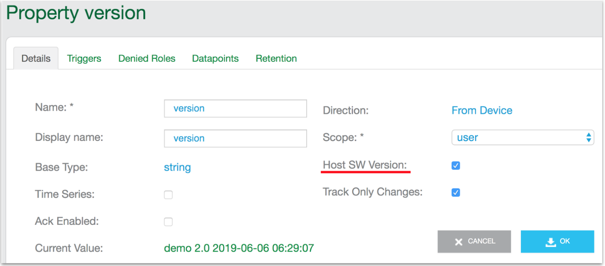

This example is a simplified version of the default <code>example/app/ledevb/demo.c</code>. As you can see in the listing, it includes only four properties: <code>Blue_button</code>, <code>Green_LED</code>, <code>version</code>, and <code>oem_host_version</code>. Below the listing are instructions for running the example followed by a line-by-line analysis. Subsequent pages in the guide provide a series of examples that augment this baseline example to help you explore additional capabilities.

<pre class="numbered">
#include &lt;string.h&gt;
#include &lt;ayla/utypes.h&gt;
#include &lt;ayla/host_lib.h&gt;
#include &lt;arch/board.h&gt;
#include &lt;mcu_io.h&gt;
#include &lt;toolchain/attributes.h&gt;
#include &lt;ayla/ayla_proto_mcu.h&gt;
#include &lt;ayla/props.h&gt;
#include &lt;demo/demo.h&gt;

#define DEMO_SUFFIX ""
#define DEMO_NAME "demo"
#define DEMO_VERSION "2.0"

const char version[] ATTRIB_VERSION = DEMO_NAME DEMO_SUFFIX " " DEMO_VERSION " " BUILD_VERSION;
static char template_version[] = DEMO_NAME DEMO_SUFFIX " 1.9";

static u8 blue_button;

static void set_led(struct prop &ast;prop, void &ast;arg, void &ast;valp, size_t len) {
  u8 val = &ast;(u8 &ast;)valp;
  u32 led = (u32)arg;
  board_led_set(led, val);
}

static int send_led(struct prop &ast;prop, void &ast;arg) {
  u32 led = (u32)prop-&gt;arg;
  u8 val = board_led_get(led);
  return prop_send(prop, &val, sizeof(val), arg);
}

static int send_version(struct prop &ast;prop, void &ast;arg) {
  return prop_send(prop, version, strlen(version), arg);
}

static struct prop prop_table[] = {
  {"Blue_button", ATLV_BOOL, NULL, prop_send_generic, &blue_button, sizeof(blue_button)},
  {"Green_LED", ATLV_BOOL, set_led, send_led, (void &ast;)LED1, 1},
  {"version", ATLV_UTF8, NULL, send_version, NULL, 0},
  {"oem_host_version", ATLV_UTF8, NULL, prop_send_generic, template_version, sizeof(template_version) - 1},
};

static struct prop_table demo_prop_table = PROP_TABLE_INIT(prop_table);

static void demo_set_button_state(u32 button, u32 button_value) {
  blue_button = button_value;
  prop_send_req("Blue_button");
}

int main(int argc, char &ast;&ast;argv) {
  board_init(argc, argv);
  ayla_host_lib_init();
  board_module_reset();
  demo_factory_reset_handle();
  mcu_button_handler_set(0, demo_set_button_state);
  prop_table_add(&demo_prop_table);
  prop_send_req_to_ads_only("version");
  prop_request_value(NULL);

  for (;;) {
    demo_poll();
  }
}
</pre>

## Run the example

<ol>
<li><code>cd ~/Ayla-host-lib-2.0</code>.</li>
<li>If necessary, <code>cp example/app/ledevb/demo.c example/app/ledevb/demo.orig</code>.</li>
<li><code>nano example/app/ledevb/demo.c</code>, and replace the contents with the example.</li>
<li><code>make</code> and <code>make download</code>.
<li>Press/release the black button on the host board.</li>
<li>Verify that the <code>Blue_button</code> and <code>Green_LED</code> properties work.</li>
</ol>

## Analyze the example

### prop_table

The primary Ayla-related purpose of a host application is to define and maintain a <code>prop_table</code> with one entry for each supported property:

<pre class="numbered" style="counter-reset: line 35;">
static struct prop prop_table[] = {
  {"Blue_button", ATLV_BOOL, NULL, prop_send_generic, &blue_button, sizeof(blue_button)},
  {"Green_LED", ATLV_BOOL, set_led, send_led, (void &ast;)LED1, 1},
  {"version", ATLV_UTF8, NULL, send_version, NULL, 0},
  {"oem_host_version", ATLV_UTF8, NULL, prop_send_generic, template_version, sizeof(template_version) - 1},
};

static struct prop_table demo_prop_table = PROP_TABLE_INIT(prop_table);

prop_table_add(&demo_prop_table);
</pre>

A <code>prop_table</code> is an array of <code>struct prop</code> instances, each containing the name, type, set function pointer, send function pointer, value, and/or other information pertinent to a supported property. <code>To Device</code> properties like <code>Green_LED</code> have both set and send function pointers. The Ayla Cloud calls the set function to, for example, power on/off an LED. The host application utilizes the send function to provide the current state of the property to the Ayla Cloud when, for example, the device comes back online. <code>From Device</code> properties like <code>Blue_button</code>, <code>version</code>, and <code>oem_host_version</code>, which send information to the Ayla Cloud, but do not receive information from the cloud, have <code>send</code> functions, but not <code>set</code> functions. So, for example, <code>Blue_button</code> sends changes in button state to the Ayla Cloud, but does not allow the cloud to change button state. 

The <code>PROP_TABLE_INIT</code> macro transforms a <code>struct prop</code> array into a <code>struct prop_table</code> as required by the <code>prop_table_add</code> function which provides to the Ayla Agent a pointer to the property table. 

These structures and macros are defined in <code>ayla/libayla/include/ayla/props.h</code>.

### Blue_button

To handle blue button interrupt events, the host application implements <code>demo_set_button_state</code> which sets <code>blue_button</code> to the new value, and then calls <code>prop_send_req</code> to schedule the sending of the Blue_button property value via <code>prop_send_generic</code>. 

<pre class="numbered" style="counter-reset: line 44;">
static u8 blue_button;

static void demo_set_button_state(u32 button, u32 button_value) {
  blue_button = button_value;
  prop_send_req("Blue_button");
}

mcu_button_handler_set(0, demo_set_button_state);
</pre>

During initialization, the host application registers <code>demo_set_button_state</code> with the platform-dependent layer (<code>libtarget.a</code>) by calling <code>mcu_button_handler_set</code>.

### Green_LED

To handle green LED events from the Ayla Cloud, the host application implements <code>set_led</code> which calls <code>board_led_set</code>, part of the platform-dependent layer in <code>libtarget.a</code>, to power on/off the LED. 

<pre class="numbered" style="counter-reset: line 19;">
static void set_led(struct prop &ast;prop, void &ast;arg, void &ast;valp, size_t len) {
  u8 val = &ast;(u8 &ast;)valp;
  u32 led = (u32)arg;
  board_led_set(led, val);
}

static int send_led(struct prop &ast;prop, void &ast;arg) {
  u32 led = (u32)prop-&gt;arg;
  u8 val = board_led_get(led);
  return prop_send(prop, &val, sizeof(val), arg);
}
</pre>

The host application also implements <code>send_led</code> to determine the current state of an LED, and send the state to the Ayla Cloud, usually at initialization time.

### version

The <code>version</code> property specifies the host application software version (e.g. <code>demo 2.0 2019-06-06 06:29:07</code>). You do not have to use the constants and macro seen in the code snippet. You can use a string instead.

<code>ATTRIB_VERSION</code> is defined in <code>toolchain/gcc/include/toolchain/attributes.h</code>.

<code>BUILD_VERSION</code> is defined in <code>example/libdemo/include/demo/demo.h</code>

<pre class="numbered" style="counter-reset: line 10;">
#define DEMO_SUFFIX ""
#define DEMO_NAME "demo"
#define DEMO_VERSION "2.0"

const char version[] ATTRIB_VERSION = DEMO_NAME DEMO_SUFFIX " " DEMO_VERSION " " BUILD_VERSION;
</pre>

Important: The property name "version" does NOT indicate that this property contains the host application software version. Rather, it is the property attribute "Host SW Version" set to TRUE. To see this property attribute, browse to the [Ayla Developer Portal](/content/ayla-developer-portal), click on the DSN of your device, click on the <code>version</code> property, and note the "Host SW Version" attribute set to TRUE.

### oem_host_version

The <code>oem_host_version</code> property helps to tell the Ayla Cloud which template to use when instantiating a digital twin for this device. The Ayla Cloud actually uses the OEM ID, OEM Model, and template version when choosing a template for a device.

<pre class="numbered" style="counter-reset: line 10;">
#define DEMO_SUFFIX ""
#define DEMO_NAME "demo"

static char template_version[] = DEMO_NAME DEMO_SUFFIX " 1.9";

static struct prop prop_table[] = {
  {"oem_host_version", ATLV_UTF8, NULL, prop_send_generic, template_version, sizeof(template_version) - 1},
};
</pre>

<code>oem_host_version</code> is an "internal reserved property" by name. The Ayla Cloud creates one of these properties for each digital twin. 

### main

<pre class="numbered" style="counter-reset: line 49;">
int main(int argc, char &ast;&ast;argv) {
  board_init(argc, argv);
  ayla_host_lib_init();
  board_module_reset();
  demo_factory_reset_handle();
  mcu_button_handler_set(0, demo_set_button_state);
  prop_table_add(&demo_prop_table);
  prop_send_req_to_ads_only("version");
  prop_request_value(NULL);

  for (;;) {
    demo_poll();
  }
}
</pre>

<table class="code-line">
<tr>
<td>Line 51</td>
<td>The <code>board_init</code> function initializes the host board which may include initializing timers, interrupts, and serial communication.</td>
</tr>
<tr>
<td>Line 52</td>
<td>The <code>ayla_host_lib_init</code> function initializes platform-independent <code>libayla.a</code> which enables communication between the host application and the Ayla Agent.</td>
</tr>
<tr>
<td>Line 53</td>
<td>The <code>board_module_reset</code> function sets up a reset line to the Ayla Module, and pulses the line to reset the module.</td>
</tr>
<tr>
<td>Line 54</td>
<td>The <code>demo_factory_reset_handle</code> function checks to see if a user has pushed a button on the host board to cause a factory reset and, if so, tells the Ayla Module to reset the host board.</td>
</tr>
<tr>
<td>Line 55</td>
<td>The <code>mcu_button_handler_set</code> function tells <code>libtarget.a</code> which function to call for button interrupts.</td>
</tr>
<tr>
<td>Line 56</td>
<td>The <code>prop_table_add</code> function provides <code>libayla.a</code> a pointer to the <code>demo_prop_table</code> which includes a pointer to the <code>prop_table</code> array.</td>
</tr>
<tr>
<td>Line 57</td>
<td>The <code>prop_send_req_to_ads_only</code> function schedules the sending of the <code>version</code> property value to the Ayla Cloud.</td>
</tr>
<tr>
<td>Line 58</td>
<td>The <code>prop_request_value</code> function asks the Ayla Cloud to send all "To Device" property values to the host application. </td>
</tr>
<tr>
<td>Line 61</td>
<td>The <code>demo_poll</code> function processes callbacks and timers. It must be called within an infinite loop.</td>
</tr>
</table>