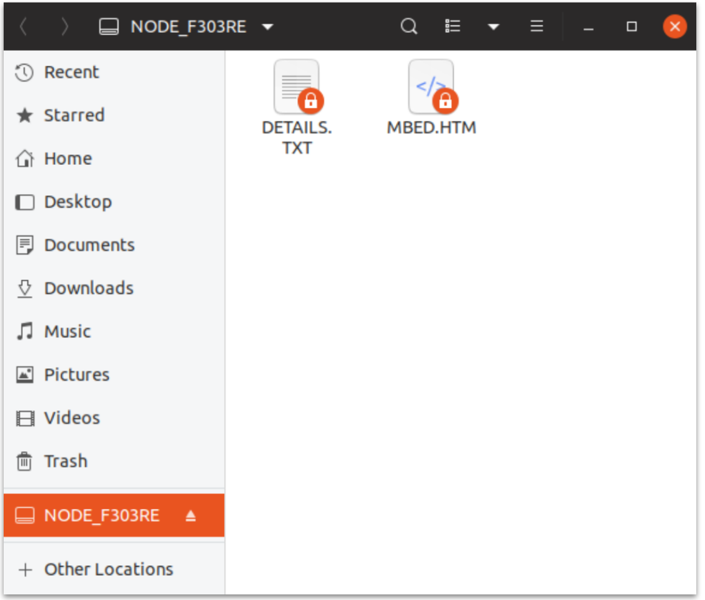

This page helps you set up a gcc build environment on Linux, Mac, and Windows so that you can iteratively modify and build the host application on your computer, and download and run it on the STM32 Nucleo board of your Ayla Dev Kit.

<ul class="nav nav-tabs" role="tablist">
<li class="nav-item"><a class="nav-link active" id="linux-tab" data-toggle="tab" href="#linux-content" role="tab">Linux</a></li>
<li class="nav-item"><a class="nav-link" id="mac-tab" data-toggle="tab" href="#mac-content" role="tab">Mac</a></li>
<li class="nav-item"><a class="nav-link" id="windows-tab" data-toggle="tab" href="#windows-content" role="tab">Windows</a></li>
</ul>

These instructions apply to Ubuntu 19.04 running on VMware Fusion v10.1.6 hosted on a MacBook running OS X El Capitan v10.11.6. You may need to modify certain steps depending on your Linux version and environment.

<!--
https://ubuntu.com/download/desktop
ubuntu-19.04-desktop-amd64
https://smallbusiness.chron.com/load-iso-image-vmware-46401.html
(Cannot connect the virtual device sata0:1 because no corresponding device is available on the host.)
Reinstall VMware tools 
-->

<!--
<ol>
<li>Browse to <a href="https://www.osboxes.org/ubuntu/#ubuntu-19-04-vmware">OS Boxes</a>, and download Ubuntu 19.04 Disco Dingo (<code>1904-64.7z</code>).</li>
<li>Use <a href="https://theunarchiver.com/">Unarchiver</a> to unzip <code>1904-64.7z</code>. You will see the disk image <code>Ubuntu 19.04 (64bit).vmdk</code>.</li>
<li>In VMware, create a Ubuntu 64-bit custom virtual machine with Legacy BIOS that uses the Ubuntu disk image.</li>
<li>Log in using the password <code>osboxes.org</code>.</li>
<li>Click Virtual Machine &gt; Install VMware Tools, click Install, and click the notification.</li>
<li>Copy and paste <code>VMwareTools-10.2.5-8068393.tar.gz</code> to the Downloads folder, right click, and click Extract Here.</li>
<li>In a terminal, run the following:
<pre>
$ cd ~/Downloads/VMwareTools-10.2.5-8068393/vmware-tools-distrib
$ sudo ./vmware-install.pl
</pre>
</li>
<li>Restart the VM.</li>
<li><a href="https://kb.vmware.com/s/article/1004055">Enable a shared folder</a> by clicking Virtual Machine &gt; Settings &gt; Sharing. Check Enable Shared Folders. Click the plus sign and add a folder. Access the shared folder at <code>cd /mnt/hgfs</code>.</li>
<li>Install <code>git</code> with <code>sudo apt install git</code>.</li>
<li>Install <code>screen</code> with <code>sudo apt install screen</code>.</li>
<li>Add your user to the <code>dialout</code> group, and restart:
<pre>
$ groups osboxes
$ sudo usermod -a -G dialout osboxes
</pre>
</li>
<li>Inspect the OS environment:
<pre>
$ git --version
git version 2.20.1

$ screen --version
Screen version 4.06.02 (GNU) 23-Oct-17

$ python3 --version
Python 3.7.3

$ unzip --version
caution:  both -n and -o specified; ignoring -o
UnZip 6.00 of 20 April 2009, by Debian. Original by Info-ZIP.

$ gcc --version
gcc (Ubuntu 8.3.0-6ubuntu1) 8.3.0
Copyright (C) 2018 Free Software Foundation, Inc.

$ make --version
GNU Make 4.2.1
Built for x86_64-pc-linux-gnu
Copyright (C) 1988-2016 Free Software Foundation, Inc.
</pre>
</li>
</li>
<li>Browse to <a href="https://developer.arm.com/tools-and-software/open-source-software/developer-tools/gnu-toolchain/gnu-rm/downloads">ARM</a>, and download <code>gcc-arm-none-eabi-8-2018-q4-major-linux.tar.bz2</code>.</li>
<li>Move the file to <code>/home/osboxes</code>, and extract:
<pre>
$ tar xjf gcc-arm-none-eabi-8-2018-q4-major-linux.tar.bz2
</pre>
You should see the following in <code>/home/osboxes</code>:
<pre>
$ ls -1d gcc&ast;
gcc-arm-none-eabi-8-2018-q4-major
gcc-arm-none-eabi-8-2018-q4-major-linux.tar.bz2
</pre>
</li>
<li>Install <code>openocd</code>:
<pre>
$ sudo apt-get install openocd
</pre>
It should install in the following locations. Note the <code>/usr/share/openocd/scripts</code> directory which contains essential configuration files (e.g. <code>board/st_nucleo_f3.cfg</code>) that enable openocd to communicate with your Ayla Dev Kit.
<pre>
$ ls -1 /usr/bin/openocd
/usr/bin/openocd

$ ls -1d /usr/share/openocd
/usr/share/openocd
</pre>
You may want to run these commands:
<pre>
$ which openocd
/usr/bin/openocd

$ openocd --version
Open On-Chip Debugger 0.10.0
</pre>
</li>
<li>Download the [Ayla Host Library](https://connection.aylanetworks.com) to <code>/home/osboxes</code>, and unzip:
<pre>
$ unzip Ayla-host-lib-2.0-rc1.zip
</pre>
You should see this in <code>/home/osboxes</code>:
<pre>
$ ls -1d Ayla&ast;
Ayla-host-lib-2.0-rc1
Ayla-host-lib-2.0-rc1.zip
</pre>
</li>
<li>Modify your shell environment:
<pre>
$ export TOOLCHAIN_DIR=/home/osboxes/gcc-arm-none-eabi-8-2018-q4-major
$ export PYTHON=python3
</pre>
</li>
<li>Build Ayla components:
<pre>
$ cd ~/Ayla-host-lib-2.0-rc1
$ make
</pre>

<a data-toggle="collapse" href="#make-results">Click to view sample results</a>.

<pre class="collapse" id="make-results">
making libtarget
make[1]: Entering directory '/home/osboxes/Ayla-host-lib-2.0-rc1/target/stm32f3_nucleo'
make -C ../../arch/stm32f3
make[2]: Entering directory '/home/osboxes/Ayla-host-lib-2.0-rc1/arch/stm32f3'
DEP ../../ext/CMSIS/Device/ST/STM32F30x/Source/Templates/system_stm32f30x.c
DEP ../../ext/STM32F30x_StdPeriph_Driver/src//stm32f30x_tim.c
DEP ../../ext/STM32F30x_StdPeriph_Driver/src//stm32f30x_syscfg.c
DEP ../../ext/STM32F30x_StdPeriph_Driver/src//stm32f30x_spi.c
DEP ../../ext/STM32F30x_StdPeriph_Driver/src//stm32f30x_misc.c
DEP ../../ext/STM32F30x_StdPeriph_Driver/src//stm32f30x_gpio.c
DEP ../../ext/STM32F30x_StdPeriph_Driver/src//stm32f30x_flash.c
DEP ../../ext/STM32F30x_StdPeriph_Driver/src//stm32f30x_exti.c
DEP ../../ext/STM32F30x_StdPeriph_Driver/src//stm32f30x_rcc.c
DEP console_platform.c
DEP uart_platform.c
DEP stm32f3_discovery.c
DEP spi_platform.c
DEP mcu_io.c
DEP ../stm32/uart_platform_noOS.c
DEP ../stm32/stm32.c
DEP ../stm32/al_intr.c
CC ../stm32/al_intr.c
CC ../stm32/stm32.c
CC ../stm32/uart_platform_noOS.c
CC mcu_io.c
CC spi_platform.c
CC stm32f3_discovery.c
CC uart_platform.c
CC console_platform.c
CC ../../ext/STM32F30x_StdPeriph_Driver/src//stm32f30x_rcc.c
CC ../../ext/STM32F30x_StdPeriph_Driver/src//stm32f30x_exti.c
CC ../../ext/STM32F30x_StdPeriph_Driver/src//stm32f30x_flash.c
CC ../../ext/STM32F30x_StdPeriph_Driver/src//stm32f30x_gpio.c
CC ../../ext/STM32F30x_StdPeriph_Driver/src//stm32f30x_misc.c
CC ../../ext/STM32F30x_StdPeriph_Driver/src//stm32f30x_spi.c
CC ../../ext/STM32F30x_StdPeriph_Driver/src//stm32f30x_syscfg.c
CC ../../ext/STM32F30x_StdPeriph_Driver/src//stm32f30x_tim.c
CC ../../ext/CMSIS/Device/ST/STM32F30x/Source/Templates/system_stm32f30x.c
CC -O3 ../stm32/al_intr.c
CC -O3 ../stm32/stm32.c
CC -O3 ../stm32/uart_platform_noOS.c
CC -O3 mcu_io.c
CC -O3 spi_platform.c
CC -O3 stm32f3_discovery.c
CC -O3 uart_platform.c
CC -O3 console_platform.c
CC -O3 ../../ext/STM32F30x_StdPeriph_Driver/src//stm32f30x_rcc.c
CC -O3 ../../ext/STM32F30x_StdPeriph_Driver/src//stm32f30x_exti.c
CC -O3 ../../ext/STM32F30x_StdPeriph_Driver/src//stm32f30x_flash.c
CC -O3 ../../ext/STM32F30x_StdPeriph_Driver/src//stm32f30x_gpio.c
CC -O3 ../../ext/STM32F30x_StdPeriph_Driver/src//stm32f30x_misc.c
CC -O3 ../../ext/STM32F30x_StdPeriph_Driver/src//stm32f30x_spi.c
CC -O3 ../../ext/STM32F30x_StdPeriph_Driver/src//stm32f30x_syscfg.c
CC -O3 ../../ext/STM32F30x_StdPeriph_Driver/src//stm32f30x_tim.c
CC -O3 ../../ext/CMSIS/Device/ST/STM32F30x/Source/Templates/system_stm32f30x.c
AR libtarget.a
/home/osboxes/gcc-arm-none-eabi-8-2018-q4-major/bin/arm-none-eabi-ar: creating ../../build/stm32f3_nucleo/spi/lib/libtarget.a
make[2]: Leaving directory '/home/osboxes/Ayla-host-lib-2.0-rc1/arch/stm32f3'
make[1]: Leaving directory '/home/osboxes/Ayla-host-lib-2.0-rc1/target/stm32f3_nucleo'

making libayla
make[1]: Entering directory '/home/osboxes/Ayla-host-lib-2.0-rc1/ayla/libayla'
DEP wifi_conf.c
DEP utf8.c
DEP uart.c
DEP tlv.c
DEP timer.c
DEP spi_ping.c
DEP spi.c
DEP serial_msg.c
DEP schedeval.c
DEP sched.c
DEP props.c
DEP prop_dp.c
DEP host_ota.c
DEP host_log.c
DEP host_lib.c
DEP host_event.c
DEP crc32.c
DEP crc16.c
DEP conf_access.c
DEP clock_utils.c
DEP callback.c
CC callback.c
CC clock_utils.c
CC conf_access.c
CC crc16.c
CC crc32.c
CC host_event.c
CC host_lib.c
CC host_log.c
CC host_ota.c
CC prop_dp.c
CC props.c
CC sched.c
CC schedeval.c
CC serial_msg.c
CC spi.c
CC spi_ping.c
CC timer.c
CC tlv.c
CC uart.c
CC utf8.c
CC wifi_conf.c
CC -O3 callback.c
CC -O3 clock_utils.c
CC -O3 conf_access.c
CC -O3 crc16.c
CC -O3 crc32.c
CC -O3 host_event.c
CC -O3 host_lib.c
CC -O3 host_log.c
CC -O3 host_ota.c
CC -O3 prop_dp.c
CC -O3 props.c
CC -O3 sched.c
CC -O3 schedeval.c
CC -O3 serial_msg.c
CC -O3 spi.c
CC -O3 spi_ping.c
CC -O3 timer.c
CC -O3 tlv.c
CC -O3 uart.c
CC -O3 utf8.c
CC -O3 wifi_conf.c
AR libayla.a
/home/osboxes/gcc-arm-none-eabi-8-2018-q4-major/bin/arm-none-eabi-ar: creating ../../build/stm32f3_nucleo/spi/lib/libayla.a
make[1]: Leaving directory '/home/osboxes/Ayla-host-lib-2.0-rc1/ayla/libayla'
echo; echo making libdemo; \
make -C ./example/libdemo ARCH_FAMILY=stm32

making libdemo
make[1]: Entering directory '/home/osboxes/Ayla-host-lib-2.0-rc1/example/libdemo'
DEP demo_img_mgmt.c
DEP wifi_demo.c
DEP demo_power.c
DEP demo_poll.c
DEP demo_factory_reset.c
CC demo_factory_reset.c
CC demo_poll.c
CC demo_power.c
CC wifi_demo.c
CC demo_img_mgmt.c
CC -O3 demo_factory_reset.c
CC -O3 demo_poll.c
CC -O3 demo_power.c
CC -O3 wifi_demo.c
CC -O3 demo_img_mgmt.c
AR libdemo.a
/home/osboxes/gcc-arm-none-eabi-8-2018-q4-major/bin/arm-none-eabi-ar: creating ../../build/stm32f3_nucleo/spi/lib/libdemo.a
make[1]: Leaving directory '/home/osboxes/Ayla-host-lib-2.0-rc1/example/libdemo'

making libcons
make[1]: Entering directory '/home/osboxes/Ayla-host-lib-2.0-rc1/example/libcons'
DEP printf.c
DEP parse_hex.c
DEP parse_argv.c
DEP console.c
DEP cmd_handle.c
DEP atty.c
CC atty.c
CC cmd_handle.c
CC console.c
CC parse_argv.c
CC parse_hex.c
CC printf.c
CC -O3 atty.c
CC -O3 cmd_handle.c
CC -O3 console.c
CC -O3 parse_argv.c
CC -O3 parse_hex.c
CC -O3 printf.c
AR libcons.a
/home/osboxes/gcc-arm-none-eabi-8-2018-q4-major/bin/arm-none-eabi-ar: creating ../../build/stm32f3_nucleo/spi/lib/libcons.a
make[1]: Leaving directory '/home/osboxes/Ayla-host-lib-2.0-rc1/example/libcons'

making example/app/ledevb
make[1]: Entering directory '/home/osboxes/Ayla-host-lib-2.0-rc1/example/app/ledevb'
DEP demo.c
CC demo.c
AS ../../../ext/CMSIS/Device/ST/STM32F30x/Source/Templates/gcc_ride7/startup_stm32f30x.s
CC -O3 demo.c
CC link ledevb
OBJCOPY ../../../build/stm32f3_nucleo/spi/example/app/ledevb/ledevb.bin
package OTA image ../../../build/stm32f3_nucleo/spi/example/app/ledevb/ledevb.bin to ../../../build/stm32f3_nucleo/spi/example/app/ledevb/ledevb.img
version demo_dp 2.0 2019-05-31 09:53:15
app_image size: 56328
make[1]: Leaving directory '/home/osboxes/Ayla-host-lib-2.0-rc1/example/app/ledevb'
</pre>
</li>
<li>Connect your computer to the STM32 Nucleo board of your Ayla Dev Kit:

</li>
<li>Connect to Linux:

The following notification appears:

</li>
<li>Click the notification, and view the NODE_F303RE mount:

</li>
<li>In <code>arch/stm32f3/arch.mk</code>, ensure the path (in yellow) points to your installation:
<pre>
OPENOCD_CONF = \
  -s /usr/share/openocd/scripts \
  -f board/$(OPENOCD_BOARD) \
  -f $(ARCH_DIR)/gcc/discovery_gdb.cfg
</pre>
</li>
<li>Download <code>build/stm32f3_nucleo/spi/example/app/ledevb/ledevb.img</code> to your Ayla Dev Kit:
<pre>
$ make download
</pre>

<a data-toggle="collapse" href="#make-download-results">Click to view sample results</a>. Despite the error messages, these results show a successful download. See the third-from-last line. The error messages indicate a "diff" between the existing on-board image and the new image, confirming that a download is warranted.

<pre class="collapse" id="make-download-results">
make -C example/app/ledevb \
  TARGET=stm32f3_nucleo USE_UART=0 download
make[1]: Entering directory '/home/osboxes/Ayla-host-lib-2.0-rc1/example/app/ledevb'
/usr/bin/openocd -s /usr/share/openocd/scripts -f board/st_nucleo_f3.cfg -f ../../../arch/stm32f3/gcc/discovery_gdb.cfg \
  -c "reset halt" \
  -c "verify_image ../../../build/stm32f3_nucleo/spi/example/app/ledevb/ledevb.img 0x08002000 bin" \
  -c shutdown || \
/usr/bin/openocd -s /usr/share/openocd/scripts -f board/st_nucleo_f3.cfg -f ../../../arch/stm32f3/gcc/discovery_gdb.cfg \
  -c "reset halt" \
  -c "flash write_image erase ../../../build/stm32f3_nucleo/spi/example/app/ledevb/ledevb.img 0x08002000 bin" \
  -c shutdown || \
echo "download failed"
Open On-Chip Debugger 0.10.0
Licensed under GNU GPL v2
For bug reports, read
  http&colon;//openocd.org/doc/doxygen/bugs.html
adapter speed: 1000 kHz
adapter_nsrst_delay: 100
Info : The selected transport took over low-level target control. The results might differ compared to plain JTAG/SWD
none separate
srst_only separate srst_nogate srst_open_drain connect_deassert_srst
Info : Unable to match requested speed 1000 kHz, using 950 kHz
Info : Unable to match requested speed 1000 kHz, using 950 kHz
Info : clock speed 950 kHz
Info : STLINK v2 JTAG v29 API v2 SWIM v18 VID 0x0483 PID 0x374B
Info : using stlink api v2
Info : Target voltage: 3.246873
Info : stm32f3x.cpu: hardware has 6 breakpoints, 4 watchpoints
Info : Unable to match requested speed 1000 kHz, using 950 kHz
Info : Unable to match requested speed 1000 kHz, using 950 kHz
adapter speed: 950 kHz
target halted due to debug-request, current mode: Thread 
xPSR: 0x01000000 pc: 0x080004ec msp: 0x20001000
target halted due to breakpoint, current mode: Thread 
xPSR: 0x61000000 pc: 0x2000002e msp: 0x20001000
Error: checksum mismatch - attempting binary compare
diff 0 address 0x08002000. Was 0x10 instead of 0xfc
diff 1 address 0x08002001. Was 0x5e instead of 0x7f
diff 2 address 0x08002004. Was 0x25 instead of 0x5d
...
...
diff 127 address 0x0800211d. Was 0xc3 instead of 0x27
More than 128 errors, the rest are not printed.

Open On-Chip Debugger 0.10.0
Licensed under GNU GPL v2
For bug reports, read
  http&colon;//openocd.org/doc/doxygen/bugs.html
adapter speed: 1000 kHz
adapter_nsrst_delay: 100
Info : The selected transport took over low-level target control. The results might differ compared to plain JTAG/SWD
none separate
srst_only separate srst_nogate srst_open_drain connect_deassert_srst
Info : Unable to match requested speed 1000 kHz, using 950 kHz
Info : Unable to match requested speed 1000 kHz, using 950 kHz
Info : clock speed 950 kHz
Info : STLINK v2 JTAG v29 API v2 SWIM v18 VID 0x0483 PID 0x374B
Info : using stlink api v2
Info : Target voltage: 3.253193
Info : stm32f3x.cpu: hardware has 6 breakpoints, 4 watchpoints
Info : Unable to match requested speed 1000 kHz, using 950 kHz
Info : Unable to match requested speed 1000 kHz, using 950 kHz
adapter speed: 950 kHz
target halted due to debug-request, current mode: Thread 
xPSR: 0x01000000 pc: 0x080004ec msp: 0x20001000
auto erase enabled
Info : device id = 0x10036446
Info : flash size = 512kbytes
target halted due to breakpoint, current mode: Thread 
xPSR: 0x61000000 pc: 0x2000003a msp: 0x20001000
wrote 57344 bytes from file ../../../build/stm32f3_nucleo/spi/example/app/ledevb/ledevb.img in 3.549346s (15.778 KiB/s)
shutdown command invoked
make[1]: Leaving directory '/home/osboxes/Ayla-host-lib-2.0-rc1/example/app/ledevb'
</pre>
</li>
<li>Press/release the black button on the host board to run the newly downloaded host app.

</li>
</ol>
-->

Under Construction.

<!--
$ tar xjf gcc-arm-none-eabi-8-2018-q4-major-mac.tar.bz2

$ ls -1d gcc*
gcc-arm-none-eabi-8-2018-q4-major
gcc-arm-none-eabi-8-2018-q4-major-mac.tar.bz2
-->

Under Construction.

Possible options:

<ol>
<li>Windows native environment.</li>
<li><a href="https://cygwin.com/install.html">Cygwin</a>.</li>
<li><a href="https://docs.microsoft.com/en-us/windows/wsl/install-win10">Windows Subsystem for Linux</a>.</li>
<li><a href="https://devblogs.microsoft.com/commandline/introducing-windows-terminal/">Windows Terminal</a>.</li>
</ol>

<!--

These instructions apply to a "Windows 10 Enterprise October 2018 Update Evaluation" image running on VMware Fusion v10.1.6 hosted on a MacBook running OS X El Capitan v10.11.6. You may need to modify certain steps depending on your Windows version and environment.

<ol>
<li>Browse to the <a href="https://developer.microsoft.com/en-us/windows/downloads/virtual-machines">Windows Dev Center</a>, and download the VMware image.</li>
<li>Unzip with <code>ditto -x -k WinDev1905Eval.VMware.zip</code>.</li>
<li>In VMware, import an existing virtual machine.</li>
<li>In the VM, browse to <a href="https://cygwin.com/install.html">Cygwin</a>.</li>
<li>Download setup-x86_64.exe, and navigate to the Downloads folder.</li>
<li>Run the executable, accept defaults, and don't select any packages.</li>
<li>Move setup-x86_64.exe into <code>C:\cygwin64</code>.</li>
<li>Open a Command Terminal, and change directory to <code>C:\cygwin64</code>.</li>
<li>Run <code>setup-x86_64.exe -h</code> to show options.</li>
<li>Install these packages:
<pre>
$ setup-x86_64.exe -q -P wget -P make -P gcc-g++ -P python3 -P screen -P nano
</pre>
You may need to press Enter in the terminal after the installation appears to complete. 
</li>
<li>Download and run <a href="https://www.7-zip.org/">7z1900-x64</a> to install 7-Zip.</li>
<li>Browse to the <a href="https://developer.arm.com/tools-and-software/open-source-software/developer-tools/gnu-toolchain/gnu-rm/downloads">ARM</a> page.</li>
<li>Download <code>gcc-arm-none-eabi-8-2018-q4-major-win32.zip</code>.</li>
<li>Run 7-Zip as Administrator.</li>
<li>Unzip <code>gcc-arm-none-eabi-8-2018-q4-major-win32.zip</code> into <code>C:\Program Files (x86)</code> so that it looks like this:
<pre>
c:\Program Files (x86)\gcc-arm-none-eabi-8-2018-q4-major-win32
</pre>
</li>
</ol>
-->

<!--
https://docs.microsoft.com/en-us/windows/wsl/install-win10

run cygwin terminal as admin

$ mv /cygdrive/c/Users/User/Downloads/gcc-arm-none-eabi-8-2018-q4-major-linux.tar.bz2 ~

$ tar xjf gcc-arm-none-eabi-8-2018-q4-major-linux.tar.bz2

$ ls -1d gcc*
gcc-arm-none-eabi-8-2018-q4-major
gcc-arm-none-eabi-8-2018-q4-major-linux.tar.bz2
<ol>

<li>Unzip <a href="http://www.freddiechopin.info/en/download">openocd-0.10.0.7z</a> into cygwin <code>C:\cygwin64\usr\share\openocd-0.10.0</code>.</li>
<li>Add <code>C:\cygwin64\usr\share\openocd-0.10.0\bin-x64</code> to $PATH. In cygwin, it will be <code>/usr/share/openocd-0.10.0/bin-x64</code>.
<ol>
<li>Run Control Panel.</li>
<li>Click System and Security &gt; System &gt; Advanced System Settings &gt; Environment Variables.</li>
<li>In <code>User variables for user</code>, select <code>Path</code>, and click Edit.</li>
<li>Add <code>C:\cygwin64\usr\share\openocd-0.10.0\bin-x64</code>.</li>
</ol>
</li>
<li>Unzip Ayla-host-lib-2.0-rc1.zip into <code>/cygdrive/c/cygwin64/home/User</code>.</li>
<li>Open a <code>Cygwin64 Terminal</code>. Use this to export environment variables, make, etc.</li>
<li>Set the <code>TOOLCHAIN_DIR</code> environment variable:
<pre>
$ export TOOLCHAIN_DIR="/cygdrive/c/Program Files (x86)/gcc-arm-none-eabi-8-2018-q4-major-win32"
</pre>
<li>Set the <code>PYTHON</code> environment variable:
<pre>
$ export PYTHON=python3
</pre>
</li>
<li>Change directory and run make:
<pre>
$ cd ~/Ayla-host-lib-2.0-rc1
$ make
</pre>
</li>
</ol>
-->

