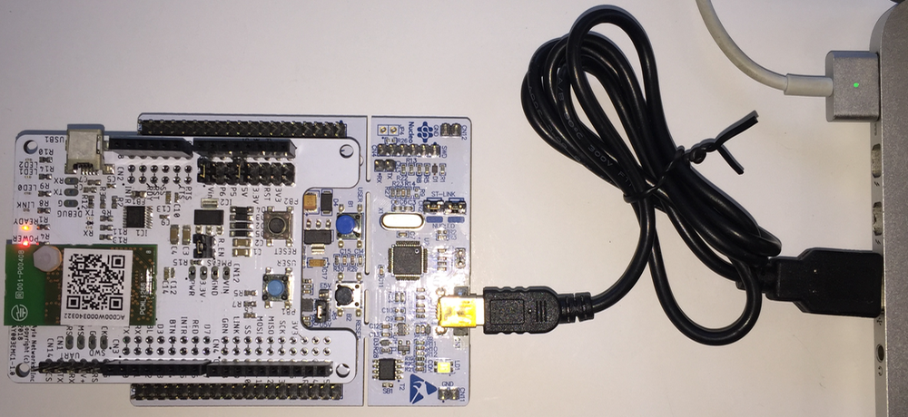
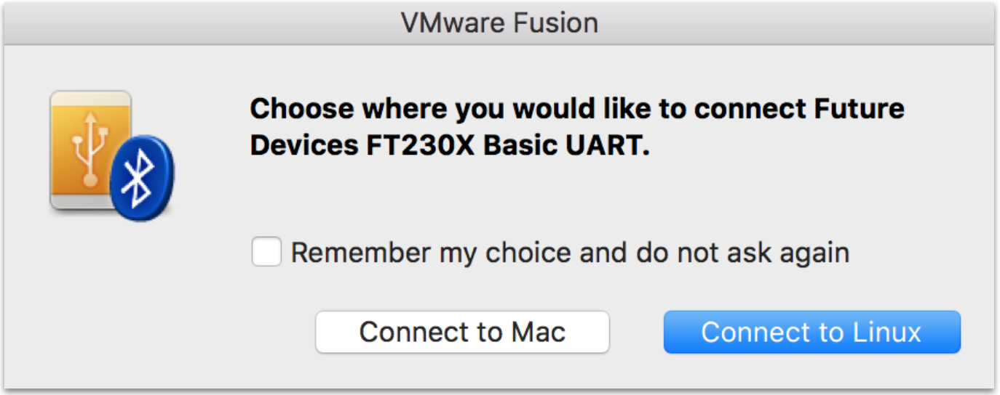
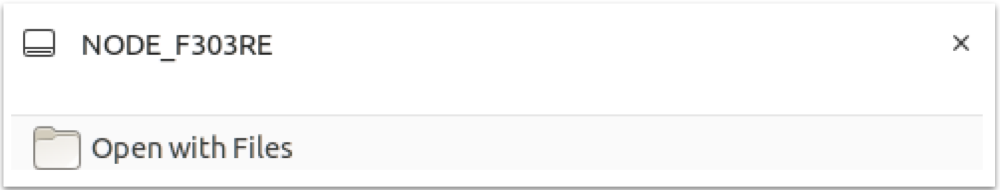

This page helps you set up a GNU build environment on VMware/Ubuntu so that you can iteratively modify and build the host application on your computer, and download and run it on the STM32 Nucleo board of your Ayla Dev Kit. 

<ol>
<li>[Set up a GNU build environment on VMware/Ubuntu](/blog/how-to-set-up-a-gnu-build-environment-on-vmware-ubuntu).</li>
<li>Browse to <a href="https://developer.arm.com/tools-and-software/open-source-software/developer-tools/gnu-toolchain/gnu-rm/downloads">ARM</a>, and download <code>gcc-arm-none-eabi-8-2018-q4-major-linux.tar.bz2</code>.</li>
<li>Move the file to <code>/home/matt</code>, and extract:
<pre>
$ tar xjf gcc-arm-none-eabi-8-2018-q4-major-linux.tar.bz2
</pre>
You should see the following in <code>/home/matt</code>:
<pre>
$ ls -1d gcc&ast;
gcc-arm-none-eabi-8-2018-q4-major
gcc-arm-none-eabi-8-2018-q4-major-linux.tar.bz2
</pre>
</li>
<li>Install <code>openocd</code>:
<pre>
$ sudo apt-get install openocd
</pre>
It should install in the following location:
<pre>
$ ls -1 /usr/bin/openocd
/usr/bin/openocd
</pre>

Note the <code>/usr/share/openocd/scripts</code> directory which contains essential configuration files (e.g. <code>board/st_nucleo_f3.cfg</code>) that enable openocd to communicate with your Ayla Dev Kit.

You may want to run these commands:
<pre>
$ which openocd
/usr/bin/openocd

$ openocd --version
Open On-Chip Debugger 0.10.0
</pre>
</li>
<li><a href="https://connection.aylanetworks.com/s/article/Ayla-Host-Library-and-Reference-Application">Download the Ayla Host Library</a> archive file (e.g. Ayla-host-lib-2.0.zip) to <code>/home/matt</code>, and unzip:
<pre>
$ unzip Ayla-host-lib-2.0-rc4.zip
</pre>
You should see this in <code>/home/matt</code>:
<pre>
$ ls -1d Ayla&ast;
Ayla-host-lib-2.0
Ayla-host-lib-2.0-rc4.zip
</pre>
If you need to copy the Ayla Host Library archive file from your computer to the VM, you first need to enable sharing:
<ol>
<li>On the VMware Fusion menu bar, click <code>Virtual Machine &gt; Sharing &gt; Sharing Settings</code>.</li>
<li>Check <code>Enable Shared Folders</code>.</li>
<li>Click the <code>+</code> sign, and add a folder.</li>
<li>Exit the Sharing dialog box.</li>
<li>In a VM terminal, access the shared folder with <code>cd /mnt/hgfs</code> and <code>ls</code>.</li>
</ol>
</li>
<li>Modify your shell environment:
<pre>
$ export TOOLCHAIN_DIR=/home/matt/gcc-arm-none-eabi-8-2018-q4-major
$ export PYTHON=python3
</pre>
</li>
<li>Build Ayla components:
<pre>
$ cd ~/Ayla-host-lib-2.0
$ make
</pre>
<li>Connect your computer to the STM32 Nucleo board of your Ayla Dev Kit:

</li>
<li>Connect to Linux:

The following notification appears:

</li>
<li>Flash <code>build/stm32f3_nucleo/spi/example/app/ledevb/ledevb.img</code> to your Ayla Dev Kit:
<pre>
$ make download
</pre>
</li>
</ol>

**Click [Build environment test](../build-environment-test) to continue**.
