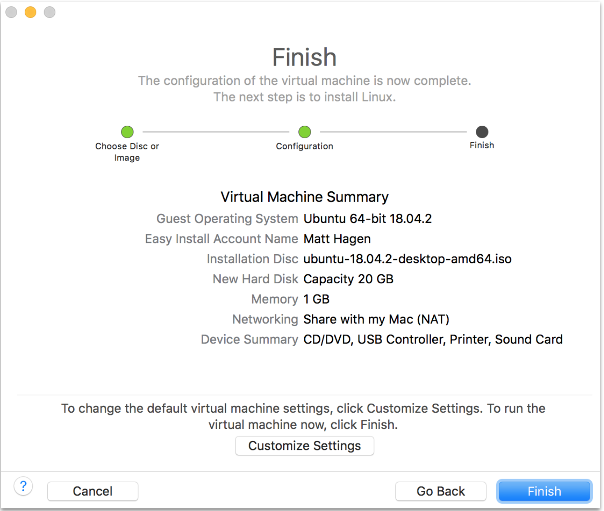
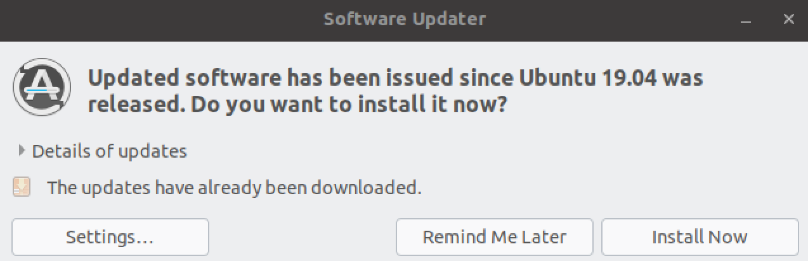

This page helps you set up a gcc build environment on VMware/Ubuntu so that you can iteratively modify and build the host application on your computer, and download and run it on the STM32 Nucleo board of your Ayla Dev Kit. The following instructions were tested using Ubuntu 19.04 running on VMware Fusion v10.1.6 hosted on a MacBook running OS X El Capitan v10.11.6. You may need to modify certain steps depending on your environment.

<ol>
<li>Browse to <a href="https://ubuntu.com/download/desktop">Download Ubuntu Desktop</a>.</li>
<li>Download <code>Ubuntu 19.04</code>.</li>
<li>Run VMware Fusion, click <code>File &gt; New</code>, and drag <code>ubuntu-19.04-desktop-amd64.iso</code> to the installation screen:

</li>
<li>Complete the installation:

</li>
<li>Optionally, if prompted, update software, and reboot:

</li>
<li>Open a terminal:

</li>
<li><code>sudo apt install git</code>.</li>
<li><code>sudo apt install screen</code>.</li>
<li>Add your user to the <code>dialout</code> group, and restart:
<pre>
$ groups matt
matt : matt adm cdrom sudo dip plugdev lpadmin sambashare
$ sudo usermod -a -G dialout matt
$ groups matt
matt : matt adm dialout cdrom sudo dip plugdev lpadmin sambashare
</pre>
</li>
<li>Inspect the OS environment:
<pre>
$ git --version
git version 2.20.1

$ screen --version
Screen version 4.06.02 (GNU) 23-Oct-17

$ python3 --version
Python 3.7.3

$ unzip --version
caution:  both -n and -o specified; ignoring -o
UnZip 6.00 of 20 April 2009, by Debian. Original by Info-ZIP.

$ gcc --version
gcc (Ubuntu 8.3.0-6ubuntu1) 8.3.0
Copyright (C) 2018 Free Software Foundation, Inc.

$ make --version
GNU Make 4.2.1
Built for x86_64-pc-linux-gnu
Copyright (C) 1988-2016 Free Software Foundation, Inc.
</pre>
</li>
<li>Browse to <a href="https://developer.arm.com/tools-and-software/open-source-software/developer-tools/gnu-toolchain/gnu-rm/downloads">ARM</a>, and download <code>gcc-arm-none-eabi-8-2018-q4-major-linux.tar.bz2</code>.</li>
<li>Move the file to <code>/home/matt</code>, and extract:
<pre>
$ tar xjf gcc-arm-none-eabi-8-2018-q4-major-linux.tar.bz2
</pre>
You should see the following in <code>/home/matt</code>:
<pre>
$ ls -1d gcc&ast;
gcc-arm-none-eabi-8-2018-q4-major
gcc-arm-none-eabi-8-2018-q4-major-linux.tar.bz2
</pre>
</li>
<li>Install <code>openocd</code>:
<pre>
$ sudo apt-get install openocd
</pre>
It should install in the following location:
<pre>
$ ls -1 /usr/bin/openocd
/usr/bin/openocd
</pre>

Note the <code>/usr/share/openocd/scripts</code> directory which contains essential configuration files (e.g. <code>board/st_nucleo_f3.cfg</code>) that enable openocd to communicate with your Ayla Dev Kit.

You may want to run these commands:
<pre>
$ which openocd
/usr/bin/openocd

$ openocd --version
Open On-Chip Debugger 0.10.0
</pre>
</li>
<li>Download the Ayla Host Library archive file (e.g. Ayla-host-lib-2.0-rc4.zip) to <code>/home/matt</code>, and unzip:
<pre>
$ unzip Ayla-host-lib-2.0-rc4.zip
</pre>
You should see this in <code>/home/matt</code>:
<pre>
$ ls -1d Ayla&ast;
Ayla-host-lib-2.0
Ayla-host-lib-2.0-rc4.zip
</pre>
If you need to copy the Ayla Host Library archive file from your computer to the VM, you first need to enable sharing:
<ol>
<li>On the VMware Fusion menu bar, click <code>Virtual Machine &gt; Sharing &gt; Sharing Settings</code>.</li>
<li>Check <code>Enable Shared Folders</code>.</li>
<li>Click the <code>+</code> sign, and add a folder.</li>
<li>Exit the Sharing dialog box.</li>
<li>In a VM terminal, access the shared folder with <code>cd /mnt/hgfs</code> and <code>ls</code>.</li>
</ol>
</li>
<li>Modify your shell environment:
<pre>
$ export TOOLCHAIN_DIR=/home/matt/gcc-arm-none-eabi-8-2018-q4-major
$ export PYTHON=python3
</pre>
</li>
<li>Build Ayla components:
<pre>
$ cd ~/Ayla-host-lib-2.0
$ make
</pre>
<li>Connect your computer to the STM32 Nucleo board of your Ayla Dev Kit:

</li>
<li>Connect to Linux:

The following notification appears:

</li>
<li>Flash <code>build/stm32f3_nucleo/spi/example/app/ledevb/ledevb.img</code> to your Ayla Dev Kit:
<pre>
$ make download
</pre>
</li>
</ol>