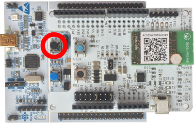
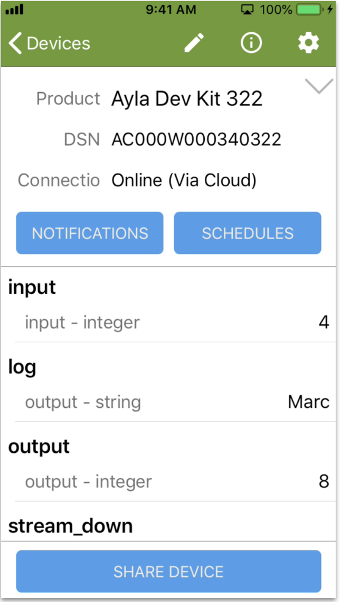

Recall from the [Properties](../../user-guide/properties) page that the default host application includes <code>input</code> and <code>output</code> integer properties, and that when you set <code>input</code> to a value (e.g. <code>5</code>) the host application sets <code>output</code> to <code>input * input</code> (e.g. <code>25</code>). Changing this behavior so that the host application sets <code>output</code> to <code>input + input</code> (e.g. <code>10</code>) provides a simple way to test your build environment:

<ol>
<li><code>cd ~/Ayla-host-lib-2.0</code>.</li>
<li><code>cp example/app/ledevb/demo.c example/app/ledevb/demo.orig</code>.</li>
<li><code>nano example/app/ledevb/demo.c</code>.</li>
<li>Find the <code>prop_table</code> array:
<pre>
static struct prop prop_table[] = {
  ...
  ...
}
</pre>
</li>
<li>Find the <code>input</code> prop structure within the array:
<pre>
{"input", ATLV_INT, set_input, prop_send_generic, &input, sizeof(input)},
</pre>
Note that the Ayla Cloud invokes <code>set_input</code> to set a new value for the <code>input</code> property.
</li>
<li>Find the <code>set_input</code> function:
<pre>
static void set_input(struct prop &ast;prop, void &ast;arg, void &ast;valp, size_t len)
  ...
  output = i &ast; i;
  ...
}
</pre>
</li>
<li>Change <code>i &ast; i</code> to <code>i + i</code>, and save.</li>
<li><code>make</code> and <code>make download</code>.
<li>Press/release the black button on the host board to run the newly downloaded host app.

</li>
<li>In Aura, change <code>input</code> to some value (e.g. <code>4</code>), and verify that <code>output</code> changes to twice the value (e.g. <code>8</code>).

</li>
</ol>