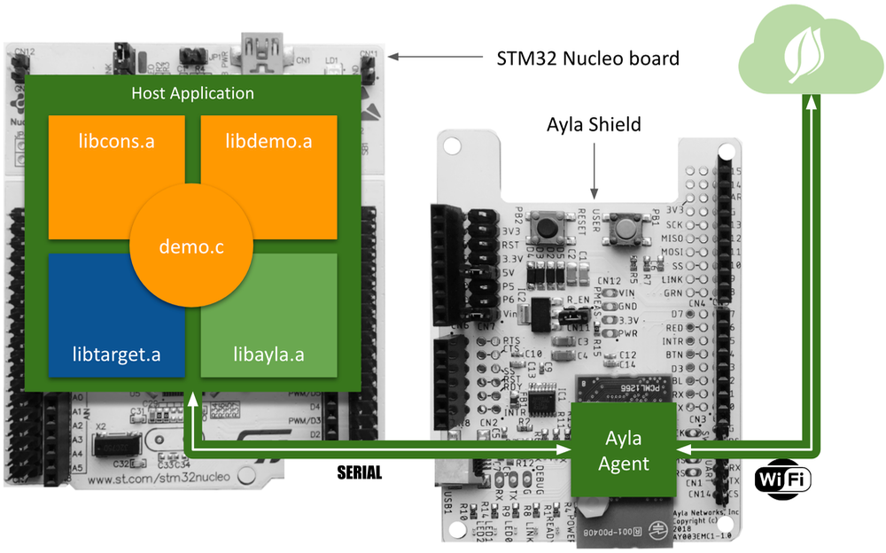
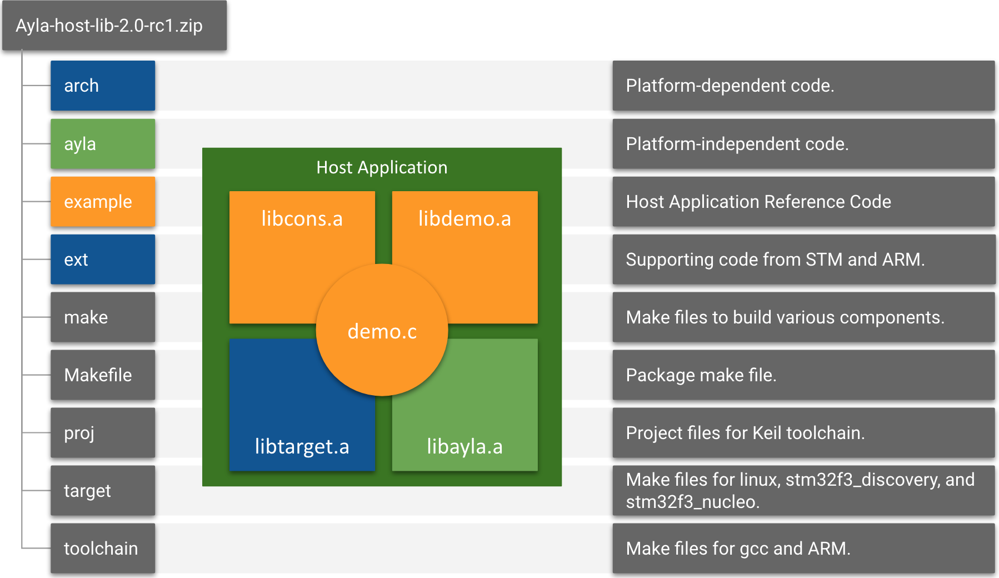

The host application is named <code>ledevb.img</code>. It is the result of compiling <code>demo.c</code> to <code>demo.o</code>, and linking that to four Ayla libraries: <code>libdemo.a</code>, <code>libayla.a</code>, <code>libtarget.a</code>, and <code>libcons.a</code>:

Host application source code is contained in <code>Ayla-host-lib-2.0-rc1.zip</code>. The diagram below illustrates: 

## demo.c

<code>example/app/ledevb/demo.c</code> is the only file you need to modify as you experiment with your Ayla Dev Kit.

* Events
* demo_log

### ifdef

* DEMO_CONF
* DEMO_FILE_PROP
* DEMO_SCHED_LIB
* DEMO_POWER_MGMT
* DEMO_CONSOLE
* BOARD_LED_UREG
* DEMO_IMG_MGMT

What happens during initialization?

How do callbacks work?

What are the various options (e.g. SPI v. UART)?

What are the API points?

What are events?

What is the composition of a struct prop?

How does a property work?

How do you add a property?

How do you turn on/off ifdef's?

What are the ifdef's?

How do version and template_version work? What are they used for?

### struct prop

## libdemo.a
* example/libdemo/demo_factory_reset.o
* example/libdemo/demo_poll.o
* example/libdemo/demo_power.o
* example/libdemo/demo_img_mgmt.o

## libayla.a
* ayla/libayla/callback.o
* ayla/libayla/clock_utils.o
* ayla/libayla/conf_access.o
* ayla/libayla/crc16.o
* ayla/libayla/crc32.o
* ayla/libayla/host_event.o
* ayla/libayla/host_lib.o
* ayla/libayla/host_log.o
* ayla/libayla/host_ota.o
* ayla/libayla/prop_dp.o
* ayla/libayla/props.o
* ayla/libayla/sched.o
* ayla/libayla/schedeval.o
* ayla/libayla/serial_msg.o
* ayla/libayla/spi.o
* ayla/libayla/spi_ping.o
* ayla/libayla/timer.o
* ayla/libayla/tlv.o
* ayla/libayla/uart.o
* ayla/libayla/utf8.o
* ayla/libayla/wifi_conf.o

## libtarget.a
* arch/stm32/al_intr.o
* arch/stm32/stm32.o
* arch/stm32/uart_platform_noOS.o
* arch/stm32f3/mcu_io.o
* arch/stm32f3/spi_platform.o
* arch/stm32f3/stm32f3_discovery.o
* arch/stm32f3/uart_platform.o
* arch/stm32f3/console_platform.o
* ext/STM32F30x_StdPeriph_Driver/src/stm32f30x_rcc.o
* ext/STM32F30x_StdPeriph_Driver/src/stm32f30x_exti.o
* ext/STM32F30x_StdPeriph_Driver/src/stm32f30x_flash.o
* ext/STM32F30x_StdPeriph_Driver/src/stm32f30x_gpio.o
* ext/STM32F30x_StdPeriph_Driver/src/stm32f30x_misc.o
* ext/STM32F30x_StdPeriph_Driver/src/stm32f30x_spi.o
* ext/STM32F30x_StdPeriph_Driver/src/stm32f30x_syscfg.o
* ext/STM32F30x_StdPeriph_Driver/src/stm32f30x_tim.o
* ext/CMSIS/Device/ST/STM32F30x/Source/Templates/system_stm32f30x.o

## libcons.a
* /example/libcons/atty.o
* /example/libcons/cmd_handle.o
* /example/libcons/console.o
* /example/libcons/parse_argv.o
* /example/libcons/parse_hex.o
* /example/libcons/printf.o

## Other

<table>
<tr><th>Library File</th><th>Source File</th><th>Purpose</th></tr>
<tr>
<td rowspan="5">libdemo.a</td>
<td>demo_factory_reset.c</td>
<td>Schedules the Ayla Module to factory reset if, during startup, the user holds down the reset button.</td>
</tr>
<tr>
<td>demo_img_mgmt.c</td>
<td>sss</td>
</tr>
<tr>
<td>demo_poll.c</td>
<td>sss</td>
</tr>
<tr>
<td>demo_power.c</td>
<td>sss</td>
</tr>
<tr>
<td>wifi_demo.c</td>
<td>sss</td>
</tr>
<tr>
<td rowspan="21">libayla.a</td>
<td>callback.c</td>
<td>sss</td>
</tr>
<tr>
<td>clock_utils.c</td>
<td>sss</td>
</tr>
<tr>
<td>conf_access.c</td>
<td>sss</td>
</tr>
<tr>
<td>crc16.c</td>
<td>sss</td>
</tr>
<tr>
<td>crc32.c</td>
<td>sss</td>
</tr>
<tr>
<td>host_event.c</td>
<td>sss</td>
</tr>
<tr>
<td>host_lib.c</td>
<td>sss</td>
</tr>
<tr>
<td>host_log.c</td>
<td>sss</td>
</tr>
<tr>
<td>host_ota.c</td>
<td>sss</td>
</tr>
<tr>
<td>prop_dp.c</td>
<td>sss</td>
</tr>
<tr>
<td>props.c</td>
<td>sss</td>
</tr>
<tr>
<td>sched.c</td>
<td>sss</td>
</tr>
<tr>
<td>schedeval.c</td>
<td>sss</td>
</tr>
<tr>
<td>serial_msg.c</td>
<td>sss</td>
</tr>
<tr>
<td>spi.c</td>
<td>sss</td>
</tr>
<tr>
<td>spi_ping.c</td>
<td>sss</td>
</tr>
<tr>
<td>timer.c</td>
<td>sss</td>
</tr>
<tr>
<td>tlv.c</td>
<td>sss</td>
</tr>
<tr>
<td>uart.c</td>
<td>sss</td>
</tr>
<tr>
<td>utf8.c</td>
<td>sss</td>
</tr>
<tr>
<td>wifi_conf.c</td>
<td>sss</td>
</tr>

<tr>
<td>libtarget.a</td>
<td>sss</td>
<td>sss</td>
</tr>

<tr>
<td>libcons.a</td>
<td>sss</td>
<td>sss</td>
</tr>

</table>

By modifying and rebuilding the example host application, and by downloading it onto the Ayla Dev Kit, you can learn how to create applications that run on edge devices and connect to the Ayla Cloud. The Ayla example host application is part of a software package called <code>ayla-host-lib-2.0-rc1</code> that includes the components described below.

### Summary

### Details

<table>
<tr><th>Dir/File</th><th>Dir/File</th><th>File</th><th>Description</th></tr>
<tr>
  <td rowspan="39">arch</td>
  <td>include</td>
  <td>arch/board.h</td>
  <td>
void board_module_reset(void); 
int board_module_ready(void); 
int board_led_get(u32 led); 
void board_led_set(u32 led, u8 val); 
void board_led_init(u32 led); 
int board_factory_reset_detect(void); 
int board_mac_ssid_detect(void); 
void board_gpio_enable(u32 port); 
void board_gpio_set(u32 port, u8 logical_value); 
int board_gpio_get(u32 port); 
void board_init(int argc, char **argv);
  </td>
</tr>
<tr>
  <td rowspan="7">linux</td>
  <td>al_time.c</td>
  <td>sss</td>
</tr>
<tr>
  <td>arch.mk</td>
  <td>sss</td>
</tr>
<tr>
  <td>board_linux.c</td>
  <td>sss</td>
</tr>
<tr>
  <td>console_platform.c</td>
  <td>sss</td>
</tr>
<tr>
  <td>Makefile</td>
  <td>sss</td>
</tr>
<tr>
  <td>mcu_io.h</td>
  <td>sss</td>
</tr>
<tr>
  <td>uart_platform.c</td>
  <td>sss</td>
</tr>
<tr>
  <td rowspan="8">stm32</td>
  <td>al_intr.c</td>
  <td>sss</td>
</tr>
<tr>
  <td>build_tool/img_pkg/img_pkg.py</td>
  <td>sss</td>
</tr>
<tr>
  <td>builddate.bat</td>
  <td>sss</td>
</tr>
<tr>
  <td>cm3_intr.h</td>
  <td>sss</td>
</tr>
<tr>
  <td>loader.c</td>
  <td>sss</td>
</tr>
<tr>
  <td>stm32.c</td>
  <td>sss</td>
</tr>
<tr>
  <td>stm32.h</td>
  <td>sss</td>
</tr>
<tr>
  <td>uart_platform_noOS.c</td>
  <td>sss</td>
</tr>
<tr>
  <td rowspan="23">stm32f3</td>
  <td>arch_image.mk</td>
  <td>sss</td>
</tr>
<tr>
  <td>arch.mk</td>
  <td>sss</td>
</tr>
<tr>
  <td>console_platform.c</td>
  <td>sss</td>
</tr>
<tr>
  <td>console_platform.h</td>
  <td>sss</td>
</tr>
<tr>
  <td>flash_layout.h</td>
  <td>sss</td>
</tr>
<tr>
  <td>gcc/common_paths.mk</td>
  <td>sss</td>
</tr>
<tr>
  <td>gcc/discovery_gdb.cfg</td>
  <td>sss</td>
</tr>
<tr>
  <td>gcc/image.ld</td>
  <td>sss</td>
</tr>
<tr>
  <td>gcc/loader.gdb</td>
  <td>sss</td>
</tr>
<tr>
  <td>gcc/README</td>
  <td>The paths are incorrect (e.g. <code>mcu/arch/stm32/stm32f3/gcc</code>).</td>
</tr>
<tr>
  <td>loader/loader.c</td>
  <td>sss</td>
</tr>
<tr>
  <td>loader/loader.ld</td>
  <td>sss</td>
</tr>
<tr>
  <td>loader/Makefile</td>
  <td>sss</td>
</tr>
<tr>
  <td>Makefile</td>
  <td>sss</td>
</tr>
<tr>
  <td>mcu_io.c</td>
  <td>sss</td>
</tr>
<tr>
  <td>mcu_io.h</td>
  <td>sss</td>
</tr>
<tr>
  <td>spi_platform_arch.h</td>
  <td>sss</td>
</tr>
<tr>
  <td>spi_platform.c</td>
  <td>sss</td>
</tr>
<tr>
  <td>stm32f3_discovery.c</td>
  <td>sss</td>
</tr>
<tr>
  <td>stm32f3_discovery.h</td>
  <td>sss</td>
</tr>
<tr>
  <td>stm32f30x_conf.h</td>
  <td>sss</td>
</tr>
<tr>
  <td>uart_platform.c</td>
  <td>sss</td>
</tr>
<tr>
  <td>uart_platform.h</td>
  <td>sss</td>
</tr>
<tr>
  <td rowspan="58">ayla</td>
  <td rowspan="58">libayla</td>
  <td>callback.c</td>
  <td>sss</td>
</tr>
<tr>
  <td>clock.h</td>
  <td>sss</td>
</tr>
<tr>
  <td>clock_utils.c</td>
  <td>sss</td>
</tr>
<tr>
  <td>conf_access.c</td>
  <td>sss</td>
</tr>
<tr>
  <td>crc16.c</td>
  <td>sss</td>
</tr>
<tr>
  <td>crc32.c</td>
  <td>sss</td>
</tr>
<tr>
  <td>host_event.c</td>
  <td>sss</td>
</tr>
<tr>
  <td>host_lib.c</td>
  <td>sss</td>
</tr>
<tr>
  <td>host_lib_int.h</td>
  <td>sss</td>
</tr>
<tr>
  <td>host_lib_ver.h</td>
  <td>sss</td>
</tr>
<tr>
  <td>host_log.c</td>
  <td>sss</td>
</tr>
<tr>
  <td>host_ota.c</td>
  <td>sss</td>
</tr>
<tr>
  <td>host_ota_int.h</td>
  <td>sss</td>
</tr>
<tr>
  <td>include/libayla/al_intr.h</td>
  <td>sss</td>
</tr>
<tr>
  <td>include/libayla/al_time.h</td>
  <td>sss</td>
</tr>
<tr>
  <td>include/libayla/assert.h</td>
  <td>sss</td>
</tr>
<tr>
  <td>include/libayla/ayla_proto_mcu.h</td>
  <td>sss</td>
</tr>
<tr>
  <td>include/libayla/byte_order.h</td>
  <td>sss</td>
</tr>
<tr>
  <td>include/libayla/callback.h</td>
  <td>sss</td>
</tr>
<tr>
  <td>include/libayla/cmp.h</td>
  <td>sss</td>
</tr>
<tr>
  <td>include/libayla/conf_access.h</td>
  <td>sss</td>
</tr>
<tr>
  <td>include/libayla/conf_token.h</td>
  <td>sss</td>
</tr>
<tr>
  <td>include/libayla/conf_tokens.h</td>
  <td>sss</td>
</tr>
<tr>
  <td>include/libayla/crc.h</td>
  <td>sss</td>
</tr>
<tr>
  <td>include/libayla/host_event.h</td>
  <td>sss</td>
</tr>
<tr>
  <td>include/libayla/host_lib.h</td>
  <td>sss</td>
</tr>
<tr>
  <td>include/libayla/host_log.h</td>
  <td>sss</td>
</tr>
<tr>
  <td>include/libayla/host_ota.h</td>
  <td>sss</td>
</tr>
<tr>
  <td>include/libayla/internal</td>
  <td>sss</td>
</tr>
<tr>
  <td>include/libayla/offset.h</td>
  <td>sss</td>
</tr>
<tr>
  <td>include/libayla/prop_dp.h</td>
  <td>sss</td>
</tr>
<tr>
  <td>include/libayla/props.h</td>
  <td>sss</td>
</tr>
<tr>
  <td>include/libayla/sched.h</td>
  <td>sss</td>
</tr>
<tr>
  <td>include/libayla/schedeval.h</td>
  <td>sss</td>
</tr>
<tr>
  <td>include/libayla/serial_msg.h</td>
  <td>sss</td>
</tr>
<tr>
  <td>include/libayla/spi_ping.h</td>
  <td>sss</td>
</tr>
<tr>
  <td>include/libayla/spi_platform.h</td>
  <td>sss</td>
</tr>
<tr>
  <td>include/libayla/timer.h</td>
  <td>sss</td>
</tr>
<tr>
  <td>include/libayla/tlv_access.h</td>
  <td>sss</td>
</tr>
<tr>
  <td>include/libayla/uart.h</td>
  <td>sss</td>
</tr>
<tr>
  <td>include/libayla/utypes.h</td>
  <td>sss</td>
</tr>
<tr>
  <td>include/libayla/wifi_conf.h</td>
  <td>sss</td>
</tr>
<tr>
  <td>include/libayla/wifi_error.h</td>
  <td>sss</td>
</tr>
<tr>
  <td>Makefile</td>
  <td>sss</td>
</tr>
<tr>
  <td>prop_dp.c</td>
  <td>sss</td>
</tr>
<tr>
  <td>props.c</td>
  <td>sss</td>
</tr>
<tr>
  <td>sched.c</td>
  <td>sss</td>
</tr>
<tr>
  <td>schedeval.c</td>
  <td>sss</td>
</tr>
<tr>
  <td>serial_msg.c</td>
  <td>sss</td>
</tr>
<tr>
  <td>spi.c</td>
  <td>sss</td>
</tr>
<tr>
  <td>spi.h</td>
  <td>sss</td>
</tr>
<tr>
  <td>spi_ping.c</td>
  <td>sss</td>
</tr>
<tr>
  <td>spi_proto.h</td>
  <td>sss</td>
</tr>
<tr>
  <td>timer.c</td>
  <td>sss</td>
</tr>
<tr>
  <td>tlv.c</td>
  <td>sss</td>
</tr>
<tr>
  <td>uart.c</td>
  <td>sss</td>
</tr>
<tr>
  <td>utf8.c</td>
  <td>sss</td>
</tr>
<tr>
  <td>wifi_conf.c</td>
  <td>sss</td>
</tr>
<tr>
  <td rowspan="22">example</td>
  <td rowspan="2">app</td>
  <td>ledevb/demo.c</td>
  <td>sss</td>
</tr>
<tr>
  <td>ledevb/Makefile</td>
  <td>sss</td>
</tr>
<tr>
  <td rowspan="12">libcons</td>
  <td>atty.c</td>
  <td>sss</td>
</tr>
<tr>
  <td>cmd_handle.c</td>
  <td>sss</td>
</tr>
<tr>
  <td>console.c</td>
  <td>sss</td>
</tr>
<tr>
  <td>include/ayla/atty.h</td>
  <td>sss</td>
</tr>
<tr>
  <td>include/ayla/cmd.h</td>
  <td>sss</td>
</tr>
<tr>
  <td>include/ayla/console.h</td>
  <td>sss</td>
</tr>
<tr>
  <td>include/ayla/parse.h</td>
  <td>sss</td>
</tr>
<tr>
  <td>include/libcons_int.h</td>
  <td>sss</td>
</tr>
<tr>
  <td>include/Makefile</td>
  <td>sss</td>
</tr>
<tr>
  <td>include/parse_argv.c</td>
  <td>sss</td>
</tr>
<tr>
  <td>include/parse_hex.c</td>
  <td>sss</td>
</tr>
<tr>
  <td>include/printf.c</td>
  <td>sss</td>
</tr>
<tr>
  <td rowspan="7">libdemo</td>
  <td>demo_factory_reset.c</td>
  <td>sss</td>
</tr>
<tr>
  <td>demo_img_mgmt.c</td>
  <td>sss</td>
</tr>
<tr>
  <td>demo_poll.c</td>
  <td>sss</td>
</tr>
<tr>
  <td>demo_power.c</td>
  <td>sss</td>
</tr>
<tr>
  <td>include/demo/demo.h</td>
  <td>sss</td>
</tr>
<tr>
  <td>Makefile</td>
  <td>sss</td>
</tr>
<tr>
  <td>wifi_demo.c</td>
  <td>sss</td>
</tr>
<tr>
  <td>README_gmake</td>
  <td>sss</td>
  <td>sss</td>
</tr>
<tr>
  <td rowspan="2">ext</td>
  <td colspan="2">CMSIS</td>
  <td>sss</td>
</tr>
<tr>
  <td colspan="2">STM32F30x_StdPeriph_Driver</td>
  <td>sss</td>
</tr>
<tr>
  <td rowspan="5">make</td>
  <td colspan="2">common_cc.mk</td>
  <td>sss</td>
</tr>
<tr>
  <td colspan="2">common_defs.mk</td>
  <td>sss</td>
</tr>
<tr>
  <td colspan="2">cstyle.mk</td>
  <td>sss</td>
</tr>
<tr>
  <td colspan="2">demo.mk</td>
  <td>sss</td>
</tr>
<tr>
  <td colspan="2">lib.mk</td>
  <td>sss</td>
</tr>
<tr>
  <td colspan="3">Makefile</td>
  <td>sss</td>
</tr>
<tr>
  <td rowspan="5">proj</td>
  <td rowspan="5">keil</td>
  <td>stm32f3/image.sct</td>
  <td>sss</td>
</tr>
<tr>
  <td>stm32f3/ledevb.uvoptx</td>
  <td>sss</td>
</tr>
<tr>
  <td>stm32f3/ledevb.uvprojx</td>
  <td>sss</td>
</tr>
<tr>
  <td>stm32f3/loader.uvoptx</td>
  <td>sss</td>
</tr>
<tr>
  <td>stm32f3/loader.uvprojx</td>
  <td>sss</td>
</tr>
<tr>
  <td rowspan="6">target</td>
  <td rowspan="2">linux</td>
  <td>Makefile</td>
  <td>sss</td>
</tr>
<tr>
  <td>target.mk</td>
  <td>sss</td>
</tr>
<tr>
  <td rowspan="2">stm32f3_discovery</td>
  <td>Makefile</td>
  <td>sss</td>
</tr>
<tr>
  <td>target.mk</td>
  <td>sss</td>
</tr>
<tr>
  <td rowspan="2">stm32f3_nucleo</td>
  <td>Makefile</td>
  <td>sss</td>
</tr>
<tr>
  <td>target.mk</td>
  <td>sss</td>
</tr>
<tr>
  <td rowspan="3">toolchain</td>
  <td>arm-none-eabi</td>
  <td>toolchain.mk</td>
  <td>sss</td>
</tr>
<tr>
  <td rowspan="2">gcc</td>
  <td>include/toolchain/attributes.h</td>
  <td>sss</td>
</tr>
<tr>
  <td>toolchain.mk</td>
  <td>sss</td>
</tr>
</table>

