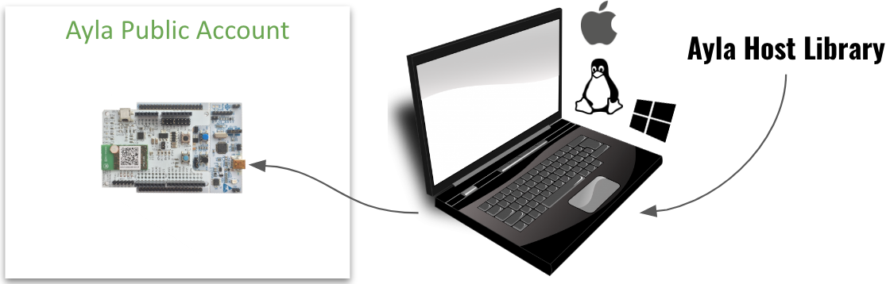

This guide helps you establish a build environment, download the Ayla Host Library, and iteratively modify, build, flash, and run the host application.

The host application (<code>ledevb.img</code>) consists of <code>demo.c</code> linked to four Ayla libraries: <code>libdemo.a</code>, <code>libayla.a</code>, <code>libtarget.a</code>, and <code>libcons.a</code>. It runs on the MCU of the STM32 Nucleo board, and interfaces via SPI or UART serial communication with the Ayla Agent running on the Ayla production module affixed to the Ayla Shield:

<code>demo.c</code> defines a set of properties appropriate for the Ayla Dev Kit:

<pre>
static struct prop prop_table[] =   {
  {"Blue_button", ATLV_BOOL, NULL, send_prop_with_meta, &blue_button, sizeof(blue_button)},
  {"Blue_LED", ATLV_BOOL, set_led, send_led, (void *)LED0, 1},
  {"Green_LED", ATLV_BOOL, set_led, send_led, (void *)LED1, 1},
  {"log", ATLV_UTF8, NULL, prop_send_generic, cmd_buf, 0},
  {"cmd", ATLV_UTF8, set_cmd, prop_send_generic, cmd_buf, 0},
  {"input", ATLV_INT, set_input, prop_send_generic, &input, sizeof(input)},
  {"output", ATLV_INT, NULL, prop_send_generic, &output, sizeof(output)},
  {"decimal_in", ATLV_CENTS, set_dec_in, prop_send_generic, &decimal_in, sizeof(decimal_in)},
  {"decimal_out", ATLV_CENTS, NULL, prop_send_generic, &decimal_out, sizeof(decimal_out)},
  {"schedule_in", ATLV_SCHED, demo_sched_set, NULL, &demo_sched[0]},
  {"stream_up", ATLV_LOC, NULL, demo_send_file_prop_with_meta, &stream_up_state, 0},
  {"stream_up_len", ATLV_INT, demo_set_length_up, prop_send_generic, &stream_up_len, sizeof(stream_up_len)},
  {"stream_down", ATLV_LOC, prop_dp_set, prop_dp_send, &stream_down_state, 0},
  {"stream_down_len", ATLV_UINT, NULL, prop_send_generic, &stream_down_state.next_off, sizeof(stream_down_state.next_off)},
  {"stream_down_match_len", ATLV_UINT, NULL, prop_send_generic, &stream_down_patt_match_len, sizeof(stream_down_patt_match_len)},
  {"version", ATLV_UTF8, NULL, send_version, NULL, 0},
  {"oem_host_version", ATLV_UTF8, NULL, prop_send_generic, template_version, sizeof(template_version) - 1},
};
</pre>

When you connect your Ayla Dev Kit to the Ayla Cloud, the cloud instantiates a digital twin from a template (not shown) to model the kit. Client applications like Aura interact with the Ayla Dev Kit via the digital twin:

Continue to [Ayla Host Library](ayla-host-library).
