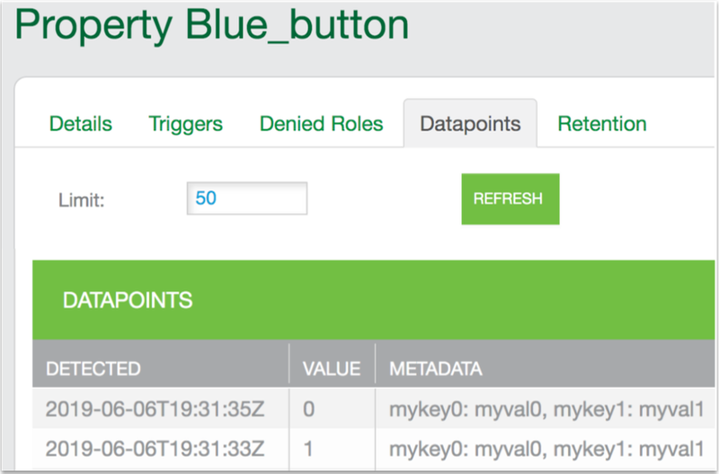

This example shows how to include metadata with property value updates. By default, when a host app sends a property value to the Ayla Cloud, the cloud records the new datapoint along with a timestamp. You may, however, want to record additional metadata that provides context to the datapoint such as location, temperature, pressure, customer id, etc. In the example, the yellow lines, which implement metadata functionality, are additions to the [Baseline example](../baseline-example).

<pre class="numbered">
#include &lt;string.h&gt;
#include &lt;ayla/utypes.h&gt;
#include &lt;ayla/host_lib.h&gt;
#include &lt;arch/board.h&gt;
#include &lt;mcu_io.h&gt;
#include &lt;toolchain/attributes.h&gt;
#include &lt;ayla/ayla_proto_mcu.h&gt;
#include &lt;ayla/props.h&gt;
#include &lt;demo/demo.h&gt;

#define DEMO_SUFFIX ""
#define DEMO_NAME "demo"
#define DEMO_VERSION "2.0"

const char version[] ATTRIB_VERSION = DEMO_NAME DEMO_SUFFIX " " DEMO_VERSION " " BUILD_VERSION;
static char template_version[] = DEMO_NAME DEMO_SUFFIX " 1.9";

static u8 blue_button;

static void set_led(struct prop &ast;prop, void &ast;arg, void &ast;valp, size_t len) {
  u8 val = &ast;(u8 &ast;)valp;
  u32 led = (u32)arg;
  board_led_set(led, val);
}

static int send_led(struct prop &ast;prop, void &ast;arg) {
  u32 led = (u32)prop-&gt;arg;
  u8 val = board_led_get(led);
  return prop_send(prop, &val, sizeof(val), arg);
}

static int send_version(struct prop &ast;prop, void &ast;arg) {
  return prop_send(prop, version, strlen(version), arg);
}

static int send_prop_with_meta(struct prop &ast;prop, void &ast;arg) {
  struct datapoint_meta meta[DP_META_MAX_ENTRIES + 1];
  int rc;
  memset(&meta, 0, sizeof(meta));
  meta[0].key = "mykey0";
  meta[0].val = "myval0";
  meta[1].key = "mykey1";
  meta[1].val = "myval1";
  rc = prop_validate_meta(meta);
  if (rc < 0) {
    prop->send_mask = 0;
    return rc;
  }
  return prop_send_meta(prop, meta, arg);
}

static struct prop prop_table[] = {
  {"Blue_button", ATLV_BOOL, NULL, send_prop_with_meta, &blue_button, sizeof(blue_button)},
  {"Green_LED", ATLV_BOOL, set_led, send_led, (void &ast;)LED1, 1},
  {"version", ATLV_UTF8, NULL, send_version, NULL, 0},
  {"oem_host_version", ATLV_UTF8, NULL, prop_send_generic, template_version, sizeof(template_version) - 1},
};

static struct prop_table demo_prop_table = PROP_TABLE_INIT(prop_table);

static void demo_set_button_state(u32 button, u32 button_value) {
  blue_button = button_value;
  prop_send_req("Blue_button");
}

int main(int argc, char &ast;&ast;argv) {
  board_init(argc, argv);
  ayla_host_lib_init();
  board_module_reset();
  demo_factory_reset_handle();
  mcu_button_handler_set(0, demo_set_button_state);
  prop_table_add(&demo_prop_table);
  prop_send_req_to_ads_only("version");
  prop_request_value(NULL);

  for (;;) {
    demo_poll();
  }
}
</pre>

## Run the example

<ol>
<li><code>cd ~/Ayla-host-lib-2.0-rc1</code>.</li>
<li><code>nano example/app/ledevb/demo.c</code>, and replace the contents with the example.</li>
<li><code>make</code> and <code>make download</code>.
<li>Press/release the black button on the host board.</li>
<li>Press/release the blue button on the Ayla Shield to send a datapoint (with metadata) to the Ayla Cloud.</li>
<li>Browse to the [Ayla Developer Portal](/content/ayla-developer-portal), click the DSN of your Ayla Dev Kit, click the Blue_button property, click Datapoints, and note the new datapoints with your metadata.

</li>
</ol>