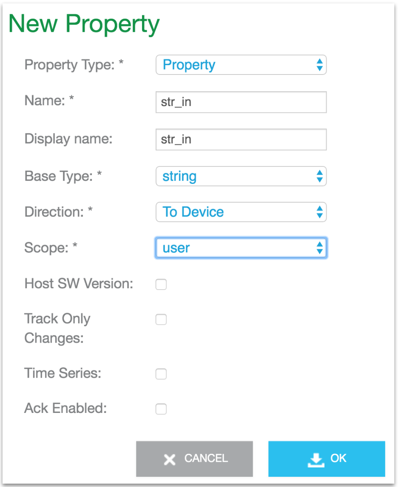
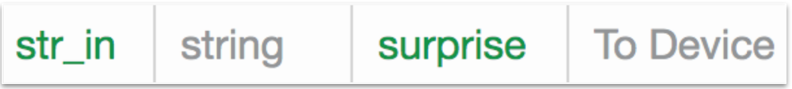
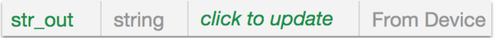

The purpose of this example is to show how to add a property to a host application and to the corresponding digital twin in the Ayla Cloud. Specifically, this example shows how to add two string properties, <code>str_in</code> and <code>str_out</code>. The first is a <code>to device</code> property, and the second is a <code>from device</code>. The host application receives a <code>str_in</code> property value update, transforms the string to uppercase, and sends the transformed string back to the cloud as <code>str_out</code>. In the example, the yellow lines, which implement the new properties, are additions to the [Baseline example](../baseline-example).

<pre class="numbered">
#include &lt;string.h&gt;
#include &lt;ctype.h&gt;
#include &lt;ayla/utypes.h&gt;
#include &lt;ayla/host_lib.h&gt;
#include &lt;arch/board.h&gt;
#include &lt;mcu_io.h&gt;
#include &lt;toolchain/attributes.h&gt;
#include &lt;ayla/ayla_proto_mcu.h&gt;
#include &lt;ayla/props.h&gt;
#include &lt;demo/demo.h&gt;

#define DEMO_SUFFIX ""
#define DEMO_NAME "demo"
#define DEMO_VERSION "2.0"

const char version[] ATTRIB_VERSION = DEMO_NAME DEMO_SUFFIX " " DEMO_VERSION " " BUILD_VERSION;
static char template_version[] = DEMO_NAME DEMO_SUFFIX " 1.9";

static u8 blue_button;
static char str_in_buf[TLV_MAX_STR_LEN + 1];
static char str_out_buf[TLV_MAX_STR_LEN + 1];

static void set_led(struct prop &ast;prop, void &ast;arg, void &ast;valp, size_t len) {
  u8 val = &ast;(u8 &ast;)valp;
  u32 led = (u32)arg;
  board_led_set(led, val);
}

static int send_led(struct prop &ast;prop, void &ast;arg) {
  u32 led = (u32)prop-&gt;arg;
  u8 val = board_led_get(led);
  return prop_send(prop, &val, sizeof(val), arg);
}

static int send_version(struct prop &ast;prop, void &ast;arg) {
  return prop_send(prop, version, strlen(version), arg);
}

static void set_str_in(struct prop &ast;prop, void &ast;arg, void &ast;valp, size_t len) {
  if (len >= sizeof(str_in_buf)) {
    len = sizeof(str_in_buf) - 1;
  }
  memcpy(str_in_buf, valp, len);
  str_in_buf[len] = '\0';
  for(int i=0; i&lt;len; i++){
    str_out_buf[i] = toupper(str_in_buf[i]);
  }
  str_out_buf[len] = '\0';
  demo_log("str_in = %s", str_in_buf);
  demo_log("str_out = %s", str_out_buf);
  prop_send_req("str_out");
}

static struct prop prop_table[] = {
  {"Blue_button", ATLV_BOOL, NULL, prop_send_generic, &blue_button, sizeof(blue_button)},
  {"Green_LED", ATLV_BOOL, set_led, send_led, (void &ast;)LED1, 1},
  {"str_in", ATLV_UTF8, set_str_in, prop_send_generic, str_in_buf, 0},
  {"str_out", ATLV_UTF8, NULL, prop_send_generic, str_out_buf, 0},
  {"version", ATLV_UTF8, NULL, send_version, NULL, 0},
  {"oem_host_version", ATLV_UTF8, NULL, prop_send_generic, template_version, sizeof(template_version) - 1},
};

static struct prop_table demo_prop_table = PROP_TABLE_INIT(prop_table);

static void demo_set_button_state(u32 button, u32 button_value) {
  blue_button = button_value;
  prop_send_req("Blue_button");
}

int main(int argc, char &ast;&ast;argv) {
  board_init(argc, argv);
  ayla_host_lib_init();
  atty_init(console_cli);
  board_module_reset();
  demo_factory_reset_handle();
  mcu_button_handler_set(0, demo_set_button_state);
  prop_table_add(&demo_prop_table);
  prop_send_req_to_ads_only("version");
  prop_request_value(NULL);

  for (;;) {
    demo_poll();
  }
}
</pre>

## Run the example

<ol>
<li>Browse to the [Ayla Developer Portal](/content/ayla-developer-portal), and click on the DSN of your device.</li>
<li>Click Add.</li>
<li>Add a <code>str_in</code> property to the digital twin by filling in the form, and clicking OK.

</li>
<li><code>Click to update</code>, and set <code>str_in</code> to a known value (e.g. "surprise").

</li>
<li>Add a <code>str_out</code> (from device) property.

</li>
<li>In a terminal, <code>cd ~/Ayla-host-lib-2.0</code>.</li>
<li><code>nano example/app/ledevb/demo.c</code>, and replace the contents with the example.</li>
<li><code>make</code> and <code>make download</code>.
<li>Open a screen session with <code>screen /dev/ttyACM0 115200</code> or similar.</li>
<li>Press/release the black button on the host board.</li>
<li>View the output in your screen session:
<pre>
ADS connection DOWN
ADS connection DOWN
ADS connection UP
demo: str_in = surprise
demo: str_out = SURPRISE
pushed str_out
pushed version
</pre>
</li>
</ol>