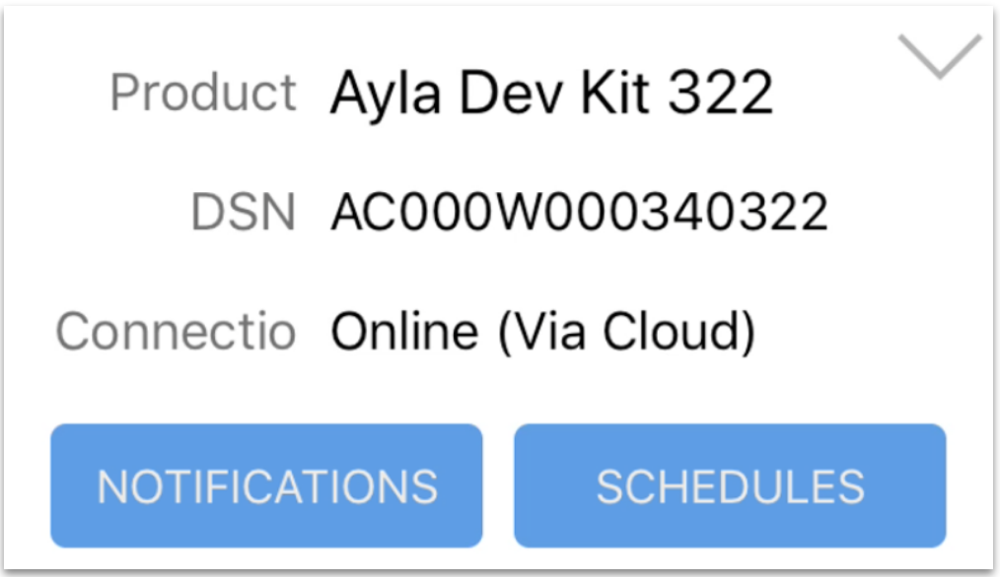
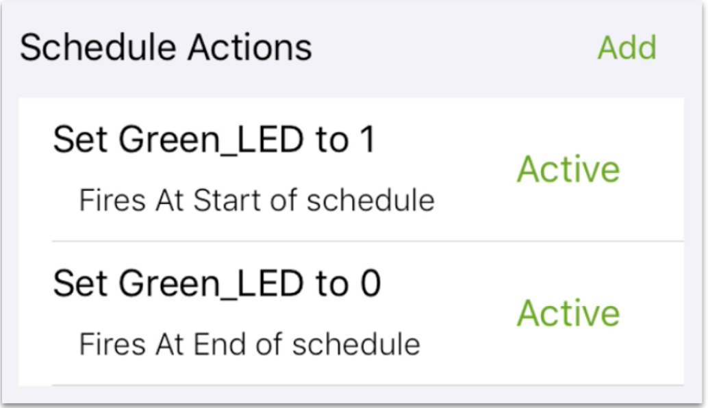

This example shows how to implement a schedule property which receives (from the Ayla Cloud) and executes a set of repeatable, user-defined actions between two points of time. In the example, the yellow lines, which implement schedule functionality, are additions to the [Baseline example](../baseline-example).

<pre class="numbered">
#include &lt;string.h&gt;
#include &lt;ayla/utypes.h&gt;
#include &lt;ayla/host_lib.h&gt;
#include &lt;arch/board.h&gt;
#include &lt;mcu_io.h&gt;
#include &lt;toolchain/attributes.h&gt;
#include &lt;ayla/ayla_proto_mcu.h&gt;
#include &lt;ayla/props.h&gt;
#include &lt;demo/demo.h&gt;
#include &lt;ayla/schedeval.h&gt;
#include &lt;ayla/sched.h&gt;

#define DEMO_SUFFIX ""
#define DEMO_NAME "demo"
#define DEMO_VERSION "2.0"

const char version[] ATTRIB_VERSION = DEMO_NAME DEMO_SUFFIX " " DEMO_VERSION " " BUILD_VERSION;
static char template_version[] = DEMO_NAME DEMO_SUFFIX " 1.9";

static u8 blue_button;

static void set_led(struct prop &ast;prop, void &ast;arg, void &ast;valp, size_t len) {
  u8 val = &ast;(u8 &ast;)valp;
  u32 led = (u32)arg;
  board_led_set(led, val);
}

static int send_led(struct prop &ast;prop, void &ast;arg) {
  u32 led = (u32)prop-&gt;arg;
  u8 val = board_led_get(led);
  return prop_send(prop, &val, sizeof(val), arg);
}

static int send_version(struct prop &ast;prop, void &ast;arg) {
  return prop_send(prop, version, strlen(version), arg);
}

#define DEMO_NSCHED 1
static struct sched_prop demo_sched[DEMO_NSCHED];

static void demo_sched_set(struct prop &ast;prop, void &ast;arg, void &ast;valp, size_t len) {
  struct sched_prop &ast;sched = (struct sched_prop &ast;)arg;
  if (len > sizeof(sched->tlvs)) {
    demo_log("received schedule %s is too long, %u bytes", prop->name, len);
    len = 0;
  }
  demo_log("%s set %s (%u bytes)", prop_source_string(prop), prop->name, len);
  memcpy(sched->tlvs, valp, len);
  sched->len = len;
  sched_run_all(NULL);
}

static struct prop prop_table[] = {
  {"Blue_button", ATLV_BOOL, NULL, prop_send_generic, &blue_button, sizeof(blue_button)},
  {"Green_LED", ATLV_BOOL, set_led, send_led, (void &ast;)LED1, 1},
  {"schedule_in", ATLV_SCHED, demo_sched_set, NULL, &demo_sched[0]},
  {"version", ATLV_UTF8, NULL, send_version, NULL, 0},
  {"oem_host_version", ATLV_UTF8, NULL, prop_send_generic, template_version, sizeof(template_version) - 1},
};

static struct prop_table demo_prop_table = PROP_TABLE_INIT(prop_table);

static void demo_set_button_state(u32 button, u32 button_value) {
  blue_button = button_value;
  prop_send_req("Blue_button");
}

int main(int argc, char &ast;&ast;argv) {
  board_init(argc, argv);
  ayla_host_lib_init();
  atty_init(console_cli);
  board_module_reset();
  demo_factory_reset_handle();
  mcu_button_handler_set(0, demo_set_button_state);
  prop_table_add(&demo_prop_table);
  prop_send_req_to_ads_only("version");
  prop_request_value(NULL);

  for (;;) {
    demo_poll();
  }
}
</pre>

## Run the example

<ol>
<li><code>cd ~/Ayla-host-lib-2.0</code>.</li>
<li><code>nano example/app/ledevb/demo.c</code>, and replace the contents with the example.</li>
<li><code>make</code> and <code>make download</code>.
<li>Open a screen session with <code>screen /dev/ttyACM0 115200</code> or similar.</li>
<li>Press/release the black button on the host board.</li>
<li>View the output in your screen session:
<pre>
ADS connection DOWN
ADS connection DOWN
ADS connection UP
pushed version
demo: cloud set schedule_in (47 bytes)
</pre>
</li>
<li>Verify that the <code>Blue_button</code> and <code>Green_LED</code> properties work.</li>
<li>In Aura, tap Schedules:

</li>
<li>Tap <code>schedule_in</code>:

</li>
<li>Modify Scheduled Actions to target the Green_LED property:

</li>
<li>Modify Start Time an End Time, and tap Save Schedule.</li>
<li>Observe the green LED glow and dim.</li>
</ol>

**Click [Config example](../config-example) to continue**.
