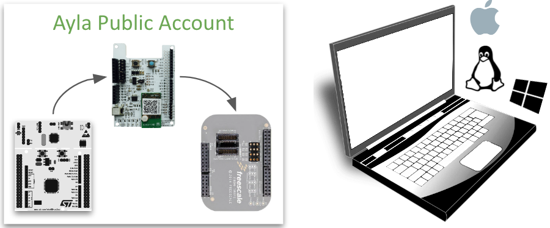
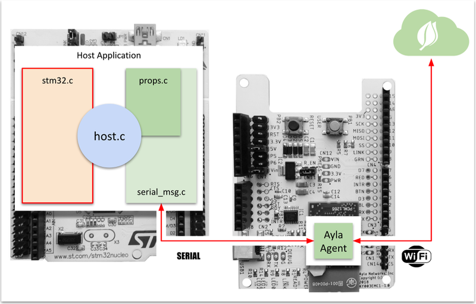

Under construction.

This guide helps you move the Ayla Shield to another host board, and port the Host Application Reference Code to the corresponding chipset.

To facilitate porting, STM32-specific code is contained in stm32.c:

Porting means (1) prying the Ayla Shield from the Nucleo board, (2) inserting the Ayla Shield into an Arduino-compatible host board, and (3) replacing stm32.c with appropriate code that calls the porting API in the host application.

<!--
We may use the [NXP Freedom Development Board](https://www.nxp.com/support/developer-resources/evaluation-and-development-boards/freedom-development-boards/mcu-boards/nxp-freedom-development-board-for-kinetis-k27-and-k28-mcus:FRDM-K28F) as the porting target. 
-->