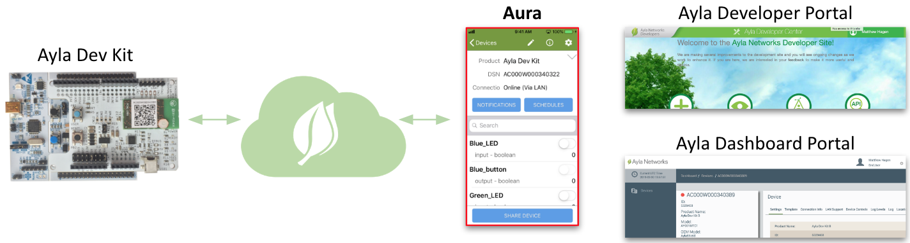
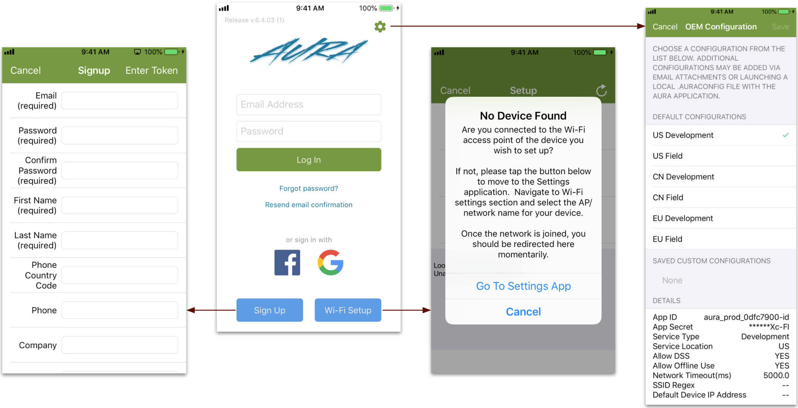
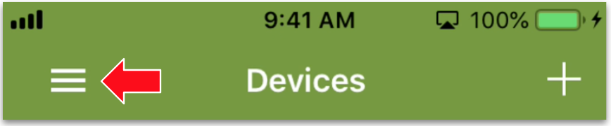
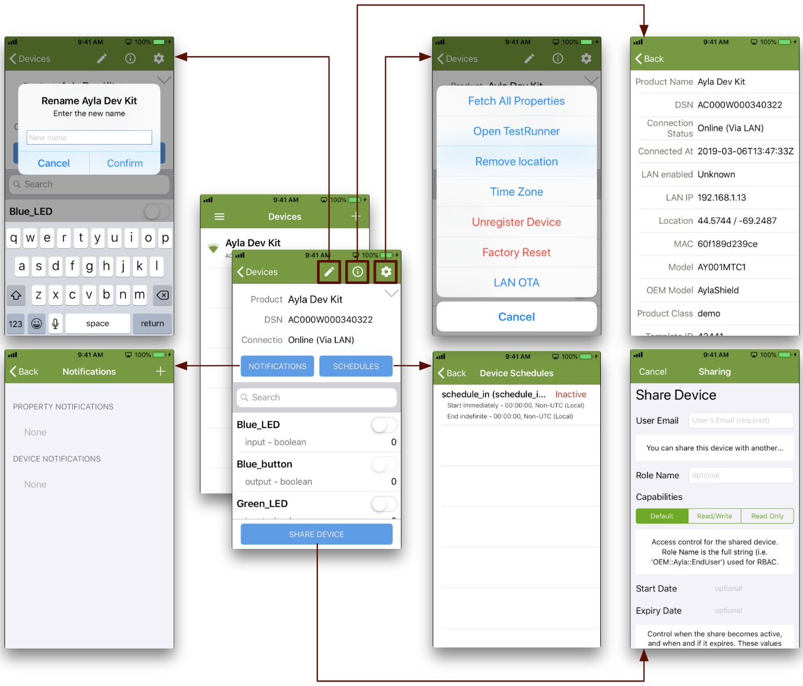

This page introduces the **Aura Mobile App**, one of the three primary clients for Ayla users.

Available for iOS and Android, Aura is designed to help developers interact with any device deployed in both development and field accounts in any Ayla Cloud region. Firmware developers can use Aura to connect, register, and test edge solutions. Integrators can use Aura to test integrations between the Ayla Cloud and business systems. And, app developers can use Aura to envision the features and functionality they might need in a customized mobile app. 

## Login Screen

The Login screen includes a Sign Up button, a Wi-Fi Setup button, and a gear icon:

* The Sign Up button enables a new user to create a user account with EndUser access rights in the Ayla Public (Cloud) Account. 
* The Wi-Fi Setup button enables users to navigate to the Settings screen of the mobile device. 
* The gear icon displays a **Configuration** screen, important when you want to point Aura to an Ayla Customer Account. Configuration parameters appear at the bottom of the screen. See [Configure Aura](../../account-guide/configure-aura) for details.

## Main Menu

Once logged in, tap the hamburger:

The Main Menu appears. The following diagram shows the structure of the Aura Mobile App:

This User Guide has addressed several of these screens already. The LAN OTA and Test Runner screens are covered in the [Developer Guide](../../developer-guide).

## Device Screen

Tapping a device on the Devices List reveals the Device screen:

Continue to [Ayla Developer Portal](../ayla-developer-portal).