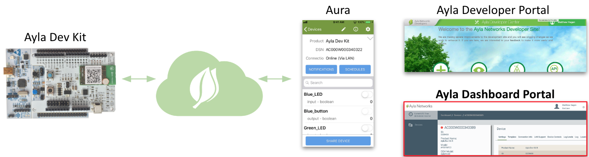
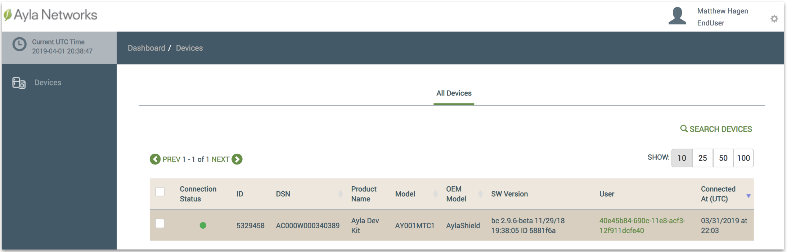
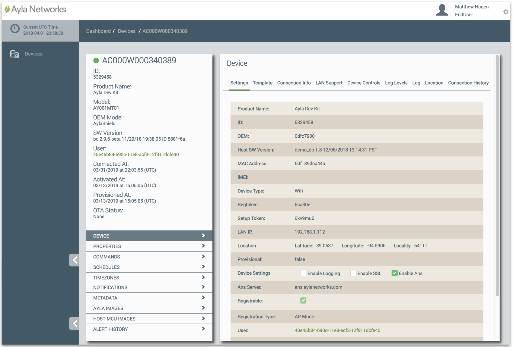

This page briefly introduces the **Ayla Dashboard Portal**, one of the three primary clients for Ayla users.

The primary purpose of the Dashboard Portal is to enable administrators to manage an Ayla <u>Customer</u> Account. A user account with EndUser access rights in the Ayla <u>Public</u> Account can do very little as illustrated in this diagram:

## Devices

Browse to the [Ayla Dashboard Portal](/content/ayla-dashboard-portal), and log in. The Devices list appears:

Then, click the row with your device. The Device page appears:

Many of the features available here are also available in Aura and the Ayla Developer Portal.