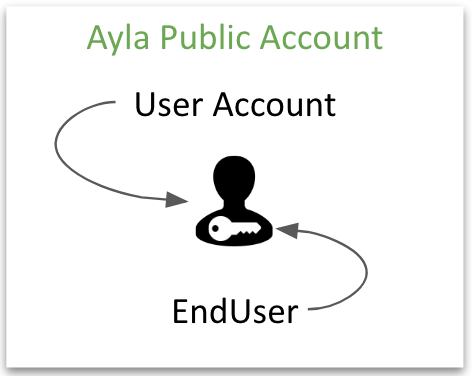
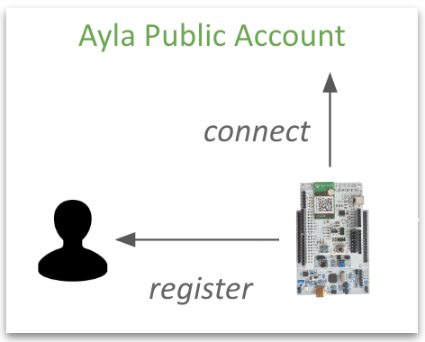
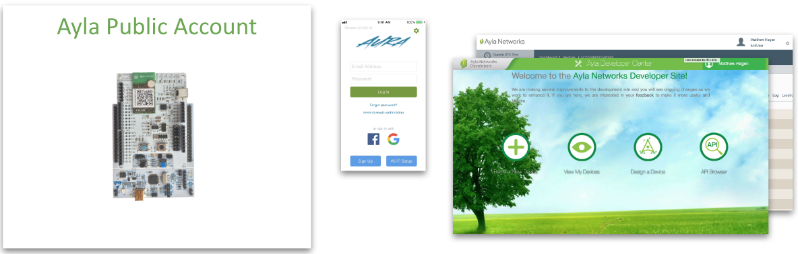

This guide helps you create a user account with EndUser access rights in the Ayla Public Account. 

Next, it shows you how to connect your kit to the Ayla Public Cloud Account, and register it to your user account:

Then, it helps you explore your kit using the [Aura Mobile App](aura-mobile-app), [Ayla Developer Portal](ayla-developer-portal), and [Ayla Dashboard Portal](ayla-dashboard-portal):

