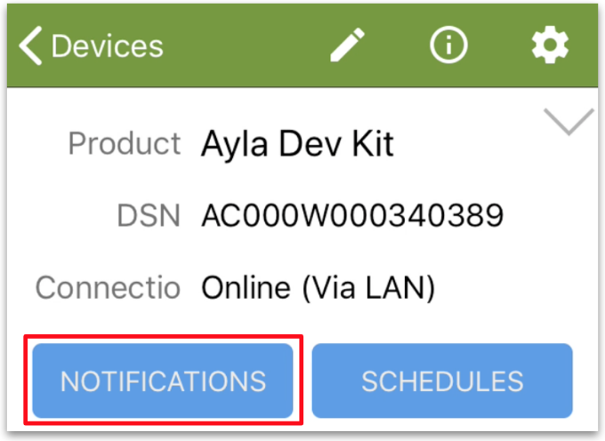

This page introduces you to push notifications of property or device conditions that you define. For example, you can configure the Ayla Cloud to send a push notification to your mobile device when the Green_LED property value changes, and/or when the Ayla Development Kit goes offline/online. To get started, tap the *Notifications* button in Aura.

**Note**: For email and text message notifications, see [Ayla Developer Portal](../ayla-developer-portal).

## Property Notifications

1. Tap "+".
1. Tap "Property notification".
1. Configure the following fields:
<table>
<tr><th>Field</th><th>Value</th></tr>
<tr><td>Notification Name</td><td>Green LED Changed</td></tr>
<tr><td>Notification Message</td><td>The Green LED changed.</td></tr>
<tr><td>Condition</td><td>When Green_LED has Changed.</td></tr>
<tr><td>Send push notification to this device</td><td>&#10003;</td></tr>
</table>
1. Tap *Save Notifications*.
1. Turn on/off Green_LED. See a push notification similar to the following:

Wait a few seconds before generating the next push notification.
1. Uncheck *Send push ...*, and save again.

## Device Notifications

1. Tap "+".
1. Tap "Device notification".
1. Configure the following fields:
<table>
<tr><th>Field</th><th>Value</th></tr>
<tr><td>Notification Name</td><td>Ayla Dev Kit Offline</td></tr>
<tr><td>Event</td><td>on_connection_lost</td></tr>
<tr><td>Threshhold</td><td>300 (seconds)</td></tr>
<tr><td>Notification Message</td><td>The Ayla Dev Kit is offline.</td></tr>
<tr><td>Send push notification to this device</td><td>&#10003;</td></tr>
</table>
1. Tap *Save Notifications*.
1. Disconnect the Ayla Dev Kit, and wait for a few minutes. See a push notification similar to the following:

1. Uncheck *Send push ...*, and save again.
