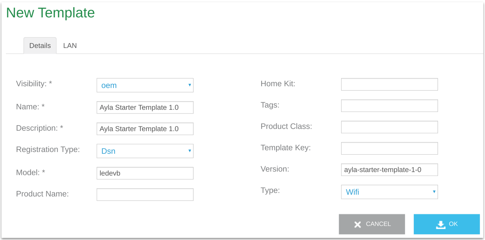
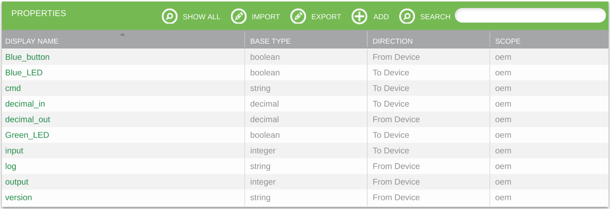
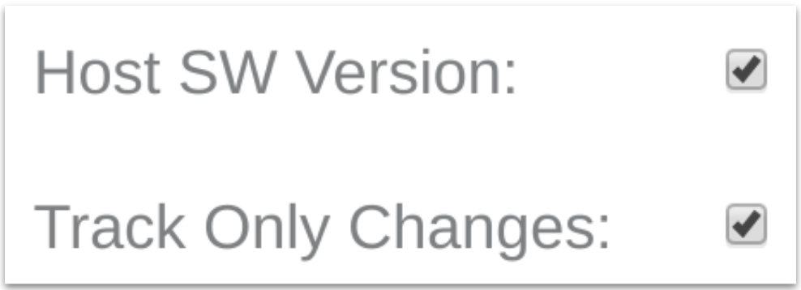

1. Create a text file with the following content, and save it as ```ayla-starter-template-1-0.csv``` to your local file system.

    ```
base_type,direction,name,display_name,scope
boolean,output,Blue_button,Blue_button,oem
boolean,input,Blue_LED,Blue_LED,oem
string,input,cmd,cmd,oem
decimal,input,decimal_in,decimal_in,oem
decimal,output,decimal_out,decimal_out,oem
boolean,input,Green_LED,Green_LED,oem
integer,input,input,input,oem
string,output,log,log,oem
integer,output,output,output,oem
string,output,version,version,oem
    ```

1. Browse to the [Ayla Developer Portal](/content/ayla-developer-portal).

1. Click Design a Device.

1. Click Add, fill out the form, and click OK.

    

1. Find your new template on the list, and click to open.

1. Click Properties.

1. Click Import, choose your ```ayla-starter-template-1-0.csv```, and click Import:

    

1. Click the Version property, check Host SW Version, and click OK:

    